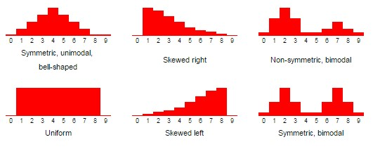

<div style="color:white;
           display:fill;
           border-radius:5px;
           background-color:#5642C5;
           font-size:200%;
           font-family:Arial;letter-spacing:0.5px">

<p width = 20%, style="padding: 10px;
              color:white;">
Combinatorics

</p>
</div>

Data Science Cohort Live NYC Sept 2022
<p>Phase 2: Topic 1</p>
<br>
<br>

<div align = "right">

</div>


Many experiments/trials:
- Finite, countable number of possibilities
- How probable a given subset of configurations are.

Enumerate the possible results of experiment/trial.

<center></center>
<center> The theory of games </center>

<center></center>
<center> Genomics </center>

#### But before delving into genomics or being the next Phil Ivy:

#### Theory of counting with Big Bird and Snuffalaupagus

<table><tr><td></td><td></td></tr></table>

#### Permutations

How many ways are there to arrange the big birds?

<table><tr><td><br> <center>Big Bird 1</center></td><td><br><center>Big Bird 2</center></td><td><br><center>Big Bird 3</center></td></tr></table>

Equivalent to:

Put the Big Birds into the three buckets.

<table><tr><td><br> <center>Big Bird 1</center></td><td><br><center>Big Bird 2</center></td><td><br><center>Big Bird 3</center></td></tr></table>

<table><tr><td><br></td><td><br></td><td><br></td></tr></table>

What are the possibilities for the first bucket?

<table><tr><td><br> <center>Big Bird 1</center></td><td><br><center>Big Bird 2</center></td><td><br><center>Big Bird 3</center></td></tr></table>

<table><tr><td><br></td><td><br></td><td><br></td></tr></table>

<table><tr><td><br><center>Big Bird 1</center></td><td><br><center>Big Bird 2</center></td><td><br><center>Big Bird 3</center></td></tr></table>

<table><tr><td><br></td><td><br></td><td><br></td></tr></table>

<table><tr><td><br><center>Big Bird 1</center></td><td><br><center>Big Bird 2</center></td><td><br><center>Big Bird 3</center></td></tr></table>

<table><tr><td><br></td><td><br></td><td><br></td></tr></table>

Three possible combinations for the first bucket.

- An example of one of these results:

<table><tr><td><br><center>Big Bird 2</center></td><td><br><center>Big Bird 3</center></td></tr></table>

<table><tr><td><br><center>Big Bird 1</center></td><td><br></td><td><br></td></tr></table>

But could have had:

<table><tr><td><br><center>Big Bird 1</center></td><td><br><center>Big Bird 3</center></td></tr></table>

<table><tr><td><br><center>Big Bird 2</center></td><td><br></td><td><br></td></tr></table>

For each of previous possibilities:
- Put one of remaining birds in the second bucket.


<table><tr><td><br><center>Big Bird 2</center></td><td><br><center>Big Bird 3</center></td></tr></table>

<table><tr><td><br><center>Big Bird 1</center></td><td><br></td><td><br></td></tr></table>

<table><tr><td><br><center>Big Bird 2</center></td><td><br><center>Big Bird 3</center></td></tr></table>

<table><tr><td><br><center>Big Bird 1</center></td><td><br></td><td><br></td></tr></table>

Three possible placements for the first bucket.

For each possibility on first bucket:
- 2 possible placements for second bucket


Example of one of these results:

<table><tr><td><br><center>Big Bird 2</center></td></tr></table>

<table><tr><td><br><center>Big Bird 1</center></td><td><br><center>Big Bird 3</center></td><td><br></td></tr></table>

And obviously for each choice on first and second bucket:

Last bucket, one bird left. One possibility.

<table><tr><td><br><center>Big Bird 2</center></td></tr></table>

<table><tr><td><br><center>Big Bird 1</center></td><td><br><center>Big Bird 3</center></td><td><br></td></tr></table>


<table><tr><td><br><center>Big Bird 1</center></td><td><br><center>Big Bird 3</center></td><td><br><center>Big Bird 2</center></td></tr></table>

If played this game for all the possibilities:


<table>
    <tr><td><br><center>Big Bird 1</center></td><td><br><center>Big Bird 3</center></td><td><br><center>Big Bird 2</center></td></tr>
        <tr><td><br><center>Big Bird 1</center></td><td><br><center>Big Bird 2</center></td><td><br><center>Big Bird 3</center></td></tr>
        <tr><td><br><center>Big Bird 2</center></td><td><br><center>Big Bird 1</center></td><td><br><center>Big Bird 3</center></td></tr>

</table>

<table>
    <tr><td><br><center>Big Bird 2</center></td><td><br><center>Big Bird 3</center></td><td><br><center>Big Bird 1</center></td></tr>
        <tr><td><br><center>Big Bird 3</center></td><td><br><center>Big Bird 1</center></td><td><br><center>Big Bird 2</center></td></tr>
        <tr><td><br><center>Big Bird 3</center></td><td><br><center>Big Bird 2</center></td><td><br><center>Big Bird 1</center></td></tr>

</table>

6 possible arrangements or permutations of big birds:
- Equivalent to ways in which to put the birds in buckets.

Final result:
- 3 possible places to put first big bird
    - For each possible choice above:
        - 2 possible places to put second big bird
            - For each possible choice above:
                - 1 possible place to put third big bird


Total configurations = $3\times2\times1 = 6 $

All possible ways to arrange/permute the big birds!

In general for N objects:

$$ N! = N(N-1)(N-2)(N-3)....2\times1 $$ 

is the number of permutations (or arrangements)

Now a slighly different scenario:
- 5 Big Birds
- 3 buckets

<table><tr><td><br><center>Big Bird 1</center></td><td><br><center>Big Bird 2</center></td><td><br><center>Big Bird 3</center></td><td><br><center>Big Bird 4</center></td><td><br><center>Big Bird 5</center></td></tr></table>

<table><tr><td><br></td><td><br></td><td><br></td></tr></table>

Any of the five can go into first bucket.

What about the second bucket?

<table><tr><td><br><center>Big Bird 1</center></td><td><br><center>Big Bird 2</center></td><td><br><center>Big Bird 3</center></td><td><br><center>Big Bird 5</center></td></tr></table>

<table><tr><td><br><center>Big Bird 4</center></td><td><br></td><td><br></td></tr></table>

<table><tr><td><br><center>Big Bird 1</center></td><td><br><center>Big Bird 3</center></td><td><br><center>Big Bird 5</center></td></tr></table>

<table><tr><td><br><center>Big Bird 4</center></td><td><br><center>Big Bird 2</center></td><td><br></td></tr></table>

The last bucket: three possibilities.

Putting it altogether: $ 5\times 4 \times 3 = 60 $

<table><tr><td><br><center>Big Bird 1</center></td><td><br><center>Big Bird 3</center></td><td></tr></table>

<table><tr><td><br><center>Big Bird 4</center></td><td><br><center>Big Bird 2</center></td><td><br><center>Big Bird 5</center></td></tr></table>

Another way to formulate the counting:

$$ 5\times4\times3 = \frac{5\times4\times3\times2\times1}{2\times1} = \frac{5!}{2!} = \frac{5!}{(5-3)!} = 60  $$

The general permutation case: n objects, r bins.

Total arrangements:

$$ P(n,r) = \frac{n!}{(n-r)!} $$

#### Permutations in Python
- Get permutations of object selections:
    - lists and base Python
    - arrays and numpy methods

Starting with base python and lists:
- Very useful library: itertools

```python
import itertools
```
- itertools.permutations(collection, num_buckets)
- num_bucket default is number of elements in collection

```python
permutation_list = list(itertools.permutations([1,2,3]))
permutation_list
```
Can get the number of permutations:

```python
P_n = len(permutation_list)
P_n
```
Can also specify number we want to select:
- i.e. number of buckets

```python
# numbers we are selecting from
larger_list = [1,2,3,4,5]
# choose number of buckets putting numbers into
num_buckets = 3
permutation_selector = list(itertools.permutations(larger_list, num_buckets))
```
```python
print(permutation_selector)
```
```python
n_selector = len(permutation_selector)
n_selector
```
Can do similar things with numpy arrays/pandas Series:
- But more importantly can get:
    - A random instance of a permutation of the array
    - A random sampling sequence of a given array

- np.random permutation function

```python
# import libraries and permutation function
from numpy.random import permutation
import numpy as np
```
Let's define a simple numpy array:

```python
simple_arr = np.array([1,2,3])
```
```python
np.random.permutation([1,2,3])
```
Similar to when we were putting 5 big birds into 3 bins:

- Select a subset of a list
- np.random choice function

```python
# will do a selection for us:
from numpy.random import choice

larger_array= np.array([1,2,3,4,5])
num_buckets = 3
```
The choice function takes elements in sequence:
- out of original selection pool (replacement = False)
- into "sampled" array

```python
choice(larger_array, size = num_buckets, replace = False)
```
#### Combinations

Let's go back to our prevous big bird selection:

Counted how many ways to put Big Bird 1-5 into 3 buckets.

A particular result:

<table><tr><td><br><center>Big Bird 1</center></td><td><br><center>Big Bird 3</center></td><td></tr></table>

<table><tr><td><br><center>Big Bird 4</center></td><td><br><center>Big Bird 2</center></td><td><br><center>Big Bird 5</center></td></tr></table>

Another result:

<table><tr><td><br><center>Big Bird 1</center></td><td><br><center>Big Bird 3</center></td><td></tr></table>

<table><tr><td><br><center>Big Bird 2</center></td><td><br><center>Big Bird 5</center></td><td><br><center>Big Bird 4</center></td></tr></table>

Previously:

- Counted previous instances as separate outcomes.
- Order of selection mattered.

But what if I only care that Big Bird 2, 4, and 5 sit in buckets?

Not the order.

Two equivalent selections:
<table><tr><td><br><center>Big Bird 2</center></td><td><br><center>Big Bird 5</center></td><td><br><center>Big Bird 4</center></td></tr>

<tr><td><br><center>Big Bird 5</center></td><td><br><center>Big Bird 2</center></td><td><br><center>Big Bird 4</center></td></tr>

</table>
<center>Number of equivalent selections here?</center>

3! equivalent selections for 3 buckets.

Number of permutation:

$$ P(5,3) = \frac{5!}{(5-3)!} = 60 $$

Order of selection matters here.

All the permutations:
- But now for each arrangement in buckets:
- Divide out the number of equivalent selections (number of bins)

Number of **combinations**:

$$ C(5,3) = \frac{5!}{(5-3)!3!} =10 $$

The general permutation case: n objects, r bins.

Total arrangements:

$$ P(n,r) = \frac{n!}{(n-r)!} $$

General formula for combinations
$$ C(N, r) = {N \choose r} =   \frac{N!}{(N - r)! r!} $$

Another way to think about it: How many combinations for two groups (selected/unselected)?

<table><tr><td><br><center>Big Bird 1</center></td><td><br><center>Big Bird 3</center></td><td></tr></table>

<table><tr><td><br><center>Big Bird 2</center></td><td><br><center>Big Bird 5</center></td><td><br><center>Big Bird 4</center></td></tr></table>

- Arrangements within given unselected group: $ (N - r)! $
-  Arrangements within given selected group: $ r! $
- Total number of arrangements selected/unselected: $ N! $

Divide total by ways of selecting subgroups.

$$ \frac{N!}{(N-r)!r!} $$

With Python:

```python
perms = list(itertools.permutations([1,2,3,4,5], 3))
print(perms)
```
```python
len(perms)
```
Get combinations:
- itertools.combinations(collection, num_selections)

```python
combs = list(itertools.combinations([1,2,3,4,5], 3))
print(combs)
```
```python
len(combs)
```
A related problem:
- Number of **arrangements** with identical members.
- Identical members form subgroups.

<table><tr><td></td><td></td><td></td><td></td><td></td></tr></table>

<table><tr><td></td><td></td><td></td><td></td><td></td></tr></table>

Total arrangements with identical objects: $$ \frac{5!}{2!3!} \rightarrow \frac{N!}{n_1!n_2!} $$

The general cases with k groups of identical objects

Total number of arrangements:
 $$ \frac{N!}{n_1!n_2!n_3!...n_k!} $$
 $$ N = n_1 + n_2 + ... + n_k $$

So far:
- Taking from a pile and put into bins:
    - people select randomly from a bag and keeping selection
    - **sampling without replacement**

- Other option:
    - Pick from a bag at random
    - When done with selection, put back in bag.
    - **sampling with replacement**

#### Sample with replacement: example
Each bin: choose either a Big Bird or a Snuffy.

<table><tr><td></td><td></td></tr></table><br>

Put them in the cages:
<table><tr><td></td><td></td></tr></table>

How many ways this time?

- First cage: 2 possibilities, Second cage: 2 possibilities
- Total: $ 2 \times 2 = 4 $
- Counts all orderings!


<center></center>
<center> Wait! Count me in! </center>


<table><tr><td></td>
<td></td>
<td></td></tr></table><br>

Put them in the cages. Sample with replacement!
<table><tr><td></td><td></td></tr></table>

- $3^2 = 9$ arrangements.


<table><tr><td></td>
<td></td>
<td></td></tr></table><br>

Put them in the cages. Sample with replacement!
<table><tr><td></td><td></td><td></td><td></td></tr></table>

- $3^4 = 81$ arrangements.

Generally:

Total arrangements (sampling with replacement)

$$ P =  n^r $$

- r = number of bins/selections
- n = number of items in collection

**Python: Sampling with/without replacement**

Take a simple list:
- Compare sampling with and without replacement side-by-side
- itertools.product()

```python
# wtihout replacement
li_small = [1,2,3]
list(itertools.permutations(li_small, 2))
```
```python
#with replacement
li_small = [1,2,3]
list(itertools.product(li_small, repeat=2))
```
- Random sampling: numpy.random.choice
    - replacement = True

```python
from numpy.random import choice
num_buckets = 2
choice(li_small, size = num_buckets, replace = True)
```
#### Sampling with replacement:
- So far order mattered.
- What if we want combinations instead?

Construction for counting is a little bit tricky here.

See additional material if interested:

#### A quick case study

Our company TastyDelish Cereals:
- Promoting/marketing on three cereals:
    - Big Bananarama
    - Chocomagnificence
    - Sugar Dreams

Among a field of eight cereals. Is our marketing effective?

- Probability that our cereals rank in top 3?

**Assuming marketing doesn't do anything**:
- Each top 3 selection equally likely.
- Counting problem.

```python
cereal_pool = ['Big Bananarama', 'Count Chocula', 'Fruity Pebbles', 'Trix',
               'Chocomagnificence', 'Sugar Dreams', 'Lucky Charms', 'Special K']
```
Total possibilities

$$ \frac{N!}{(N - r)!} $$

In our case: $ 8!/5! $

```python
from numpy import math

N = 8 # 8 total cereals
r = 3 # selecting in order the top 3 cereals

total_possibilities = (math.factorial(N)/
                       math.factorial(N-r))
total_possibilities
```
How many results where Big Bananarama, Chocomagnificence, and Sugar Dreams are all in top 3?


```python
desired_scenarios = math.factorial(r)
desired_scenarios
```
Calculating likelihood under assumption marketing makes no difference:

```python
probability = desired_scenarios/total_possibilities
print(probability)
```
Can also formulate this as a combination problem:
- We only care that all three were in the top 3
- Not the order.

```python
import itertools
top3_combinations = list(itertools.combinations(cereal_pool, 3))
top3_combinations
```
Only one combinations has our 3 cereals in the top 3.

```python
probability_comb = 1/(len(top3_combinations))
probability_comb
```
Same as before.

Future steps:

 - Look at our real data
 - Test whether it follows probabilities predicted by simple counting.
 - Reject the notion that marketing doesn't matter?
 - Hypothesis testing

```python

```

-----File-Boundary-----
<div style="color:white;
           display:fill;
           border-radius:5px;
           background-color:#5642C5;
           font-size:200%;
           font-family:Arial;letter-spacing:0.5px">

<p width = 20%, style="padding: 10px;
              color:white;">
Probability: The Mathematics of Uncertainty

</p>
</div>

Data Science Cohort Live NYC Sept 2022
<p>Phase 2: Topic 1</p>
<br>
<br>

<div align = "right">

</div>


# Probabilty Fundamentals


> [xkcd comic 1252](https://xkcd.com/1252/)

# Objectives

- Describe the fundamentals of probability theory
- Describe set theory and its terminology
- Define conditional probability

# Set Theory Basics

In probability theory, a **set** is a well-defined collection of objects (called **elements**). An element is either in a given set or not and order is not considered.

If an **element** $x$ belongs to a set $S$, then you'd write $x \in S$.

On the other hand, if $x$ does not belong to a set $S$, then you'd write $x\notin S$.

> **More Math & Details**
>
> Set theory is a whole branch of mathematics just like calculus or geometry so there's a lot we could talk about! We won't here but you can see some extra information in a [Level Up section](#Level-Up:-More-Set-Theory) towards the end of this notebook.

## Set Operations

Let's first imagine two sets $A$ and $B$ with some overlapping elements


The **union** of 2 sets $A$ and $B$ is the set $T$ of elements of either $A$ or $B$, or in both. We denote this with the symbol $\cup$.


$$\large T = A\cup B = B\cup A$$


The **intersection** of two sets $A$ and $B$ is the set $V$ that contains all elements of $A$ that also belong to $B$. We denote this with the symbol $\cap$.


$$\large V = A\cap B = B\cap A$$


# Probability Theory

Probability theory is the study of the frequency of a given event occurring with respect to all possible events. In this section we'll discuss the event space & sets, calculate the probability of events, and discuss the relevance of probability theory in data science.

## Why Should I Care About Probabilities?

Studying probabilities allows us to make better and more informed decisions, based on data previously collected. For example, understanding the fact that it is nearly impossible for us to ever win the lottery from a probabilistic standpoint deters us from using it as a source of income.

Probability theory also lies at the heart of making inferences using our data, which is what statistics is all about!

Combined with statistics / decision theory:
- Make optimal predictions based on limited data.
- Limited data = incomplete information.
- Estimate uncertainty in those predictions.

- Assess veracity of a statement/hypothesis
    - Given limited set of data
- How certain are we of estimates?

## Probability Terminology

- An **outcome** is a possible result of a random phenomenon (e.g. a 5 on a six-sided die)
- A **sample space** is the set of all possible outcomes for a random phenomenon (e.g. {1, 2, 3, 4, 5, 6} for rolling a six-sided die)
- An **event** is a specific outcome of a random phenomemon (e.g. actually rolling a six-sided die and getting a 5)

### Random Variables


> [Source: _Dilbert_ comic](https://dilbert.com/strip/2001-10-25)

> A **random variable** has an outcome that can take on different values, resulting from a random phenomenon

- A random variable can either be continuous or discrete
    - **Continuous**: the variable can have any values within a range (e.g. a person's height)
    - **Discrete**: the variable can only have a finite subset of values within a range (e.g. number of cars owned)

This allows us think of events in mathematical terms and use mathematical notation to abstract the ideas.

For example, let's state that $Y$ is the number of tails after $10$ flips.

Thus we can write these examples:

- $P(Y=3)$ is _the probability of having $3$ tails after flipping a coin $10$ times_
- $P(Y\le8)$ is _the probability of having $8$ or fewer tails after flipping a coin $10$ times_
- $P(Y\text{ is even})$ is _the probability that the number of tails is even after flipping a coin $10$ times_

Hopefully, you can now see the power of abstracting these outcomes with notation.

## Probability Using Sets

In its most basic form, the **probability** of an event occurring is the size of the successful outcome set divided by the size of the sample space. In some ways, probability is just about counting outcomes.

**Example**: What is the probability of rolling an even number on a six-sided die?

* Successful outcomes: {2, 4, 6} has size 3
* Sample space: {1, 2, 3, 4, 5, 6} has size 6
* Probability = 3/6 = 1/2 = 50%

We sometimes write probability statements using notation like $P(E) = 0.5$, where $E$ is an event, such as rolling an even number on a six sided die.

## Independence

A special condition is when the outcome of $A$ has no bearing on the outcome of $B$. We say these two events are **independent** (e.g. rolling a die and tossing a coin).

Formally, *$A$ and $B$ are independent* if and only if the probability that *both* $A$ *and* $B$ happen is:

$$P(A \cap B) = P(A) \cdot P(B)$$

Hopefully, we can see where this comes from when two events are independent. If the the event doesn't have any effect on the other, then the chances of them happening is probability of the first event multiplied by the second.

> **NOTE**
>
> In many cases we'll treat events as independent for convenience even if they technically are not independent from one another. Usually you can ignore very small dependence effects.
>
> For example, we would likely describe two coin flips of the same coin (two events) to be independent from one another. But technically speaking, maybe after a coin flip the side that the coin that lands face-down is damaged and slightly affects future coin flips. In this case, we likely would ignore this affect and assume a sequence of coin flips to be independent.

## Joint Probability

Sometimes we want to know the probability of two different events occurring - we refer to this as **joint probability**.

The probability that *either* $A$ *or* $B$ happens is:

$$P(A  \cup  B) = P(A) + P(B) - P(A  \cap  B)$$


### \N{BRAIN} Knowledge Check

**AND Question**: What is the probability of rolling a 5 on a fair die _and_ getting a tails on a fair coin toss?

1/6 * 1/2


<p>
</p>
<details>
    <summary><b><u>Answer</u></b></summary>

Answer: Of the six possible outcomes on a die roll only one (the 5) will do. So the chance of getting a 5 on a die is 1/6. Of the two possible outcomes on a coin toss again only one (tails) will do.

So the calculation is: $\left(\frac{1}{6}\right)\left(\frac{1}{2}\right) = \frac{1}{12}$


</details>

**OR Question**: What is the probability of rolling a 5 on a die _or_ getting a tails on a coin toss?

1/6 + 1/2 - 1/6*1/2
1/6 + 3/6 - 1/12
4/6 - 1/12
8/12 - 1/12
7/12


<p>
</p>
<details>
    <summary><b><u>Answer</u></b></summary>

Answer: Here we want to count all the die-coin combinations where we have a 5 on the die AND all the die-coin combinations where we have a tails on the coin. But one thing we have to keep in mind is the following:

When we count the 5-on-the-die combinations, we'll count two: 5-heads and **5-tails**.
When we count the tails-on-the-coin combinations, we'll count six: 1-tails, 2-tails, 3-tails, 4-tails, **5-tails**, and 6-tails.

But then we've counted the combination where **both** the 5 and the tails occur **twice**.

So the correct calculation is the sum of the individual probabilities **less the probability of their intersection**:

$\frac{1}{6} + \frac{1}{2} - \left(\frac{1}{6}\right)\left(\frac{1}{2}\right) = \frac{7}{12}$
</details>

# Conditional Probability

## Fermat and Pascal: The Unfinished Game

> This example borrowed from Peter Norvig's excellent repo [here](https://github.com/norvig/pytudes).

<table>
<tr><td><center><a href="https://en.wikipedia.org/wiki/Pierre_de_Fermat">Pierre de Fermat</a><br>1654
<td><center><a href="https://en.wikipedia.org/wiki/Blaise_Pascal">Blaise Pascal]</a><br>1654
</table>

Consider a gambling game consisting of tossing a coin repeatedly. Player H wins the game as soon as a total of 10 heads come up, and T wins if a total of 10 tails come up before H wins. If the game is interrupted when H has 8 heads and T has 7 tails, how should the pot of money (which happens to be 100 Francs) be split?  Here are some proposals, and arguments against them:
- It is uncertain, so just split the pot 50-50.
    - *No, because surely H is more likely to win.*
- In proportion to each player's current score, so H gets a 8/(8+7) share.
    - *No, because if the score was 0 heads to 1 tail, H should get more than 0/1.*
- In proportion to how many tosses the opponent needs to win, so H gets 3/(3+2).
    - *This seems better, but no, if H is 9 away and T is only 1 away from winning, then it seems that giving H a 1/10 share is too much.*

In 1654, Blaise Pascal and Pierre de Fermat corresponded on this problem, with Fermat [writing](http://mathforum.org/isaac/problems/prob1.html):

>Dearest Blaise,
>
>As to the problem of how to divide the 100 Francs, I think I have found a solution that you will find to be fair. Seeing as I needed only two points to win the game, and you needed 3, I think we can establish that after four more tosses of the coin, the game would have been over. For, in those four tosses, if you did not get the necessary 3 points for your victory, this would imply that I had in fact gained the necessary 2 points for my victory. In a similar manner, if I had not achieved the necessary 2 points for my victory, this would imply that you had in fact achieved at least 3 points and had therefore won the game. Thus, I believe the following list of possible endings to the game is exhaustive. I have denoted 'heads' by an 'h', and tails by a 't.' I have starred the outcomes that indicate a win for myself.
>
>       h h h h *       h h h t *       h h t h *       h h t t *
>       h t h h *       h t h t *       h t t h *       h t t t
>       t h h h *       t h h t *       t h t h *       t h t t
>       t t h h *       t t h t         t t t h         t t t t
>
>I think you will agree that all of these outcomes are equally likely. Thus I believe that we should divide the stakes by the ration 11:5 in my favor, that is, I should receive $\frac{11}{16}\cdot100$ = 68.75 Francs, while you should receive 31.25 Francs.
>
>
>I hope all is well in Paris,
>
>Your friend and colleague,
>
>Pierre

Pascal agreed with this solution, and [replied](http://mathforum.org/isaac/problems/prob2.html) with a generalization that made use of his previous invention, Pascal's Triangle. There's even [a book](https://smile.amazon.com/Unfinished-Game-Pascal-Fermat-Seventeenth-Century/dp/0465018963?sa-no-redirect=1) about it.

## A New Condition

It's an obvious point that the probability of either man winning depends on the results of the coin flips so far. One might like to know not just what, say, Fermat's chances of winning are at this point but also what his chances of  winning would be **given that the next flip results in a 'heads'**. This is asking about a ***conditional probability***.

The probability that Fermat wins the game may be 68.75%, but what would it be if the next flip is 'heads'?

Let's define...
* Event $F$ as Fermat winning the game.
* Event $H$ as the next flip turning up heads

We can write $P(F | H)$ as the **conditional probability** that Fermat wins _given_ that the next flip is heads.

If the next flip is heads, this would make the score 9H - 7T, and so the remaining possible outcomes would then be:

- H (50% chance; Fermat wins 10H-7T)
- TH (25% chance; Fermat  wins 10H-8T)
- TTH (12.5% chance; Fermat wins 10H-9T)
- TTT (12.5% chance; Fermat loses 9H-10T)

So the probability that Fermat wins, **given that the next flip is 'heads'**, $P(F | H)$, is 87.5%.

The probability of Fermat winning has increased, which is to say that the events of (a) the next flip being 'heads' and (b) Fermat winning the game are **not independent**: (a) makes (b) more likely.

## Conditional Probability Rules

When events _are_ independent, the rule for probabilistic AND (I'll use '$\cap$' below) is simple:

$$\large P(a\cap b) = P(a) P(b)$$

But the more general rule, which includes non-independent events, is:

$$\large P(a\cap b) = P(a | b) P(b)$$

In fact, this is the definition of conditional probability. Rearranging:

$$\large P(a | b) = \frac{P(a\cap b)}{P(b)}$$

 Note that, when $a$ and $b$ are independent, then we have:

 $$\begin{align}
    P(a | b) &= \frac{P(a\cap b)}{P(b)} \\
             &= \frac{P(a) P(b)}{P(b)} \\
             &= P(a)
\end{align}$$

## Conditional Probability Example

Let's see how we can use these definitions to solve a conditional probability problem.

Suppose we have the following probabilities:

- The probability of rain tomorrow is 0.8;
- The probability that I take my umbrella tomorrow, given that it rains, is 0.9.

What is the probability that *both* (a) it rains tomorrow and (b) I take my umbrella?

```python
prob_rain = 0.8                           # P(r)
prob_umb_if_rain = 0.9                    # P(u | r)

prob_rain_and_umb = 0.8 * 0.9             # P(r AND u)
prob_rain_and_umb
```
> **NOTE**
>
> This approaches something called ***Bayes's Theorem***. There's a bit more in [this _Level Up_ section](#Level-Up:-Bayes-Theorem). We'll also see more of this in a future lecture.

# The Law of Total Probability

Sometimes we want to calculate an **unconditional** probability by making use of some conditional probabilities.

Suppose we want to calculate the probability of $e$, the event that Two-Face will free his hostages.

Now like any good cartoon villain, Two-Face has the ridiculous quirk that he makes his decisions partially dictated from his coin's flip.


Since Two-Face is a pretty bad dude, he still does the bad thing even if his coin lands "heads". So let's suppose we express this like below:

- $P(e | H) = 0.9$
- $P(e | T) = 0.1$

where $H$ is the event of a particular coin toss coming up "heads" and $T$ is the event of that same coin toss coming up "tails".

Suppose we also know that the coin is weighted unfairly (Two-Face is one bad dude), in such a way that the coin has a $40\%$ chance of coming up "heads" and a $60\%$ chance of coming up "tails":

- $P(H) = 0.4$
- $P(T) = 0. 6$

We can now solve the original question of the probability that Two-Face will free his hostages.

What we really want to know is $P(e)$, the probability that Two-Face will free his hostages. So we calculate:

$$\begin{align}
P(e) &= P(e | H) P(H) + P(e | T) P(T) \\
     &= (0.9)(0.4) + (0.1)(0.6)  \\
     &= 0.36 + 0.06 \\
     &= 0.42
\end{align}$$

Not great; we may need Batman to step in and alter the conditional probabilities

## Aside: Mathematical Notation and Formalism

Notice that $H$ and $T$ together have an interesting relationship. In particular:

- $P(H\cap T) = 0$, i.e. the two events are mutually *exclusive*; and
- $P(H\cup T) = 1$, i.e. the two events are jointly *exhaustive* of all possibilities.

Any set of two or more events with these two features (where, strictly, for no event $z$ do we have $P(z) = 0$) is said to **partition** the space of possibilities. In our case, we have $\Omega = \{H, T\}$.

For an arbitrary partition, $\Omega = \{\xi_1, ..., \xi_n\}$, the ***law of total probability*** tells us the following:

$P(e) = P(e\cap\xi_1) + ... + P(e\cap\xi_n) = P(e | \xi_1)\times P(\xi_1) + ... + P(e | \xi_n)\times P(\xi_n)$.

# Level Up: More Set Theory

## A Note on Set Notation

We usually denote sets with curly braces $\large \{\}$ with elements within them.

For example, the following set $A$ has the numbers $0,3,5,6,7,8,9$ in it:

$$\large \{8,6,7,5,3,0,9\}$$

Sometimes, there are a pattern of elements/values in a set and it'd be tough to write them down. So we use a special notation to denote a set $S$:

$$\large S = \{x \mid x \in T, \text{other conditions} \}$$

where:
- $x$ is an element in $S$
- $|$ is read as "such that" and denotes that $x$ must fulfill the following conditions
- $x\in T$ means $x$ is from some other defined set $T$
- Followed by other conditions on the elements ($x$) of $S$

### Quick Notation Example

If we defined a set to include all numbers less than $3$, it'd be tough to write down all the those numbers. This would not only include integers such as $2,1,0,-1,\cdots)$ (denoted with $\mathbb{Z}$) but also numbers like $\pi, \sqrt{2}, 1.5,  \frac{1}{3},$ and _infinitely_ more numbers. Turns out these are [_real numbers_]() (denoted with $\mathbb{R}$).

So to save on paper, we might instead write:

$$\large \{x \mid x \in \mathbb{R}, x \lt 6 \}$$

### \N{BRAIN} Knowledge Check

What numbers would be included in this set?

$$\large \{x \mid x \in \mathbb{Z}, 0 \leq x \leq 20 \}$$

## Empty Set

The **empty set**, written as $\emptyset$ or { }, has no elements.

Weirdly enough, a set could include $\emptyset$:

$$\large \{\emptyset, 1, 2\}$$

The above set would have ***three*** elements in it

> In set theory, turns out having "nothing" is still something.

## Subsets

Set $T$ is a **subset** of set $S$ if every element in set $T$ is also in set $S$. The mathematical notation for a subset is $T \subset S$.

> **NOTE**
>
> $\emptyset$ is a subset of every set. (_Every set has the set of nothing_)

## Python & Sets

Python has a [`set` type](https://docs.python.org/3/library/stdtypes.html#set) and can be useful since they follow the mathematical rules of sets!

In Python, if I want to make a set, I can use the base function `set()`, or I can use '{' and '}'.

```python
a = set([1, 2])
```
```python
b = {1, 2}
```
```python
a == b
```
```python
a1 = {2, 1}

a1 == a
```
### Empty Set

The **empty set**, written as $\emptyset$ or { }, has no elements. Just remember that in Python, `{}` will initiate an empty _dictionary_, not a set.

```python
type({})
```
```python
m = set()
```
```python
type(m)
```
```python
print(m)
```
### Iterables

```python
a = set(['greg'])
```
```python
b = {'greg'}
```
```python
c = set('greg')
```
```python
a == b
```
```python
a == c
```
```python
a
```
```python
c
```
### Subsets

```python
c
```
```python
d = set(['g', 'r'])
```
```python
d.issubset(c)
```
```python
m = set()
m.issubset(c)
```
### Set Operations - Example

We are trying to create rooming arrangements based on staff interest for a staff trip. <br>

Who should room with whom based on shared interests?

```python
Robin = {"art", "traveling", "wine", "doodling", "tech", "gadgets"}
Rob = {"rock-climbing", "traveling", "dad jokes", "ice cream"}
Alison = {"wine", "traveling", "Schitts Creek", "dogs"}
Su = {"Schitts Creek", "dogs", "tarot card reading", "croquet", "taxonomy"}
Molly = {"wine", "ice cream", "dogs", "zookeeping", "traveling"}
```
```python
Robin.intersection(Alison)
```
```python
Rob.intersection(Alison)
```
**Prompt**: What would the union of the sets `Rob` and `Alison` tell us?

```python
Rob.union(Alison)
```
# Level Up: Bayes Theorem

Intuitively, we expect that $P(a\cap b) = P(b\cap a)$, so we could equally well write:

- $P(a\cap b) = P(b | a)\times P(a)$.

This equivalence leads to an important theorem of conditional probability:

$P(a | b)\times P(b) = P(b | a)\times P(a)$

Thus:

$\huge P(a | b) = \frac{P(a)\times P(b | a)}{P(b)}$.

This is **Bayes's Theorem**. We'll have more to say about this in a later lesson.

# Level Up: Permutations & Combinations

Permutations and combinations are helpful when we're trying to solve certain counting problems. Formulas help us calculate the total number of possible outcomes in various scenarios.

### Permutations

Use these when ordering matters: How many different arrangements can you get out of a number of elements?

The number of arrangements of $r$ elements out of a total of $n$ elements is given by: $\Large\frac{n!}{(n \N{EN DASH} r)!}$.

Why is this the right formula?

We have:
- $n$ choices for the item in the first position;
- $n-1$ choices for the item in the second position (since we've reserved one of the original items for the first position);
- ... ;
- and $n-(r-1)=n-r+1$ choices for the item in the last position.

So that's $n!$ without the terms below $n-r+1$, i.e. $\frac{n!}{(n-r)!}$.

### Combinations

Ordering does not matter. <br/>
How many different selections can you get out of a number of elements? <br/>
The number of selections of $r$ out of a total of $n$ elements is given by: $\Large{n\choose r} = \frac{n!}{r!(n \N{EN DASH} r)!}$.

Why is this the right formula?

We have:

The count is related to the number of associated permutations of $r$ elements, choosing from a total of $n$, namely $\frac{n!}{(n-r)!}$.

But since order doesn't matter, we need to divide our count by the number of ways of arranging the $r$ objects we've chosen. And we know what that number is: It's simply $r!$.

So our total count will be $\frac{n!}{(n-r)!r!}$.


-----File-Boundary-----
<div style="color:white;
           display:fill;
           border-radius:5px;
           background-color:#5642C5;
           font-size:200%;
           font-family:Arial;letter-spacing:0.5px">

<p width = 20%, style="padding: 10px;
              color:white;">
Distributions: Part I

</p>
</div>

Data Science Cohort Live Sept 2022
<p>Phase 2: Topic 12</p>
<br>
<br>

<div align = "right">

</div>

```python
# Import the dependencies
import pandas as pd
import numpy as np
from scipy import stats
from matplotlib import pyplot as plt
import seaborn as sns
%matplotlib inline
```
# Objectives

* Explain how sampling is related to its related population
* Describe the difference between discrete and continuous random variables
* Describe the difference between PMFs, PDFs, and CDFs

# First Steps: Sampling

Before we get into our main topic of probability distributions, it'll help to first understand the concept of **sampling**.

## Our View of The World Isn't Perfect

We don't have _perfect_ information; life doesn't have an answer key.

Ideally, we want to have all the details of a whole group. But as you can guess, that's not always feasible.

**\N{BRAIN} Knowledge Check**: What are some reasons we sometimes _can't_ observe the whole group?
<details>
<ul>
    <li>Expensive</li>
    <li>Unrealistic</li>
    <li>We don't need it to gain insights!</li>
</ul>
</details>

## Solutions?

Let's use an example scenario to think about how we can approach this. Let's say we would like to know the ages of students at Flatiron School.

Picture what this might look like. How would you describe the population of students' ages?

> **Key Terms**
>
> We define the **population** as the whole group we're interested in. We abstract this to the population being the whole set of _possible outcomes_.
>
> And when we "pick" a student (or students), we say we have (randomly) _sampled_ over the population. We call this subset of "picked" individuals/outcomes from the population a **sample**.

Well, if we knew what the **population** (all the Flatiron students) looked like, we could probably get an idea of what the likely age is of a _randomly_ picked one from the population.

We can describe the "look" of the population a **probability distribution**.

> **Key Terms**
>
> A **probability distribution** is a representation of the frequencies of potential outcomes or the percentage of time each outcome occurs.

There are a few ways to get the probability distribution, even if it's only approximate.

### Observe the Whole Population

This might seem like "cheating" but sometimes this is really the best way even if it's "expensive" (monetarily, time, or otherwise). Sometimes this has already been done for us and we can use those results. It's important to note that sometimes the information is outdated but we can use it as approximately right. (Think how the US Census is done only every 10 years.)

So in our example, we could have a _distribution_ of ages of our population. Let's say of all students were asked their age when enrolling:

- $15\%$ are under the age of $25$
- $30\%$ are between $25$ & $30$
- $25\%$ are between $30$ & $35$
- $20\%$ are between $35$ & $40$
- $10\%$ are over the age of $40$

### We Sample and Infer the Population's Distribution

Another method is to sample the population (usually randomly) and observe what the sample's distribution looks like. We can then infer what the population might look like.

Suppose we ask 100 random students their ages and observe the following:

- $10$ are under the age of $25$
- $30$ are between $25$ & $30$
- $30$ are between $30$ & $35$
- $15$ are between $35$ & $40$
- $15$ are over the age of $40$

Then we can guess that our population is similar to this distribution.

How similar? Well, that can be a tough question and is part of _inferential statistics_ where we make predictions based on our observations/data.  We'll  be going into more detail about this in the near future.

## Sampling & Point Estimates

**Know the differences - Population v Sample Terminology**

Characteristics of populations are called *parameters*<br/>
Characteristics of a sample are called *statistics*


Let's work through an example to understand this topic better. We grabbed wage and classification information for 11,739 City of Seattle Employees (as of March 2022).
Details: https://data.seattle.gov/City-Business/City-of-Seattle-Wage-Data/2khk-5ukd

| Parameter/Statistic | Population | Sample |
| :-: | :-: | :-: |
| Mean | $ \mu $ | $\bar{x}$ |
| Std-Dev | $\sigma$ | $s$ |
| Proportion | $P$ | $p$ |
| Size | $N$ | $n$ |
| Data value | $X$ | $x$ |
| Correlation | $\rho$ | $r$ |

|  Statement  | Value | Formal Equality Notation |
| :-: | :-: | :-: |
| A and B | True | $ P(A) \times P(B) $ |
| A and C | True | $ P(A) \times P(C) $ |
| B and C | True | $ P(B) \times P(C) $ |
| A and B and C | True | $ P(A) \times P(B) \times P(C) $ |

```python
# Grab our data
df = pd.read_csv('data/City_of_Seattle_Wage_Data_031422.csv')
df.head()
```
```python
# Thing to note - the column name 'Hourly Rate ' has a space at the end
df.columns
```
```python
[c.replace(" ", "") for c in df.columns]
```
```python
# So let's rename the columns
df = df.rename(columns = dict(zip(df.columns, [c.replace(" ", "") for c in df.columns])))
```
```python
# Check our work
df.head()
```
What we'll do is grab a random sample, of 500 employees, and see how the sample statistics match up with our population parameters.

```python
# gonna use the random library to add randomness
import random

# seed for reproducibility (not too random)
random.seed(2021)
```
```python
# set our parameters
sample_size = 30
total_employees = len(df)
```
```python
# Sample 500 random employees
sample = df.sample(sample_size)
```
```python
#Make a visualization that shows the distribution of hourly rate

plt.figure(figsize=(8,6))

sns.histplot(df['HourlyRate'], label='Full Dataset', stat='density', kde=True)
sns.histplot(sample['HourlyRate'], label='Sample', stat='density', kde=True, color='orange', alpha=.5)

plt.xlabel("Hourly Rate")
plt.ylabel("Frequency")
plt.title("Distribution of Hourly Rates Amongst Seattle City Employees")
plt.legend()
plt.show()
```
Another comparison:

```python
print("Full Dataset:")
print(df.describe())
print("*" * 20)
print("Sample:")
print(sample.describe())
```
So, how'd our sample do, in terms of representing our underlying population?

-

Now let's change that 500 to something smaller, like 5 or 10 - rerun the code, how does our sample do in that case?

-

## Going Forward

Today, we're going to focus on how we can describe probability distributions. This will give us a tool set whether we're talking about a sample or an established population.

> **Aside - Use a Mathematical Model as a Proxy to the Population's Distribution**
>
> If we know what a population distribution _should_ look, we can mathematically  define a model that would fill-in for our population.
>
> This is analogous to something like using a perfect circle to approximate a car's tire. Is it exactly the same? No, there are some deviations from the circle but it's close enough for many applications.
>
> There are many other _parametric probability distributions_ which can be described mathematically and can be very convenient for us. We won't focus on this now, but know that is another use case of probability distributions.

# Probability Distributions

We will learn about a variety of different probability distributions, but before we do so, we need to establish the difference between **discrete** and **continuous** distributions.

A fundamental distinction among kinds of distributions is the distinction between discrete and continuous distributions.

A **discrete distribution** (or variable) takes on countable values, like integers, where every outcome has a positive probability.

A **continuous distribution** takes on a continuum of values, like real numbers. It assigns probabilities to ranges of values (not any one single value)


[More Explanation](https://mathbitsnotebook.com/Algebra1/FunctionGraphs/FNGContinuousDiscrete.html)

## Discrete Distributions

With discrete distributions, you can only get certain specific values, not all values in a range.  Take, for example, a roll of a single six-sided die.


There are 6 possible outcomes of the roll. As you see on the PMF plot, the bars which represent probability do not touch, suggesting non-integer numbers between 1 and 6 are not possible results.

### Examples of Discrete Distributions
- **Uniform Distribution**
    - Occurs when all possible outcomes are equally likely.
    - e.g. rolling a six-sided die

- **Bernoulli Distribution**
    - Represents the probability of success for a certain experiment (binary outcome).
    - e.g. flipping a fair coin

- **Binomial Distribution**
    - Represents the probability of observing a specific number of successes (Bernoulli trials) in a specific number of trials.
    - e.g. number of defects found from a 100-random sample from the production line

## Continuous Distributions

With a continuous distribution, you can expect to get any value within a range. Think about measuring the length of something. The reported measurement can always be more or less precise.

### Examples of Continuous Distributions

- **Continuous Uniform**
    - A continuous distribution that takes values within a specified range *a* to *b*, when each value within the range is equally likely.
    - e.g. time take an elevator arrive at your floor.

- **Normal (Gaussian)**
    - A probability distribution that is symmetric about the mean, showing that the mean are more frequent in occurrence than data far from the mean.
    - e.g. individual height in a population

- **Exponential**
    - Uses to model the time elapsed between events.
    - e.g. amount of time a postal clerk spends with a customer

## Probability Distribution Functions

### Probability Mass Functions (PMF) / Probability Density Functions (PDF) & Cumulative Density Functions (CDF)

(I know, "Probability Distribution Functions" and "Probability Density Functions" have the same acronym. PDF normally stands for the latter - the former is a more catch-all term for all three of these)


# PMF: Probability Mass Function

The **probability mass function (PMF)** for a *discrete random variable* gives, at any value $k$, the probability that the random variable takes the value $k$.

### Probability Density Function

**Probability density functions (PDF)** are similar to PMFs, in that they describe the probability of a result within a range of values. But where PMFs are appropriate for discrete variables and so can be descibed with barplots, PDFs are smooth curves that describe *continuous random variables*.

We can think of a PDF as a bunch of bars of probabilities getting smaller and smaller until each neighbor is indistinguishable from its neighbor.

It is then intuitive that you cannot calculate expected value and variance in the same way as we did with PMFs.  Instead, we have to integrate over the entirety of the curve to calculate the expected value.


## Distributions with Scipy Stats

Documentation: https://docs.scipy.org/doc/scipy/reference/stats.html

## First Up: Get to know the stats module with Discrete Distributions!

### Bernoulli Distribution

The **Bernoulli** distribution shows the outcome of a single trial where there are only 2 possible options.

The easiest example is a single coin flip of a fair coin.

```python
# Define our likelihood of 'success' - aka Heads
p_success = .5

# Now - lets use the stats library to get the probabilities
p_tails = stats.bernoulli.pmf(k=0, p=p_success) # Probability of 'failure' (0)

p_heads = stats.bernoulli.pmf(k=1, p=p_success) # Probability of 'success' (1)
```
```python
# Create a dict for visualization:
coin_flip = {
    'Tails' : p_tails,
    'Heads' : p_heads
}

print(coin_flip)
```
```python
# visualize it
plt.figure(figsize=(8,6))

plt.bar(coin_flip.keys(), height=coin_flip.values())

plt.ylabel('Probability')
plt.xlabel('Result of Coin Flip')
plt.ylim(0, 1)
plt.show()
```
A note - Bernoulli distributions do not need to showcase a fair and balanced trial, as is the case above. Let's look really quickly at a game where the chance of winning is only 10%:

```python
p_success = .1

# Let's 'freeze' this distribution
rv = stats.bernoulli(p_success)

# Create a dict for visualization:
unfair_game = {
    'Lose' : rv.pmf(k=0),
    'Win' : rv.pmf(k=1)
}

print(unfair_game)
# Note the python rounding - not an issue
```
```python
# visualize it
plt.figure(figsize=(8,6))

plt.bar(unfair_game.keys(), height=unfair_game.values())

plt.ylabel('Probability')
plt.xlabel('Result of Game')
plt.show()
```
```python
# visualize it
plt.figure(figsize=(8,6))

plt.bar(unfair_game.keys(),
        height=[rv.cdf(0), rv.cdf(1)],
        label='Cumulative Probability')

plt.bar(unfair_game.keys(),
        height=unfair_game.values(),
        label='Unbalanced Bernoulli Discrete Probability')

plt.ylabel('Probability')
plt.xlabel('Result of Unfair Game')
plt.legend(bbox_to_anchor=(1, 1))
plt.show()
```
Another note - a **Bernoulli** distribution is not the same as a **Binomial** distribution.

- Bernoulli shows the probable results of a single trial with only 2 outcomes
- Binomial shows the probable summed results of MANY trials with only 2 outcomes

## Uniform Distribution


The **Uniform** distribution applies when all possible values of the variable are _equally probable_.

If I'm rolling a fair die, then the six possible outcomes are all equally probable. That is, the chance that I roll a 1 is 1 in 6, as is the chance that I roll a 2 etc.

```python
low = 1
high = 6

possible_rolls = {}
# Scipy stats' randint is a discrete uniform distribution
for roll in range(low, high+1):
    possible_rolls[roll] = stats.randint.pmf(k=roll, low=low, high=high+1)

possible_rolls
```
```python
# visualize it
plt.bar(possible_rolls.keys(), height=possible_rolls.values())

plt.ylabel('Probability')
plt.xlabel('Result of Die Roll')
plt.ylim(0, 1)
plt.show()
```
```python
# 'freeze' the distribution
rv = stats.randint(low=low, high=high+1)

# using dictionary comprehension (!!) to get the CDF
cdf_roll = {roll: rv.cdf(roll) for roll in possible_rolls.keys()}
cdf_roll
```
```python
# visualize it
plt.figure(figsize=(8,6))
plt.bar(cdf_roll.keys(), height=cdf_roll.values(),
        label='Cumulative Probability')

plt.bar(possible_rolls.keys(), height=possible_rolls.values(),
        label='Uniform Discrete Probability')

plt.ylabel('Probability')
plt.xlabel('Result of Die Roll')
plt.legend()
plt.show()
```
## Next Up: Continuous Distributions!

### Normal Distribution

Suppose I want to simulate the behavior of a certain frog, whose species has an average weight of 15 oz. with a standard deviation of 2.5 oz.:

```python
# Create required parameters for the distribution
mu = 15  # mean of the data
sigma = 2.5  # standard deviation of the data
size = 100  # number of observations to be created

# Create a discrete distribution with the given parameter values
# Use rvs to create random values within this distribution
normal = stats.norm.rvs(loc=mu, scale=sigma, size=size)

print(f'Continuous Random Variable: \n {normal} \n')
```
The **mean** of our probability density function (PDF) affects where it is centered on the x-axis. This is the `loc` parameter in the `stats` module.

The two plots below have the same shape, but different centers.

```python
# Plotting the probability density function for continuous data
fig, ax = plt.subplots()

# Distribution with zero mean
mean = 0

# Calculate the percentile for x axis using stats.norm.ppf()
z_curve = np.linspace(stats.norm(mean, 1).ppf(0.01),
                      stats.norm(mean, 1).ppf(0.99),
                      100)

# Calculate the density values using stats.norm.pdf() for every percentile position
# Plot the distribution in red
ax.plot(z_curve,
        stats.norm(mean, 1).pdf(z_curve),
        'r-', lw=5, alpha=0.6, label='z_curve')

# Distribution with mean value = 1
mean = 1

# Calculate the percentile for x axis using stats.norm.ppf()
z_curve = np.linspace(stats.norm(mean, 1).ppf(0.01),
                      stats.norm(mean, 1).ppf(0.99),
                      100)

# Calculate the density values using stats.norm.pdf() for every percentile position
# Plot the distribution in blue
ax.plot(z_curve,
        stats.norm(mean, 1).pdf(z_curve),
        'b-', lw=5, alpha=0.6, label='norm pdf')

ax.set_title("Two distributions differing in mean")
```
The **variance** of our plots describes how closely the points are gathered around the mean. Low variance means tight and skinny, high variance short and wide. This is the `scale` parameter in the `stats` module - but note that the `scale` parameter for the `stats.norm` distribution specifically means the standard deviation (aka the square root of variance)

The two plots below have the same mean, but different variance:

```python
# Create 2 normal distributions with same mean, but different sigma/scale
fig, ax = plt.subplots()

mean = 1
std = 1
z_curve = np.linspace(stats.norm(mean, std).ppf(0.01),
                      stats.norm(mean, std).ppf(0.99),
                      100)

ax.plot(z_curve, stats.norm(mean, std).pdf(z_curve),
        'r-', lw=5, alpha=0.6, label='z_curve')

mean = 1
std = 3
z_curve = np.linspace(stats.norm(mean, std).ppf(0.01),
                      stats.norm(mean, std).ppf(0.99),
                      100)

ax.plot(z_curve, stats.norm(mean, std).pdf(z_curve),
        'b-', lw=5, alpha=0.6, label='norm pdf')

ax.set_title("Two distributions differing in variance")
```
## Some Things to Be Aware Of

- For continuous random variables, obtaining probabilities for observing a specific outcome is not possible
- Be careful with interpretation of PDF

We can use the CDF to learn the probability that a variable will be less than or equal to a given value.

Typically, you'll see something like this equation associated with the CDF:

$$F(x) = P(X\leq x)$$

###  Code with Python:

Let's use the ```scipy.stats``` module to calculate the cumulative density for both discrete and continuous distributions.

For discrete distributions, let's try to calculate the probability of the **binomial** distribution for the number of successes equal or less than 8 successes out of 20 trials (assuming the trials are fairly balanced, so equally as likely to get a success as a failure).

$$P(x \leq 8)$$

```python
# Need the probability of success
p_success = .5
```
```python
# Create the random discrete value for the number of success
k = 8
n_trials = 20

# Calculate the probability for x equal or less than 8
stats.binom.cdf(k, n=n_trials, p=p_success)
# Same as:
# stats.binom(n=n_trials, p=p_success).cdf(k=k)
```
```python
# Visualizing this!
rv = stats.binom(n=n_trials, p=p_success)

nums = range(0, 21)

plt.figure(figsize=(8, 6))
plt.bar(nums, rv.pmf(nums),
        color=['green' if n <= 8 else 'blue' for n in nums])

plt.plot(nums, rv.cdf(nums), color='orange',
         label='Binomial Cumulative Distribution')

plt.vlines(x=k, ymin=0, ymax=rv.cdf(8), color='red',
           label='K=8')
plt.hlines(y=rv.cdf(k), xmin=0, xmax=k, color='red')

plt.xlabel('Number of Successes')
plt.xticks(ticks=nums)
plt.legend()
plt.show()
```
For continuous distribution, we can calculate the probability of the normal distribution for a random value of x equal or less than 18.

$$P(x \leq 18)$$

```python
# Need our mean and standard deviation - same as our frog example
mu = 15
sigma = 2.5
```
```python
# Create the random x value for calculation
x = 18

# Calculate the probability for x equal or less than 18
stats.norm.cdf(x=x, loc=mu, scale=sigma)
```
```python
# Visualizing this!
rv = stats.norm(loc=mu, scale=sigma)
# Don't worry about this numpy bit, it's to help visualize
z_curve = np.linspace(rv.ppf(0.01), rv.ppf(0.99), 100)

plt.figure(figsize=(8,6))

plt.plot(z_curve, rv.pdf(z_curve))
plt.plot(z_curve, rv.cdf(z_curve), label='Normal Cumulative Distribution')

plt.fill_between(z_curve, rv.pdf(z_curve), where=z_curve < 18, color='green')


plt.vlines(x=x, ymin=0, ymax=rv.cdf(x), color='red',
           label='x=18')
plt.hlines(y=rv.cdf(x), xmin=z_curve[0], xmax=x, color='red')

plt.legend();
```
Note: the ```cdf``` function by default return the probability of the left hand tail of the distribution. If you are interested to calculate the right hand tail probability, you can simply subtract the probability of the left tail from 1.

$$P(x>18) = 1 - P(x \leq 18)$$

## Example: Using CDF & comparison to PDF

Consider the following normal distributions of heights (more on the normal distribution below).

The PDF and the CDF look like so:

```python
# Create a simulate dataset with mean = 67, sigma = 4, and N = 1000
r = sorted(stats.norm.rvs(loc=67, scale=4, size=1000))

# Calculate the CDF using stats.norm.cdf()
r_cdf = stats.norm.cdf(r, loc=67, scale=4)

# Plot the PDF and CDF side-by-side
fig, (ax1, ax2) = plt.subplots(1, 2, figsize=(10, 5))
sns.kdeplot(r, ax=ax1, shade=True)
ax1.set_title('PDF of Height in US')

ax2.plot(r, r_cdf, color='g')
ax2.set_title('CDF of Height in the US');
```
If we provide `numpy` with the underlying parameters of our distribution, we can calculate:

```python
# the probability that a value falls below a specified value
r = stats.norm(67, 4)
print(f'The probability density at 73 is {r.cdf(73)}')
```
```python
# the probability that a value falls between two specified values
r = stats.norm(67, 4)
print(f'Probability between the range 67 to 75 is {r.cdf(75) - r.cdf(67)}')
```
We can also calculate the value associated with a specfic percentile:

```python
# the 95th percentile
print(f'The 95th percentile: {r.ppf(0.95)}')
```
# Exercises

## Order Totals CDF & PDF

Imagine that an online clothing business gets orders with totals that are normally distributed with an average of \\$95 and a standard deviation of \\$18. **Graph the PDF and CDF** for the orders for this business.

```python
# Your code here
r = sorted(stats.norm.rvs(loc=95, scale=18, size=1000))
r_cdf = stats.norm.cdf(r, loc=95, scale=18)
fig, (ax1, ax2) = plt.subplots(1, 2, figsize=(10, 5))
sns.kdeplot(r, ax=ax1, shade=True)
ax1.set_title('PDF of Revenue')
ax2.plot(r, r_cdf, color='g')
ax2.set_title('CDF of Revenue')
```
<details>
    <summary>Answer</summary>
        <code>
        r = sorted(stats.norm.rvs(loc=95, scale=18, size=1000))
        r_cdf = stats.norm.cdf(r, loc=95, scale=18)
        fig, (ax1, ax2) = plt.subplots(1, 2, figsize=(10, 5))
        sns.kdeplot(r, ax=ax1, shade=True)
        ax1.set_title('PDF of Revenue')
        ax2.plot(r, r_cdf, color='g')
        ax2.set_title('CDF of Revenue')
        </code>
</details>

## Order Totals Observations

After graphing, **write 1-3 observations** about the distributions of order totals based on these graphs.

**Your Observations**

Observation 1:

Observation 2:

Observation 3:

## How to Describe Distributions: Center, Spread and Shape

The **center** refers loosely to the middle-values of a distribution, and is measured more precisely by notions like the mean, the median, and the mode.

The **spread** refers loosely to how far away the more extreme values are from the center, and is measured by some value showing variation - more precisely by the standard deviation, which is effectively a measure of the average distance away from the mean.


The **shape** refers loosely how the data shows up when visualized, more specifically capturing details like symmetry or skew, as well as the number of peaks in the distribution.



Note that sometimes the center of your distribution is harder to capture precisely, if the shape is skewed:


[Image Source for the images in this cell](http://mathcenter.oxford.emory.edu/site/math117/shapeCenterAndSpread/)

# Level Up: Details on Expected Value and Variance

## For PMF - Discrete Values

### Expected Value/Mean

The expected value, or the mean, describes the 'center' of the distribution (you may hear this called the first moment).  The 'center' refers loosely to the middle-values of a distribution, and is measured more precisely by notions like the mean, the median, and the mode.

For a discrete distribution, working from the vantage point of a collected sample of n data points:

mean = $\Large\mu = \frac{\Sigma^n_{i = 1}x_i}{n}$

If we are working from the vantage point of known probabilities, the mean is referred to as the expected value. The expected value of a discrete distribution is the weighted sum of all values of x, where the weight is their probability.

The expected value of the Lotto example is:
${\displaystyle \operatorname {E} [X]= \Sigma^n_{i=1}p(x_i)x_i}$

### Variance/Standard Deviation

Variance describes the spread of the data (it is also referred to as the second moment).  The 'spread' refers loosely to how far away the more extreme values are from the center.

Standard deviation is the square root of variance, and effectively measures the *average distance away from the mean*.

From the standpoint of a sample, the variance of a discrete distribution of n data points is:

std = $\Large\sigma = \sqrt{\frac{\Sigma^n_{i = 1}(x_i - \mu)^2}{n}}$


Variance is the expectation of the squared deviation of a random variable from its mean.

For our Lotto PMF, that means:

 $ \Large E((X-\mu)^2) = \sigma^2 = \Sigma^n_{i=1}p(x_i)(x_i - \mu)^2$

# Level Up: CDF Use Cases

You might look at the CDF and wonder if it's a shadow of my beloved histogram. But there are some good use cases for this way of visualizing the CDF

```python
# First let's define some data
domain_x = np.linspace(-1,1,100)
norm_dist = stats.norm.rvs(0,0.3,domain_x.shape)
norm_dist.shape
```
## Quickly identify key values

Finding features like the median, minimum, maximum, and quartiles are easy to read

```python
f,(ax_pdf,ax_cdf) = plt.subplots(nrows=1,ncols=2,figsize=(12,4))

###### Histogram (PDF)
ax_pdf = sns.histplot(x=norm_dist, ax=ax_pdf, alpha=0.4)
# You can also see the PDF if you want
# ax_pdf = sns.kdeplot(x=out, cumulative=False, ax=ax_pdf)

# Median line
ax_pdf.vlines(
    x=np.median(norm_dist),
    ymin=0,
    ymax=10,
    linestyles='--',
    color='red'
)
# 25th-percentile line
ax_pdf.vlines(
    x=np.quantile(norm_dist, 0.25),
    ymin=0,
    ymax=10,
    linestyles='--',
    color='purple'
)
# 75th-percentile line
ax_pdf.vlines(
    x=np.quantile(norm_dist, 0.75),
    ymin=0,
    ymax=10,
    linestyles='--',
    color='purple'
)

###### CDF
ax_cdf = sns.kdeplot(x=norm_dist, cumulative=True, ax=ax_cdf)

# Median line
ax_cdf.hlines(
    y=0.5,
    xmin=-1,
    xmax=1,
    linestyles='--',
    color='red'
)
# 25th-percentile line
ax_cdf.hlines(
    y=0.25,
    xmin=-1,
    xmax=1,
    linestyles='--',
    color='purple'
)
# 75th-percentile line
ax_cdf.hlines(
    y=0.75,
    xmin=-1,
    xmax=1,
    linestyles='--',
    color='purple'
)
```
## Outliers can be more obvious

Visualizations with outliers can be a little tricky. Take a look at your histogram. With outliers, it might be identified but can distort our focus.

```python
# Add an outlier
norm_with_outliers = np.append(norm_dist, 5*np.abs(np.random.randn(5)))
print(f'The range of norm_dist: \n{norm_dist.min(), norm_dist.max()}\n')
print(f'The range of norm_with_outliers: \n{norm_with_outliers.min(), norm_with_outliers.max()}\n')
```
```python
f,(ax0,ax1) = plt.subplots(1,2, figsize=(12,4))

# Showing the outliers
sns.histplot(x=norm_with_outliers, alpha=0.4, ax=ax0)

# Ignoring outliers
ax1=sns.histplot(x=norm_with_outliers, alpha=0.4, ax=ax1)
ax1.set_xlim(right=1.)
```
In a worst-case, you might not notice the outliers because it gets swallowed up due by a bin because of the number of bins or bin width parameter

Now using a CDF, it can be a lot easier to identify when there is an extreme value even if we scale the $x$-axis.

```python
f,(ax0,ax1) = plt.subplots(1,2, figsize=(12,4))

# Showing the outliers
ax0 = sns.kdeplot(x=norm_with_outliers, cumulative=True, ax=ax0)
ax0.hlines(1,xmin=-1,xmax=3,color='red',linestyles='--')

# Ignoring outliers
ax1 = sns.kdeplot(x=norm_with_outliers, cumulative=True, ax=ax1)
ax1.hlines(1,xmin=-1,xmax=1,color='red',linestyles='--')
ax1.set_xlim(right=1.)
```
## Identifying clusters

Typically not hard with a histogram. But you can also see it in CDFs!

```python
# Create two sets of simulated data follow normal distribution
domain_x = np.linspace(-1, 1, 100)
norm_dist0 = stats.norm.rvs(0,0.3, domain_x.shape)
norm_dist1 = stats.norm.rvs(2,0.2, domain_x.shape)

# Combine the two datasets into one
two_dist = np.append(norm_dist0, norm_dist1)
```
```python
f,(ax0,ax1,ax2) = plt.subplots(3,2, figsize=(12,12))

# Histogram
ax=sns.histplot(x=norm_dist0, alpha=0.4, ax=ax0[0])
ax.set_xlim(-1,3.5)
ax=sns.histplot(x=norm_dist1, alpha=0.4, ax=ax1[0])
ax.set_xlim(-1,3.5)
ax=sns.histplot(x=two_dist, alpha=0.4, ax=ax2[0])
ax.set_xlim(-1,3.5)

# CDF
ax=sns.kdeplot(x=norm_dist0, alpha=0.4, ax=ax0[1], cumulative=True)
ax.set_xlim(-1,3.5)
ax=sns.kdeplot(x=norm_dist1, alpha=0.4, ax=ax1[1], cumulative=True)
ax.set_xlim(-1,3.5)
ax=sns.kdeplot(x=two_dist, alpha=0.4, ax=ax2[1], cumulative=True)
ax.set_xlim(-1,3.5)
```
## Relatively easy to view multiple distributions

```python
# Craete three datasets that follow normal distribution
norm_dist0 = stats.norm.rvs(0,0.3,domain_x.shape)
norm_dist1 = stats.norm.rvs(0,0.2,domain_x.shape)
norm_dist2 = stats.norm.rvs(0.3,0.2,domain_x.shape)
```
```python
f,(ax0,ax1) = plt.subplots(2,1, figsize=(12,12))

# Histogram
ax=sns.histplot(x=norm_dist0, alpha=0.4, ax=ax0, color='red')
ax=sns.histplot(x=norm_dist1, alpha=0.4, ax=ax0, color='yellow')
ax=sns.histplot(x=norm_dist2, alpha=0.4, ax=ax0, color='blue')

# CDF
ax=sns.kdeplot(x=norm_dist0, alpha=0.4, ax=ax1, cumulative=True, color='red')
ax=sns.kdeplot(x=norm_dist1, alpha=0.4, ax=ax1, cumulative=True, color='yellow')
ax=sns.kdeplot(x=norm_dist2, alpha=0.4, ax=ax1, cumulative=True, color='blue')
```
# Level Up: Skewness

Probability distributions can have skew, meaning they have more mass further from the mean on one side of the distribution than another. A skew of zero is perfectly symmetrical about the mean.


```python
# We can check skewness with scipy
z_curve = np.random.normal(0, 1, 1000)
print(f'The skewness measure of z_curve: {stats.skew(z_curve)}')
```
```python
# Plotting the distribution
fig, ax = plt.subplots(1, 1)
ax.hist(z_curve, density=True, histtype='stepfilled', alpha=0.2)
plt.show()
```
```python
# Check the skewness of a Chi Square Distribution
chisquare = stats.chi2.rvs(df=10, size=500)
print(f'The skewness measure of chi^2 distribution: \n{stats.skew(chisquare)}\n')
```
```python
# Plotting the Chi Square distribution
fig, ax = plt.subplots(1, 1)
ax.hist(chisquare, density=True, histtype='stepfilled', alpha=0.2)
ax.legend(loc='best', frameon=False)
plt.show()
```
# Level Up: Kurtosis


```python
# Check kurtosis with scipy
print(f'The kurtosis measure of z_curve: {stats.kurtosis(z_curve)}')
```
```python
# Check kurtosis for Chi Square distribution
print(f'The kurtosis meausre of Chi^2 distribution: {stats.kurtosis(chisquare)}')
```

-----File-Boundary-----
<div style="color:white;
           display:fill;
           border-radius:5px;
           background-color:#5642C5;
           font-size:200%;
           font-family:Arial;letter-spacing:0.5px">

<p width = 20%, style="padding: 10px;
              color:white;">
Distributions: Part II

</p>
</div>

Data Science Cohort Live NYC Sept 2022
<p>Phase 2: Topic 12</p>
<br>
<br>

<div align = "right">

</div>


# Objectives

* Describe the normal distribution
* Calculate $z$-scores from a normal distribution through standardization
* Describe the normal distribution's Empirical Rule

```python
import pandas as pd
from scipy import stats
from matplotlib import pyplot as plt
import seaborn as sns
import numpy as np
%matplotlib inline
```
# Normal Distribution

We'll find that the **normal distribution** or **normal curve** or **bell curve** (it has many names) is a very common distribution and it's very useful to us in statistics.


## Why a Normal Distribution?

Turns out the normal distribution describes many phenomena. Think of anything that has a typical range:

- human body temperatures
- sizes of elephants
- sizes of stars
- populations of cities
- IQ
- heart rate

Among human beings, 98.6 degrees Fahrenheit is an _average_ body temperature. Many folks' temperatures won't measure _exactly_ 98.6 degrees, but most measurements will be _close_. It is much more common to have a body temperature close to 98.6 (whether slightly more or slightly less) than it is to have a body temperature far from 98.6 (whether significantly more or significantly less). This is a hallmark of a normally distributed variable.

```python
fig, ax = plt.subplots()

mu = 0
sigma = 1
# This defines the points along the x-axis
x = np.linspace(
        stats.norm(mu,sigma).ppf(0.01), # Start plotting here
        stats.norm(mu,sigma).ppf(0.99), # End plotting here
        100                             # Number of points
)
# The values as at x given by the normal curve (with mu & sigma)
y = stats.norm(mu,sigma).pdf(x)
ax.plot(x, y,'r-');
```
### Normal PDF

If you're curious about how we can mathematically define a normal curve, we give this below. (Don't worry, you don't need to recall the mathematical definition).

<details>

$\Large f(x) = \frac{1}{\sqrt{2\pi\sigma^2}}e^{\frac{-(x - \mu)^2}{2\sigma^2}}$

This might look complicated at first, but what you should focus on is that there are really on two parameters that determine $f(x)$ given $x$
</details>

## Standard Normal Distribution

A special normal distribution called the **standard normal distribution** has a mean of 0 and variance of 1. This is also known as a z distribution.

Since we know that the shape of a normal distribution changes based on its mean and variance, we'll typically convert or **standardize** our normal distribution to the standard normal distribution.

We simply subtract the mean $\mu$ from each value and then divide by the standard deviation $\sigma$:

$$\frac{x - \mu}{\sigma}$$

We call this process **standardization**.


```python
# Let's transform the normal distribution centered on 5
# with a standard deviation of 2 into a standard normal

# Generating our data
normal_dist = np.random.normal(loc=5, scale=2, size=1000)

np.mean(normal_dist)
```
```python
# Here, let's standardize by hand
# (x - mean) / std
z_dist = [(x - np.mean(normal_dist)) / np.std(normal_dist)
          for x in normal_dist]

np.mean(z_dist)
```
```python
# Visualize it
fig, (ax0, ax1) = plt.subplots(nrows=2, sharex=True, figsize=(10, 6))

sns.histplot(data=normal_dist, ax=ax0)
ax0.set_title('Before Standardization')

sns.histplot(data=z_dist, ax=ax1)
ax1.set_title('After Standardization')

plt.tight_layout()
```
Talking about the standard normal distribution can be very convenient since the values correspond to the number of standard deviations above or below the mean.

### $z$-Score

A **$z$-score** for a data point $x$ (in a normal distribution) is simply the distance to the mean in units of standard deviations

$$\large z = \frac{x - \mu}{\sigma}$$

By calculating the z-score of an individual point, we can see how unlikely a value is.

Here's a little site with some [interactive Gaussians](https://www.intmath.com/counting-probability/normal-distribution-graph-interactive.php)

#### \N{BRAIN} Knowledge Check

What would the $z$-score be for the middle of a normal curve?

### The Empirical Rule

> Rule states that $68\%$ of the values of a normal distribution of data lie within 1 standard deviation ($\sigma$) of the mean, $95\%$ within $2\sigma$, and $99.7\%$ within $3\sigma$.

This makes it really quick to look at a normal distribution and understand where values tend to lie


#### \N{BRAIN} Knowledge Check

About what percentage of the values would be between a $z$-score of $-1$ and a $z$-score of $2$?

<details>
    <summary>Answer</summary>
    About $82\%$
</details>

```python
34+34+13.5
```
# Exercises

## Height $z$-score

The distribution of people's heights in the United States has a mean of 66 inches and a standard deviation of 4 inches. **Calculate the z-score of a height of 76 inches.**

```python
(76-66)/4
```
<details>
    <summary>Answer</summary>
    <code># z-score: z = (x - mu) / std
(76 - 66) / 4</code>
</details>

## Height Empirical Rule

Use the empirical rule and the information above to determine about how many people are between **62 inches and 74 inches**.

<details>
    <summary>Answer 1</summary>
<code># z-scores for 62" and 74":
z_62 = (62 - 66) / 4
z_74 = (74 - 66) / 4
z_62, z_74
stats.norm.cdf(z_74) -stats.norm.cdf(z_62)
</code>
    </details>

```python
l_b = (62-66)/4
u_b = (74-66)/4
l_b, u_b
stats.norm.cdf(u_b) - stats.norm.cdf(l_b)
heights = stats.norm(loc=66, scale=4)
```
<details>
    <summary>Answer 2</summary>
    <code>heights = stats.norm(loc=66, scale=4)
heights.cdf(74) - heights.cdf(62)</code>
    </details>

## Height Percentile

Assuming the above distribution of people's heights in the United States is approximately normal, what percent of people have a height less than **75 inches**?

```python
heights.cdf(75)
```
<details>
    <summary>Answer</summary>
    <code>heights.cdf(75)</code>
    </details>

## Bonus

Assuming the above distribution of people's heights in the United States is approximately normal, what range of heights contain the **middle 50% of values**,also known as the _interquartile range_ (IQR)?

```python
round(heights.ppf(.25)), round(heights.ppf(.75))
```
<details>
    <summary>Answer</summary>
    <code>heights.ppf(0.25), heights.ppf(0.75)</code>
    </details>

## Time for Pandas!

Let's use the same Seattle City Employee data from the first Distributions lecture to check out what scaling looks like in practice!

Data source: https://data.seattle.gov/City-Business/City-of-Seattle-Wage-Data/2khk-5ukd

```python
# Read in the data
df = pd.read_csv('data/City_of_Seattle_Wage_Data_031422.csv')
```
```python
# Check it
df.head()
```
```python
# Rename the columns
df = df.rename(columns = lambda x: x.replace(" ", ""))
```
```python
# Describe the numeric column
df.describe()
```
```python
# Plot the hourly rate column
sns.kdeplot(df['HourlyRate']);
```
How can we describe this distribution?

- Tri-modal?
- Lots of outliers
- Not perfectly normal, but not terrible

### Using Z-Scores

```python
# Grab a sample row
sample_row = df.sample(1)
sample_row
```
```python
#Calculate the z-score for that row's HourlyRate
(sample_row['HourlyRate'].values[0] - df['HourlyRate'].mean()) / df['HourlyRate'].std()
```
```python
# Standardize the column
mu = df['HourlyRate'].mean()
sigma = df['HourlyRate'].std()
standardized_rate = [(x-mu)/sigma for x in df['HourlyRate']]
```
```python
# Visualize it
fig, (ax1, ax2) = plt.subplots(nrows=2, ncols=1, sharex=False)
# Can toggle sharex to see the impact of the scale

sns.kdeplot(df['HourlyRate'], ax=ax1, label='Without Scaling')
ax1.legend()

sns.kdeplot(standardized_rate, ax=ax2, label='With Scaling')
ax2.legend()

plt.show()
```
Let's discuss:

-

## Central Limit Theorem (CLT)

We mentioned that the distribution above doesn't seem very normal. But here's something cool:

> "The central limit theorem states that the sampling distribution of the mean of any independent, random variable will be normal or nearly normal, if the sample size is large enough."
- From [Stat Trek](https://stattrek.com/statistics/dictionary.aspx?definition=central_limit_theorem)

Let's look at an example, using the popular Iris dataset:


Here, taking samples of 15 flowers at a time and measuring their sepal lengths, we see that the the mean of the samples is normally distributed, where the mean of that normal distribution approximates the population mean.

The coolest part is - this is true and works almost no matter what the original distribution is! (I say 'almost' because there are exceptions, of course). Even when we have _distinctly non-normal distributions_, we can use sampling to get a representation of population parameters (like the population mean).

## Revisiting Sampling

Before we apply a theorem that's related to sampling, we should remember some key things about sampling.


Our goal when sampling is to find a representative group, from which we can infer population parameters.

Remember: samples have statistics, populations have parameters.

In order to do this effectively, our sample should be randomly selected and representative of our population (which sounds nice and easy, it's hard to do in practice). We are trying to minimize bias in our sample, but also we are sampling because we're trying to minimize cost as well.

### Back to our Seattle Data

Let's take 100 samples of 50 employees each time, and see what their average hourly rate is:

```python
k = 100 # number of samples
n = 50 # number of employees per sample

# The full for loop version:
# sample_means = []
# for x in range(n):
#     sample_emps = df.sample(n=n)
#     sample_mean = sample_emps['Hourly Rate '].mean()
#     sample_means.append(sample_mean)

# But let's do this with list comprehension:
sample_means = [np.mean(df.sample(n=n))[0] for x in range(k)]
```
```python
# Plotting the distribution of our samples, plus our pop and sample means
pop_mean = df['HourlyRate'].mean()
samp_mean = np.mean(sample_means)

plt.figure(figsize=(8,6))

sns.histplot(sample_means)

plt.vlines(pop_mean, ymin=0, ymax=25, color='r', linestyle=':',
           label=f'Population Mean: {pop_mean:.2f}')
plt.vlines(samp_mean, ymin=0, ymax=25, color='g', linestyle=':',
           label=f'Mean of {k} Samples: {samp_mean:.2f}')

plt.legend();
```
# Level Up: Other Distributions

The world is full of distributions to explore! See some other less-common ones below:


## Level Up: SKLearn's Standard Scaler

Soon we'll be using a pre-built function to scale our data: https://scikit-learn.org/stable/modules/generated/sklearn.preprocessing.StandardScaler.html

Let's go ahead and peek at our first `sklearn` class!

```python
# Importing StandardScaler from the preprocessing module
from sklearn.preprocessing import StandardScaler

# Need to instantiate our scaler
scaler = StandardScaler()

# Fitting our scaler (note how we need to make the column into a dataframe)
scaler.fit(df[['HourlyRate']])

# Grabbing the transformed values out as scaled_rate
scaled_rate = scaler.transform(df[['HourlyRate']])
```
```python
# Plot and compare results
fig, (ax1, ax2, ax3) = plt.subplots(nrows=3, ncols=1, figsize=(10,6))

sns.kdeplot(df['HourlyRate'], ax=ax1, label='Without Scaling')
ax1.legend()

sns.kdeplot(standardized_rate, ax=ax2, label='Manual Scaling')
ax2.legend()

sns.kdeplot(scaled_rate[:,0], ax=ax3, label='SKLearn Standard Scaling')
ax3.legend()

plt.show()
```

-----File-Boundary-----
<div style="color:white;
           display:fill;
           border-radius:5px;
           background-color:#5642C5;
           font-size:200%;
           font-family:Arial;letter-spacing:0.5px">

<p width = 20%, style="padding: 10px;
              color:white;">
Confidence Intervals

</p>
</div>

Data Science Cohort Live NYC Sept 2022
<p>Phase 2: Topic 12</p>
<br>
<br>

<div align = "right">

</div>


# Confidence Intervals

## Learning Goals

- Describe the use of confidence intervals
- Construct confidence intervals for z and t distributions:

```python
import numpy as np
from scipy import stats
from matplotlib import pyplot as plt
import seaborn as sns
import pandas as pd
from math import gamma
%matplotlib inline
```
# Motivation & Intuition

Ever have an appointment with the cable company to setup your cable and/or internet?


What did they tell you when they scheduled that appointment?

Something like
> We'll be at your home between 7am to 8pm

And they're usually right. This is close to how we use **confidence intervals**

## Balancing Precision and Uncertainty

When we sample a population, we'd like to use the sample to tell us something about the population. But we're never 100% sure that the sample statistic (like the mean) is reflective of the population's true value. Maybe we sampled a bunch of weird data points.

There is a **trade-off** here between precision and certainty: The more precise we are in our estimate of a population parameter, the less certain we can be in our estimate, and vice versa.

Sometimes it's important to be certain, and so we'll make our estimates relatively imprecise (like a window for an appointment to hook up cable). Other times it's important to be precise, and so we'll sacrifice a level of certainty for that precision.

### \N{BRAIN} Knowledge Check
Say we get a sample from our population and measure the mean. What factors would make us more or less confident in drawing conclusions about the population?

-

# Confidence Intervals

Because sample statistics are imperfect representations of the true population values, it is often appropriate to state these estimates with **confidence intervals**.

Before proceeding, let's talk about how to _interpret_ a confidence interval.

Suppose our nature correspondent (or David Attenborough) takes several hundred measurements of parrot beak lengths in the Ganges river basin and calculates an average beak length of 9cm. He reports this measure by saying that the 90% confidence interval is (8.6, 9.4).

This does NOT mean that 90% of beaks are somewhere between 8.6cm and 9.4cm. Rather, what our correspondent means is that, if we were to conduct the same measuring experiment many times, constructing intervals in the same way, **we should expect 90% of those intervals to contain the true population mean.**

Again, for emphasis:

> "The **95%** in a **95% confidence interval** tells us that if we calculated a confidence interval from **100** different samples, about **95** of them would contain the **true population mean**."

-- [Crash Course Statistic's video on Confidence Intervals](https://youtu.be/yDEvXB6ApWc)

> **Confidence interval** will depend on the statistics of our sample:
> * Our measured/observed **sample mean**
> * Our **sample size**
> * Also depends on the underlying distribution of our data
>     - _Is it a normal distribution?_

 The confidence interval will be centered on our sample mean. To construct the endpoints we step out from the center based on the amount of variance allowed by our confidence level.

We decide our confidence level - do we want to be 80% confident? 90%? 95%? 99%?

Based on what we choose, we can then figure out our **margin of error**.

### Margin of Error

> ### Margin of Error = Critical Value * Sample Standard Error


Let's break down those two component parts:

### Critical Value

First things first - need your alpha ($\alpha$). This is what you set when you pick your confidence level!

$$\large \alpha = 1 - \text{Confidence Level}$$

So, if you pick a 95% confidence level, then $\alpha$ = 1 - .95 = .05

BUT because you want to be confident on either side, this actually ends up being divided by 2!
$$.05 / 2 = \large.025$$
This is the percentage of "acceptable" error on either side.

Why does this matter? Because you'll feed this value into your search for your critical value - a value which comes from the probability at the point at which there's 2.5% on each side.

### Standard Error

The standard error is the standard deviation of the sampling distribution. The issue is that a sample is not an exact replica of the population. We need to account for that in order to make our estimate of the $\mu$ value possible.

Let's break it down:

**Population standard deviation**

$$\large \sigma _{x} = \frac{\sigma }{\sqrt{n}}$$

* $ \sigma _{x}$ = standard error of $\bar{x} $
* $ \sigma $ = standard deviation of population

**What if we do not know the population standard deviation?** (which is most of the time)

If we do not know the population standard deviation, we can approximate for it with the sample standard deviation, balanced by the sample size

$$\large \sigma _{x} \N{ALMOST EQUAL TO} \frac{s}{\sqrt{n}}$$

- s = sample standard deviation
- n = sample size

## Time for Python!

Now that we know the pieces and what we need to calculate - we can just do this in Python.

```python
# Read in our data
df = pd.read_csv("data/City_of_Seattle_Wage_Data_031422.csv")

# Rename our columns
df = df.rename(columns=lambda x: x.replace(" ", ""))

# Check it
df.head()
```
```python
# Let's check out our population parameters
pop_mean = df['HourlyRate'].mean()
pop_std = df['HourlyRate'].std()

print(f"Population Mean: {pop_mean:.2f}, Population Standard Deviation: {pop_std:.2f}")
```
```python
# Grab a single sample
n = 30 # 30 employees in our sample
sample = df.sample(n=n)
```
```python
# Grab our sample statistics
sample_mean = np.mean(sample['HourlyRate'])
sample_std = np.std(sample['HourlyRate'], ddof=1) # Using 1 'degree of freedom'

print(f"Sample Mean: {sample_mean:.2f}, Sample Standard Deviation: {sample_std:.2f}")
```
### Quick Aside: T-Distribution vs. Normal


If data is mostly normally distributed, we use the true Gaussian normal distribution when:

- n > 100
- population standard deviation is known

Otherwise, we use the Student's T-Distribution, which has longer tails than a true Gaussian distribution and which accounts for sample size - but, as sample size increases, it looks closer and closer like the true normal distribution.

For our purposes, although we know our 'population' standard deviation, let's use the Student's T since we have less than 50 in our sample.

```python
# Stats library! Calculating our critical value up until our 2.5%

t_value = stats.t.ppf(0.975, n-1) # N-1 shows the 'degrees of freedom'
```
```python
# Calculate our standard error
samp_standard_error = sample_std / np.sqrt(n)
```
```python
# Calculate our margin of error
margin_error = t_value * samp_standard_error

# Now - the interval!
interval_min = sample_mean - margin_error
interval_max = sample_mean + margin_error
print(f"95% confident our population mean is between {interval_min:.3f} and {interval_max:.3f}")
```
```python
# Of course, there's also:
stats.t.interval(alpha=0.95,
                 loc = sample_mean,
                 scale = stats.sem(sample['HourlyRate']),
                 df=n-1)
```
```python
# Now let's see

plt.figure(figsize=(10, 8))

plt.vlines(pop_mean, 0, 2, lw=2,
           label='Population Mean')

plt.hlines(1, interval_min, interval_max, color='r',
           label='Sample Confidence Interval')

plt.xlim(pop_mean-15, pop_mean+15)
plt.yticks(ticks=[1])
plt.legend()
plt.show()
```
```python
# Now let's do all this for 10 samples!

intervals = []

for x in range(10):
    samp = df.sample(n=n) # Remember, n = 50 employees
    samp_mean = np.mean(samp['HourlyRate'])
    samp_std = np.std(samp['HourlyRate'], ddof=1)

    samp_sterr = samp_std / (n ** 0.5)
    margin_error = stats.t.ppf(0.975, n-1) * samp_sterr
    int_min = samp_mean - margin_error
    int_max = samp_mean + margin_error
    intervals.append([int_min, int_max])

plt.figure(figsize=(10, 8))

plt.vlines(pop_mean, 0, 11, lw=2, label=f'Population Mean ({pop_mean:.2f})')

for x in range(10):
    plt.hlines(x+1, intervals[x][0], intervals[x][1], color='r')

plt.ylabel("Sample Number")
plt.xlim(pop_mean-15, pop_mean+15)
plt.yticks(ticks = range(1,11))
plt.gca().invert_yaxis()
plt.legend()
plt.show()
```
Let's interpret - how'd we do?

-

## Again, For Emphasis: Interpreting Confidence Intervals

Wrong!!
> ~~95% of ages are within our confidence interval~~

Correct:
> We are 95% confident that our actual mean population age is contained within our confidence interval.

We are confident in this interval because we expect that a true population mean outside of this interval would produce these results 5% or less of the time. In other words, only an unlikely (but not impossible) sampling event could have caused us to calculate this interval, if the true mean is outside of this interval.

**The true population mean is a specific value and we do not know what it is.** The confidence level you choose is a question of how often you are willing to find an interval that does not include the true population mean, but it doesn't tell you whether this particular sample + interval calculation gave you the "right" answer.

## Key Points


- **Sample statistics** are _supplemented_ with **confidence intervals** to approximate the population
- We generally believe that a **sample statistic** is in the _neighborhood_ of true population's parameter
- The larger the sample, the less likely we got all the "weirdo" data points from the population
- We **trade certainty with precision** by expanding our interval
- Taking multiple samples (experiments) gives us a better idea of where the true population parameter value lies

# Level Up! Exercise Time \N{FLEXED BICEPS}\N{EMOJI MODIFIER FITZPATRICK TYPE-3}

Your turn!

You're weighing walruses in the Arctic in an attempt to estimate the mean weight of the Canadian walrus population. You have a sample of 30 walrus weights. The mean of the sample is 2000 lbs and the standard deviation is 200 lbs.


1. Calculate the 80%-confidence interval.
2. Calculate the 70%-confidence interval.
3. How do they compare to the normal-distribution CIs? (to calculate the latter, just use the sample standard deviation)

```python
bar_x = 2000
std_dev = 200
n = 30
```
```python
t_value_01 = stats.t.ppf(.9, n-1)
t_value_02 = stats.t.ppf(.85, n-1)
z_score_01 = stats.norm.ppf(.9)
z_score_02 = stats.norm.ppf(.85)
std_error = std_dev / np.sqrt(n)
std_error, t_value_01, t_value_02
```
```python
m_error_01 = t_value_01 * std_error
m_error_02 = t_value_02 * std_error
norm_err_01 = z_score_01 * std_error
norm_err_02 = z_score_02 * std_error
```
```python
interval_01 = (bar_x - m_error_01, bar_x + m_error_01)
conf_01 = (bar_x - norm_err_01, bar_x + norm_err_01)
interval_01, conf_01
```
```python
interval_02 = (bar_x - m_error_02, bar_x + m_error_02)
conf_02 = (bar_x - norm_err_02, bar_x + norm_err_02)
interval_02, conf_02
```
<details>
    <summary>Answer</summary>
<code># statistics
n = 30
x_bar = 2000
s = 200
# calculate t-values
t_value80 = stats.t.ppf(0.9, n-1)
t_value70 = stats.t.ppf(0.85, n-1)
# calculate t-margins of error
margin_error80 = t_value80 * 200/(n**0.5)
margin_error70 = t_value70 * 200/(n**0.5)
# calculate 70%- and 80%-intervals
conf_int80 = (x_bar - margin_error80, x_bar + margin_error80)
conf_int70 = (x_bar - margin_error70, x_bar + margin_error70)
# calculate z-values
z_score80 = stats.norm.ppf(0.9)
z_score70 = stats.norm.ppf(0.85)
# calculate z-margins of error
error_norm80 = z_score80 * 200/(n**0.5)
error_norm70 = z_score70 * 200/(n**0.5)
# calculate 70%- and 80%-intervals
conf_norm80 = (x_bar - error_norm80, x_bar + error_norm80)
conf_norm70 = (x_bar - error_norm70, x_bar + error_norm70)
# print out results
print(conf_int80)
print(conf_int70)
print(conf_norm80)
print(conf_norm70)</code>

<details>
    <summary>Answer 2</summary>
<code>

#80
stats.t.interval(alpha=0.8,
                 loc = 2000,
                 scale = s/(n**.5),
                 df=n-1)
#70
stats.t.interval(alpha=0.7,
                 loc = 2000,
                 scale = s/(n**.5),
                 df=n-1)

#80 norm
stats.norm.interval(alpha=0.8,
                 loc = 2000,
                 scale = s/(n**.5))

#70 norm
stats.norm.interval(alpha=0.7,
                 loc = 2000,
                 scale = s/(n**.5))</code>

# Level Up: Confidence Intervals for Non-Normally Distributed Data

One of the most commonly used strategies for dealing with non-normally distributed data is to find a way to reduce the problem to one that involves normally distributed data!

[Here](https://file.scirp.org/Html/3-1240887_76758.htm) is a review article that compares several different strategies. (Note that it ultimately recommends a sort of Bayesian method. We'll get to Bayesian reasoning in a later lesson.)

# Level Up: Bootstrap

One method of getting the confidence interval is to use **bootstrap** sampling. The idea is that we sample our sample to get an idea of what extreme values we could have got when sampling the population. With this, we can construct a confidence interval for our sample of the population

The important to realize is we _only use our sample_ to determine the confidence interval.


Below is an example of how this can be done.

## Example

```python
# External file
titanic_file = 'https://github.com/MrGeislinger/flatiron-school-data-science-curriculum-resources/raw/main/ProbabilityAndStats/StatisticalDistributions/data/titanic.csv'
df_titanic = pd.read_csv(titanic_file)
ages = df_titanic.Age.dropna()
```
```python
sns.displot(ages)
display(np.min(ages), np.max(ages), np.std(ages))
```
```python
# Get an example sample
sample = ages.sample(10, replace=True)
print(sample.mean())
display(sample)
```
```python
def get_all_sample_means(data, n=10, n_samples=100):
    '''
    '''
    #
    samples = np.random.choice(data, size=(n_samples, n))
    means = np.mean(samples, axis=1)
    #
    return means
```
```python
# Get many samples and their respective means
samples = get_all_sample_means(ages, n=10, n_samples=30)
samples
```
```python
# See the sample and the full data compared
sns.displot(
    samples,    # Shows sample means
    rug=True
)
sns.displot(ages)
plt.axvline(ages.mean(), color='red');
```
### Finding the Confidence Interval

```python
def bootstrap_sample(sample, n_samples=10**4):
    '''
    '''
    #
    bs_sample_means = get_all_sample_means(
        sample,
        n=len(sample),
        n_samples=n_samples
    )

    return bs_sample_means
```
```python
b_sample_means = bootstrap_sample(sample)
display(np.mean(sample))
display(b_sample_means)
```
```python
sns.displot(b_sample_means)
plt.axvline(b_sample_means.mean(), color='red');
```
```python
np.mean(b_sample_means)
```
```python
two_std = np.std(b_sample_means)*2
(np.mean(sample)-two_std, np.mean(sample)+two_std)
```
```python

```

-----File-Boundary-----
# Confidence Intervals Code Appendix

## Student's t Distribution

### Coding Key Words:

- rvs: random variates
- pdf: probability density function
- cdf: cumulative distribution function
- ppf: percent point function or percentile (inverse of cdf)

### Required parameters:

- df: degree of freedom, n - 1
- size: size of the simulated dataset
- x: location for probability calculation
- q: lower tail probability for percentile calculation

``` Python
# Import dependency
from scipy import stats

# Create the parameter values
df = 34
x = 1
q = 0.75

# Create a random variable that follows t distribution
t = stats.t.rvs(df=df, size=1000)

# Calculate the PDF at x
tx = stats.t.pdf(x=x, df=df)

# Calculate the probability equal or less than x
txx = stats.t.cdf(x=x, df=df)

# Calculate the 75th percentile
tpct = stats.t.ppf(q=q, df=df)
```

```python
# Import t from scipy.stats
from scipy import stats
```
```python
# Create the degree of freedon
df = 20

# Create a set of random values (1000) that follows t distribution
t = stats.t.rvs(df=df, size=1000)

print(f"Student's t Random Variable: \n{t}\n")
```
```python
# Calculate the pdf at x = 1
stats.t.pdf(x=1, df=df)
```
```python
# Calculate the cdf at x = 1
stats.t.cdf(x=1, df=df)
```
```python
# Calculate the t statistic at 50% percentile
stats.t.ppf(q=0.5, df=df)
```
## Confidence Intervals for Student's t Distribution

```python
# Import stats module
from scipy import stats

# Calculate the confidence interval
stats.t.interval(
    alpha=0.9,           # Confidence level
    df=df,               # Degrees of freedom
    loc=sample_mean,     # Sample mean
    scale=standard_error # Estimated standard error for t-distribution
)
```

### Confidence Intervals for Sample Means Distribution

When the population standard deviation is known, we should use the standard z (normal) distribution.

``` Python
# Import stats module
from scipy import stats

# Calculate the confidence interval
stats.norm.interval(
    alpha=0.9,            # Confidence level
    loc=sample_mean,      # Sample mean
    scale=standard_error  # Standard error for sample distribution
)
```

```python
# Import t from scipy.stats
from scipy import stats
```
```python
# Calculate the 95% confidence interval
sample_mean = 15
standard_error = 1.2

stats.t.interval(
    alpha=0.95,
    df=df,
    loc=sample_mean,
    scale=standard_error
)
```
## Bootstrap

Re-sampling method to create new samples for statistical inference.

``` Python
from sklearn.utils import resample

data = [...]

boot = resample(data,              # original data set
                replace=True,      # resampling with replacement
                n_samples=10,      # number of samples
                random_state=123   # random seed to ensure consistent result
)

print(f'Bootstrap Sample: \n{boot}')
```

```python
# Import resample from sklearn.utils
from sklearn.utils import resample
```
```python
# Create 10 boostrap samples from the random variable t
boot = resample(t,
               replace=True,
               n_samples=100,
               random_state=777
)

print(f'Boostrap Sample: \n{boot}')
```
```python

```

-----File-Boundary-----
<div style="color:white;
           display:fill;
           border-radius:5px;
           background-color:#5642C5;
           font-size:200%;
           font-family:Arial;letter-spacing:0.5px">

<p width = 20%, style="padding: 10px;
              color:white;">
Hypothesis Testing(z-test)

</p>
</div>

Data Science Cohort Live NYC Sept 2022
<p>Phase 2: Topic 13</p>
<br>
<br>

<div align = "right">

</div>


```python
from scipy import stats
import numpy as np
import seaborn as sns
import matplotlib.pyplot as plt
```
## WARM UP
* What is a standard normal distribution?
* How do we calculate the z-score?
* How do we calculate aplha?
* What does alpha represent in stats.norm.interval()?

# Objectives

- Describe the basic framework and vocabulary for hypothesis testing
- Define Null and Alternative Hypotheses
- Define p-value, $\alpha$
- Perform z-tests

# Motivation for Hypothesis Testing

When we want to be able to determine something about the world, we typically turn to science. And science is really built upon the idea testing ideas through **experiments**. If we have an idea, but our experiment(s) shows that it's unlikely to be true, then we learned something about our world!


Data _science_ can use this same process and it can be formalized through a statistical process called a **hypothesis test**. But before we can talk about performing these tests, we need to talk about how we design our experiments.

# Experiment Design

Experiments are how we get the data we need to determine if our observations are worthwhile! But if you have a poorly designed experiment, you can't trust the observations/data to say anything useful.

> **NOTE**
>
> We typically use the term "experiment" when doing a hypothesis test. This can be a little confusing when the data has been collected _before_ any other step. This is fine but we should consider if this experiment follows the general criteria of a "good" design.

## The Scientific Method

You should consider if the question you're looking to answer can be investigated with the **scientific method**. If it is, we can feel better that we're asking a _scientific question_ (compared to a question that is *unverifiable*).

There is no completely agreed upon "scientific method" but the following should help us know if we're on the right track:

- Question/Observation
- Background Knowledge
- Hypothesis
- Experiment
- Analysis
- Conclusions

## Making a Good Experiment

We strive to make the best we can which is a perfectly designed experiment that would test every possible answer to a question. Of course this is unrealistic, though we strive towards the best experiment we can to answer questions.

Below are a few items to consider for a good experiment. An experiment doesn't have to fulfill everything to still be useful, though the more items off the checkoff list the more certain we'll feel about our results.

### Control Groups

> Your experiment should consider other factors that could affect the outcome and try to account for (or *control*) those factors

### Random Trials

> By having random trials/samples, you're less likely to have bias in your observations/data

### Sample Size

> A large enough sample size that we can reasonably extrapolate to the population of interest

### Reproducible

> Being able to reproduce the experiment means we can test again and ensure are results are valid.

## Scenarios

- Chemistry - do inputs from two different barley fields produce different
yields?
- Astrophysics - do star systems with near-orbiting gas giants have hotter
stars?
- Medicine - BMI vs. Hypertension, etc.
- Business - which ad is more effective given engagement?


# Introducing Hypothesis Testing

## Intuition

Suppose we gather a sample of data. We want to know if the sample is a good representation of some known population. How can we make an appropriate guess about how *representative* the sample is of that population?

## Scenario

Imagine we're driving down the road of our hometown and see a local high school's school bus broken down at the side of the road. All of the students are safely waiting outside of the bus and you notice that they seem a bit on the taller side.


You wonder if these students are representative of the full student body or are particularly special in terms of height (maybe they could all be on the basketball team \N{BASKETBALL AND HOOP}).

We can quantify how _"weird"_ this group is compared to the student body knowing/measuring the means and standard deviations of the population and sample.

> This is at heart what hypothesis testing is: ***"Does our sample come from the population or is it a special set?"***

Suppose we already know that high school students are on average $65$ inches with a standard deviation of $3$ inches.

If we measured everyone on that bus, we would have found that their average height was $73$ inches. Through standardization, we know then the $z$-score for these particular students is $\frac{73-65}{3}=\frac{8}{3}\approx 2.7$.

According to the empirical (68\N{EN DASH}95\N{EN DASH}99.7) rule for normal distributions there is only roughly a $0.1\%$ chance that the sample came from the same population, because it is roughly 3 standard deviations above the mean.


Seems unlikely that these students aren't a special subset of the student population.


> **NOTE**
>
> We will later formalize this by defining a _threshold value_ $\alpha$ (called the **significance level**) to decide whether we believe that the sample is from the same underlying population or not.

## High-Level Hypothesis Testing

We will go deeper into in the parts & steps of hypothesis tests, but here is a high-level understanding of what a hypothesis test will look like:

1. Start with a Scientific Question (yes/no)
2. Take the skeptical stance (**null hypothesis**)
3. State the complement (**alternative hypothesis**)
4. Set a threshold for errors (**$\alpha$ significance level**)
5. Create a model (*test statistic*) of the situation *assuming the null hypothesis is true*
6. Decide whether or not to *reject the null hypothesis* by comparing the *threshold* and *test statistic*

# Steps of a Hypothesis Test

Let's go through the steps of the hypothesis test one-by-one and define what we need as we go.

Below are the general steps of the hypothesis test (we'll focus on the one-sample $z$-test)

1. State the null hypothesis and the alternative hypothesis
2. Specify significance level ($\alpha$)
3. Calculate test statistic (z-statistic)
4. Calculate p-value
5. Interpret p-value (reject or fail to reject the null hypothesis)

## STEP 1: State the Null and Alternative Hypotheses

It's important to state both the **null hypothesis** $H_0$ and **alternative hypothesis** $H_a$ (or $H_1$) so we can be clear in what we can learn from our hypothesis test.

### The Null Hypothesis

> There is NOTHING, **no** difference.


> The **null hypothesis** $H_0$ is what we would expect if there is no difference from our sample to our comparison group (population in many cases).

If we're testing the function of a new drug, then the null hypothesis will say something like:

> The drug has _no effect_ on patients (does not speed up recovery)

If we're testing whether Peeps cause dementia, then the null hypothesis will say:
> There is _no correlation_ between Peeps consumption and the rate of dementia development

### The Alternative Hypothesis

> The **alternative hypothesis** $H_a$ or $H_1$ says the sample is _different_ from the comparison group. It is essentially the opposite of the null hypothesis (there is an _effect_).

Going back to our drug example, our alternative hypothesis could be:
> The drug _decreases_ the time of recovery (versus not using the drug)

Going back to our Peeps & dementia example, our alternative hypothesis could be:
> There is a _positive correlation_ between Peeps consumption and the rate of dementia development (as Peep consumption increases, the rate of dementia increases).

### \N{BRAIN} Knowledge Check

1. A drug manufacturer claims that a drug increases memory. It designs an experiment where both control and experimental groups are shown a series of images, and records the number of correct recollections until an error is made for each group.

<details>
    <summary>Answer:</summary>
    Null: People who took the drug don't have more correct recollections than people who didn't take the drug.

    Alternative: People who took the drug do have more correct recollections than people who didn't take the drug.

2. An online toystore claims that putting a 5 minute timer on the checkout page of its website decreases conversion rate. It sets up two versions of its site, one with a timer and one with no timer.

<details>
    <summary>Answer:</summary>

    Null: The 5-minute timer does not decrease conversion rate (or, even better: the 5-minute timer is not correlated with a decrease in conversion rate).

    Alternative: The 5-minute timer decreases conversion rate.

3. The Kansas City public school system wants to test whether the scores of students who take standardized tests under the supervision of teachers differ from the scores of students who take them in rooms with school administrators.

<details>
    <summary>Answer:</summary>

    Null: The scores of students who take standardized tests under the supervision of teachers do not differ from the scores of students who take standardized tests under the supervision of school administrators.

    Alternative: The scores of students who take standardized tests under the supervision of teachers differ from the scores of students who take standardized tests under the supervision of school administrators.

4. A pest control company believes that the length of cockroach legs in colonies which have persisted after two or more insecticide treatements are longer than those in colonies which have not been treated with insecticide.

<details>
    <summary>Answer:</summary>

    Null: The legs of cockroaches in colonies that have persisted after two or more insecticide treatments are not longer than the legs of cockroaches in colonies that have not been treated with insecticide.

    Alternative: The legs of cockroaches in colonies that have persisted after two or more insecticide treatments are longer than the legs of cockroaches in colonies that have not been treated with insecticide.
</details>

5. A healthcare company believes patients between the ages of 18 and 25 participate in annual checkups less than all other age groups.

<details>
    <summary>Answer:</summary>

    Null: Patients between the ages of 18 and 25 participate in annual checkups less than patients in other age groups.

    Alternative: Patients between the ages of 18 and 25 do not participate in annual checkups less than patients in other age groups.

</details>

## STEP 2: Specify Significance Level

Now that we have our hypotheses defined, we have to determine when do we say an observation is **statistically significant**. Basically, how "weird" do things have to be until we reject $H_0$.

We choose a threshold called the **significance level** $\alpha$. The smaller the value, the more "weirdness" we're willing to accept before reject the null hypothesis.

If the probability of observing a weird value (our sample) is smaller than $\alpha$, then we will reject the null-hypothesis.

Typically we choose $\alpha$ to be $0.05$ which means that we have to observe a sample that would occur less than $5\%$ of the time if the null hypothesis is true.

## STEP 3: Calculate the Test Statistic

With the setup from the prior steps, we can now look at our sample. We'll want to find a **test statistic** that can be compared to our distribution (usually something like the normal distribution).

Today we will focus on performing a **$z$-test** which is a hypothesis test that uses the normal curve. So we will find the $z$-score of our sample's mean also known as our **$z$-statistic** in the context of hypothesis testing.

> **NOTE**
>
> Just know that we'll see there are other hypothesis tests that follow the same steps but differ in how we calculate their test statistics. We'll see more types of tests later on.

### Calculating the $z$-statistic

We first need to find the mean value of the sample $\bar{x}$

> **NOTE**
>
> We use $\bar{x}$ for a sample over $\mu$ which is reserved for a population mean. This is to remind us not to confuse the two.

After finding the mean, we need the standard deviation of the population $\sigma$ to get our $z$-statistic.

If we already know it, great! But what if we don't?

Well, we can _estimate_ the standard deviation from our sample. We call this the **standard error** $s_\bar{x}$ (or $\hat{\sigma_x}$) and is defined like below:

$$ \large \sigma \approx s_\bar{x} = \frac{s}{\sqrt{n}} $$

where $n$ is the number of data points in the sample and $s$ is the standard deviation of the sample or **sample standard deviation** (sometimes denoted as $\sigma_x$)

We won't dig too deep into this, but notice that the square-root in the denominator. This is because we're saying that the sample standard deviation $s$ is an estimate of the population standard deviation $\sigma$, but as we get more data points in our sample our estimate gets narrower/smaller.

And finally, we can calculate our $z$-statistic:

$$ \large z = \frac{\bar{x} - \mu}{\sigma} $$

> Remember that our $\mu$ comes from the null hypothesis; we expect our sample to have about the same mean as the population if the null hypothesis is true.

## STEP 4: Calculate p-value

The basic idea of a $p$-value is to quantify the probability that the results seen are in fact the result of mere random chance.

This is connected with the null hypothesis: If the null hypothesis is true and there is _**no** significant_ correlation between the population variables and our samples observed variable and would have to be the result of mere random chance.

The p-value is _probability_ that we would observe the sample measurement ($\bar{x}$) assuming the null hypothesis (the standard normal curve). This tells us how _likely or unlikely_ our sample measurement is

For the $z$-test, we can use the CDF of the normal distribution to find this probability (`p = 1 - scipy.stats.norm.cdf(z_score)`). Shortcut: `p = scipy.stats.norm.sf(z_score)`.

## STEP 5: Interpret p-value

Suppose we calculate a $p$-value for some statistic we've measured and we get a $p$-value of 20%. This would mean that there is a 20% chance that the results we observed were the result of mere random chance. Probably this is high enough that we ought _not_ to reject the null hypothesis that our variables are uncorrelated.

If $p \lt \alpha$, we reject the null hypothesis.:

If $p \geq \alpha$, we fail to reject the null hypothesis.

> **NOTE**
>
> This only tells us if there is a statistically significant difference not to what _degree_
> 
> \N{WHITE UP POINTING INDEX}\N{VARIATION SELECTOR-16} _Be careful how you interpret your p-value_

> **We never _accept_ the null hypothesis, because future experiments may yield significant results.**

* We do not throw out "failed" experiments!
* We say "this methodology, with this data, does not produce significant results"
    * Maybe we need more data!


In practice, a $p$-value _threshold_ ($\alpha$) of $5\%$ is very often the default value for these tests of statistical significance. Thus, if it is calculated that the chance that the results we observed were actually the result of randomness is less than 1 in 20, then we would _reject_ the null hypothesis.

### Another Warning

The choice of $\alpha = 0.05$ is arbitrary and has survived as a pseudo-standard largely because of traditions in teaching.

The [American Statistical Association](https://www.amstat.org) has [recently been questioning this standard](https://www.tandfonline.com/toc/utas20/73/sup1?nav=tocList&) and in fact there are movements to reject hypothesis testing in a more wholesale way.

The chief thing to keep in mind is that binary test results are often misleading. And as for an appropriate $p$-level: This really depends on the case. In some scenarios, false positives are more costly than in others. We must also determine our $\alpha$ level *before* we conduct our tests. Otherwise, we will be accused of $p$-hacking.

A cautionary study, the weight-loss chocolate study conducted by John Bohannon: https://www.scribd.com/doc/266969860/Chocolate-causes-weight-loss

> Article on explaining the whole ordeal https://io9.gizmodo.com/i-fooled-millions-into-thinking-chocolate-helps-weight-1707251800

## Summary

Steps in doing hypothesis test (one-sample z-test):

1. State alternative hypothesis (and null)
  * example: sample mean is greater than population mean (mu)
2. Specify significance level (alpha)
  * alpha is the probability of rejecting null even though its true (!)
3. Calculate test statistic (z-statistic)
  * $z = \frac{\bar{x}-\mu}{\sigma}$
4. Calculate p-value
  * p = 1 - CDF(z-stat)
  * Probability we'd find this value given null is true
  * `p = 1 - scipy.stats.norm.cdf(z_score)`
  * `p = scipy.stats.norm.sf(z_score)`
5. Interpret p-value


# Performing a $z$-test

## $z$-Tests

A $z$-test is used when you know the population mean and standard deviation.

Our test statistic is the $z$-statistic.

For a single point in relation to a distribution of points:

$z = \dfrac{{x} - \mu}{\sigma}$


<br>Our $z$-score tells us how many standard deviations away from the mean our point is.
<br>We assume that the sample population is normally destributed, and we are familiar with the empirical rule: <br>66:95:99.7


Because of this, we can say, with a $z$-score of approximately 2, our data point is 2 standard deviations from the mean, and therefore has a probability of appearing of 1-.95, or .05.

Recall the following example: Assume the mean height for women is normally distributed with a mean of 65 inches and a standard deviation of 4 inches. What is the $z$-score of a woman who is 75 inches tall?

```python
z_score = (75 - 65)/4
print(z_score)
```
```python
#p_value = stats.norm.sf(2.5)
p_value =1-stats.norm.cdf(2.5)
p_value
```
### Working with Just the Sample

When we are working with a sampling distribution, the z score is equal to <br><br>  $\Large z = \dfrac{{\bar{x}} - \mu_{0}}{\dfrac{\sigma}{\sqrt{n}}}$

$\bar{x}$ equals the sample mean.
<br>$\mu_{0}$ is the mean associated with the null hypothesis.
<br>$\sigma$ is the population standard deviation
<br>$\sqrt{n}$ is the sample size, which reflects that we are dealing with a sample of the population, not the entire population.

The denominator $\frac{\sigma}{\sqrt{n}}$, is the standard error

Standard error is the standard deviation of the sampling mean. We will go into that further below.

```python
sample_female_heights = [68, 65, 69, 70, 70,
                         61, 59, 65, 64, 66,
                         72, 71, 68, 66, 64,
                         65, 65, 70, 71, 63,
                         72, 66, 65, 65, 72]
#sample mean
x_bar = np.mean(sample_female_heights)

#population mean
mu = 65

#sample szie
n = len(sample_female_heights)

#population standard deviation
std = 4

# z-stat
z = (x_bar - mu)/(4/np.sqrt(n))
z
```
```python
# we can use stats to calculate the percentile
print(stats.norm.cdf(z))

# We can also use the survival function to calculate the probability
# p value
print(stats.norm.sf(z))
```
99% chance your sample comes from a different population

.9 % chance the sample is from the mean

p > alpha(.05) Null Hypothesis True


p < alpha(.05) Alternate Hypothesis True

```python
p = stats.norm.sf(z)
alpha = .05
if (p> alpha):
    H0 = True
else:
    H0 = False
H0
```
### Example

Let's work with the normal distribution, since it's so useful. Suppose we are told that African elephants have weights distributed normally around a mean of 9000 lbs., with a standard deviation of 900 lbs. Pachyderm Adventures has recently measured the weights of 40 African elephants in Gabon and has calculated their average weight at 8637 lbs. They claim that these statistics on the Gabonese elephants are significant. Let's find out!

What is our null hypothesis?

```python

```
<details>
    <summary>Answer</summary>
    Null hypothesis: The Gabonese elephants have the same weight as other African elephants.
    </details>

What is our alternative hypothesis?

```python

```
<details>
    <summary>Answer</summary>
    Alternative hypothesis: The Gabonese elephants do not have the same weight as other African elephants.
    </details>

What is our alpha?

```python

```
<details>
    <summary>Answer</summary>
    Since there is no specification in the problem, let's go with $\alpha=0.05$.

Remember we gave the formula for standard error before as $\frac{\sigma}{\sqrt{n}}$.
<br> Let's calculate that with our elephant numbers.

```python

```
<details>
    <summary>Answer</summary>

```python
se = 900 / np.sqrt(40)
se = 142.30249470757707
```

Now let's calculate the z-score analytically.
Remember the formula for z-score:
$z = \dfrac{{\bar{x}} - \mu_{0}}{\dfrac{\sigma}{\sqrt{n}}}$

```python

```
<details>
    <summary>Answer</summary>

```python
x_bar = 8637
mu = 9000
se = 142.3

z = (x_bar - mu) / se
z = -2.5509486999297257
```


Now let's get our p-value from the test statistic:


```python

```
<details>
    <summary>Answer</summary>

```python
p =  1- stats.norm.cdf(z)
p = stats.norm.sf(z))
p = 0.9946284931238197
```

Do we reject the Null Hypothesis?

```python

```

-----File-Boundary-----
<div style="color:white;
           display:fill;
           border-radius:5px;
           background-color:#5642C5;
           font-size:200%;
           font-family:Arial;letter-spacing:0.5px">

<p width = 20%, style="padding: 10px;
              color:white;">
Hypothesis Testing(t-test)

</p>
</div>

Data Science Cohort Live NYC Oct 2022
<p>Phase 2: Topic 14</p>
<br>
<br>

<div align = "right">

</div>


```python
from scipy import stats
import numpy as np
import seaborn as sns
import matplotlib.pyplot as plt
```
# Objectives

- Understand how type 1 & type 2 errors can be made in hypothesis tests
- Perform a Student's t-test and interpret the results

# We All Make Mistakes

Statistics is a field of imperfect knowledge: we don't know the **_truth_**, we use what we know.

We make mistakes \N{MACRON}\\\_(\N{KATAKANA LETTER TU})\_/\N{MACRON} <!--markdown shrug-->

But it's important to know what _kind of mistakes_ we're making in our process and recognize how _frequently_ we might make those mistakes.

## Getting it Right vs Getting it Wrong

It would help if we go over some terminology to help us discuss this types of errors.

When we get it **right** we have **true positives** & **true negatives**. These correspond with _rejecting the null hypothesis_ and _failing to reject the null hypothesis_.

In either situation, it means our conclusion agrees with the "truth".

When we get it **wrong** we either have a **false positive** or a **false negative**. These are the errors we care about.

## False Positives - Type 1 Errors

**False positives** are **type 1 errors** and occur when we _reject the null hypothesis_ (favoring the alternative hypothesis) but the "truth" is that we should have _failed to reject_ (favoring the null hypothesis).

We can get these errors by random chance and are associated with _finding an effect_ when one doesn't exist. We can expect this to happen if we perform many tests where there is no effect.


So what's a decent tolerance of error? Usually at rate between $1\%$ and $5\%$ but it depends on the specific experiment.

We actually define our tolerance with something we're already familiar with, the significance level $\alpha$

## False Negatives - Type 2 Errors

**False negatives** are **type 2 errors** and occur when we _fail to reject the null hypothesis_ (favoring the null hypothesis) but the "truth" is that we should have _rejected the hypothesis_ (favoring the alternative hypothesis).

This can happen again randomly but usually a symptom of not having a "good enough" experiment to notice an effect. We're likely to fail to reject $H_0$ if we don't have enough samples and/or the effect is relatively small.

This error can be denoted with $\beta$ but typically it's talked about in terms of **statistical power** ($1-\beta$) which we'll see later. Note that we want $\beta$ to be small, but statistical power to be high (they're complements of another)

Generally, we want our false negative rate $\beta$ to be about $20\%$ but again it depends on the application.

## Visualizing The Errors

We can think of a hypothesis test as comparing two normal distributions (or $t$-distributions or whichever test we're doing).

There's the sample's distribution and the comparison's distribution given by the null hypothesis (which is the population in a one-sample test).

```python
# Visulization of two samples being compared with one another
fig, ax = plt.subplots()

y = np.linspace(stats.norm(0, 1).ppf(0.001),
             stats.norm(0, 1).ppf(0.999), 100)

alpha = stats.norm(0, 1).ppf(0.95)


ax.plot(y, stats.norm(0, 1).pdf(y), 'r-', lw=5, alpha=0.6, label='Group A')
ax.axvline(alpha)

px = np.arange(stats.norm(0, 1).ppf(0.95), stats.norm(0, 1).ppf(0.999), 0.001)
ax.fill_between(px, stats.norm(0, 1).pdf(px), color = 'pink')


x = np.linspace(stats.norm(3, 1).ppf(0.001),
             stats.norm(3, 1).ppf(0.999), 100)

ax.plot(x, stats.norm(3, 1).pdf(x), 'b-', lw=5, alpha=0.6, label='Group B')


px = np.arange(stats.norm(0, 1).ppf(0.5),stats.norm(0, 1).ppf(0.95), 0.001)
ax.fill_between(px, stats.norm(3, 1).pdf(px), color='blue')
ax.legend(loc='upper right')

ax.set_title("""Hypothesis Testing: \n
$H_0$: the data point is not special and belongs to Group A \n
$H_A$: the data point is special and belongs to Group B """)
ax.text(1.35, 0.25, 'Alpha: .05', rotation=90)

ax.annotate('Type I Error!', xy=(2, 0.02),
            xytext=(3, 0.1), arrowprops={'facecolor': 'blue'})
ax.annotate('Type II Error!', xy=(1, 0.02),
            xytext=(-1.5, 0.1), arrowprops={'facecolor': 'red'})

plt.tight_layout()
```
We can visualize these two distributions as where we might expect our sample mean to be measured at.

Sometimes we might measure an extreme value in our first sample which will be interpreted as a small p-value (too weird to be part of the comparison distribution) resulting into a _type 1 error_.

# When Things Aren't Normal: $t$-Tests

## $z$-tests vs $t$-tests

We'll typically assume that our continuous variables come from normal distributions. But if we have a small sample size or don't know the population standard deviation, we have to make a *correction* to  the normal distribution. This is what the $t$-test effectively does for us by using a $t$-distribution over the normal distribution.

As we saw from a previous lecture, the $t$-distribution changes based on the degrees of freedom (number of data point in the sample). As the number of points increase, we approach the normal distribution.


**So what's the difference?** \N{RIGHTWARDS ARROW} A $t$-test is like a modified $z$-test.

> **$t$-test**:
>
> - Calculate the **$t$-statistic** using the sample's standard deviation $s$:
> $$\large t = \frac{\bar{x}-\mu}{\frac{s}{\sqrt{n}}}$$
> - We calculate the p-value from the **$t$-distribution**

> **$z$-test**:
>
> - Calculate the **$z$-statistic** using the populations standard deviation $\sigma$:
> $$\large z = \frac{\bar{x}-\mu}{\frac{\sigma}{\sqrt{n}}}$$
> - We calculate the p-value from the **normal distribution**


## Compare and contrast $z$-tests and $t$-tests.

In both cases, it is assumed that the samples are normally distributed.

$t$-distributions have more probability in the tails. As the sample size increases, this decreases and the t distribution more closely resembles the $z$, or standard normal, distribution. By sample size $n = 1000$ they are virtually indistinguishable from each other.

As the degrees of freedom go up, the $t$-distribution gets closer to the normal curve.

After calculating our $t$-stat, we compare it against our $t$-critical value determined by our predetermined alpha and the degrees of freedom.

Degrees of freedom = n - 1

# degrees of freedom
-How many individual variables are allowed to very before you can calulate the mean

(3 + 4 + 5 + x)/4 = 20

n = 4

n-1 = 3

```python
help(stats.ttest_1samp)
```
## Performing a $t$-Test

> **Scenario**
>
> - We are told that African elephants have weights distributed normally around a mean of $9000$ lbs.
> - Pachyderm Adventures has recently measured the weights of $20$ African elephants in Gabon
> - This group of Gabonese elephants were measured to have an average weight at $8562$ lbs.
>
> The claim is that these Gabonese elephants are significantly different. Let's find out!

Because the sample size is small, we need to use a one sample $t$-test. (sample compared to population)


$H_0$: _There is no difference between the Gabonese elephants and the African elephants population_

$H_1$: _There is a difference between the Gabonese elephants and the African elephants population_

Let's define our $\alpha$ to be $0.05$

```python
# We're given these values from the sample
gab = np.array([
        8234, 8929, 7922, 8688, 8840,
        8759, 8127, 8574, 8533, 8944,
        8631, 8665, 8712, 8984, 8601,
        8559, 8228, 8474, 8708, 8128
])
```
```python
print(f'Sample mean: {np.mean(gab):.1f}')
print(f'Sample std: {np.std(gab):.1f}')
```
```python
# Using Python to perform test
result = stats.ttest_1samp(gab, 9000)
t_stat, p_value = result
result
```
So, yes, we can very confidently reject our null hypothesis since the p-value is smaller than our $\alpha$.

### An Alternative Method in Making a Decision

We used SciPy above to calculate our $t$-value and ultimately our p-value from the $t$-distribution.

Alternatively, we can convert our significance level $\alpha$ using the $t$-distribution to get our **critical value $t^*$**. We then can compare $t^*$ with our $t$-statistic to determine if it's significant.

```python
# Let's continue to assume our alpha is 0.05
x_bar = 8562
mu = 9000
sample_std = np.std(gab)
n = 20

t_stat = (x_bar - mu)/(sample_std/np.sqrt(n))
t_stat
```
```python
# Calculate our t-critical value t*
c_value = stats.t.ppf(0.025, n-1)
c_value
```
```python
abs(t_stat) > c_value
```
We can again confidently reject our null hypothesis since the absolute value of our $t$-statistic is larger than that of our critical value $t^*$.

# Exercises

## Gotta Have My Coffee! \N{HOT BEVERAGE}\N{VARIATION SELECTOR-16}

A coffee shop relocates from Manhattan to Brooklyn and wants to make sure that all lattes are consistent before and after their move. They buy a new machine and hire a new barista. In Manhattan, lattes are made with 4 oz of espresso. A random sample of 25 lattes made in their new store in Brooklyn shows a mean of 4.6 oz and standard deviation of 0.22 oz. Are their lattes different now that they've relocated to Brooklyn? Use a significance level of $\alpha = 0.01$.

**State the null and alternative hypotheses**

```python
# Your Answer Here
```
<details>
    <summary>Answer</summary>
Null: The Brooklyn lattes are not different in size from the Manhattan lattes. <br/>
Alternative: The Brooklyn lattes are different in size from the Manhattan lattes.
    </details>

**Perform the test.**

```python
x_bar = 4.6
mu = 4
sample_std = .22
n = 25

t_stat = (x_bar - mu)/(sample_std/np.sqrt(n))
t_stat

c_value = stats.t.ppf(.995, n-1)
p_value = stats.t(df=24).sf(t_stat) *2
t_stat, c_value, p_value
```
<details>
    <summary>Answer</summary>

```python
mu = 4
x_bar = 4.6
s = .22
n = 25

t_stat = (4.6 - 4) / (0.22 / np.sqrt(25))
# This is a two-tailed test, so we want 1/2 of the 1% for
# the right tail and 1/2 for the left tail.
t_crit = stats.t.ppf(0.995, df=24) # .005 use abs
print("t-statistic: ", t_stat)
print("critical t-value: ", t_crit)
#Note that the P-value for a two-tailed test is always two times the P-value for either of the one-tailed tests
print("p-value: ", stats.t(df=24).sf(t_stat) *2)
```

**Make a decision**.

```python
p_value > c_value
```
<details>
    <summary>Answer</summary>
    Because the p-value is lower than our threshold of 1% (or, equivalently, because the absolute value of the t-statistic is larger than the critical t-statistic), we should reject the null hypothesis. The Brooklyn lattes are different!
    </details>

## Gotta Have My Pants! \N{JEANS}

I'm buying jeans from Pants-a-torium. I know nothing about their inventory other than prices after looking at some random jean prices:

```python
[20, 30, 30, 50, 75, 25, 30, 30, 40, 80]
```
However, I know that my typical pants store (Pants-R-Us) sells jeans at an average price of \\$58 with a standard deviation of \\$18. (Yes, I do descriptive statistics while I shop. Why do you ask?)

Should I go just to one store for a less expensive pair of jeans? I'm pretty apprehensive about my decision, so $\alpha = 0.1$.

**State the null and alternative hypotheses**

```python

```
<details>
    <summary>Answer</summary>
Null: The pants at Pants-a-torium are not cheaper than the pants at Pants-R-Us.

Alternative: The pants at Pants-a-torium are cheaper than the pants at Pants-R-Us.
    </details>

**Perform the test.**

```python
pants = np.array([20, 30, 30, 50, 75, 25, 30, 30, 40, 80])
x_bar = np.mean(pants)
mu = 58
sample_std = 18
n = len(pants)

t_stat = (x_bar - mu)/(sample_std/np.sqrt(n))
t_stat

c_value = stats.t.ppf(.95, n-1)
p_value = stats.t(df=24).sf(t_stat) *2
print(f"t-value: {t_stat} | c-value: {c_value} | p-value: {p_value}")
```
<details>
    <summary>Answer</summary>
    <code>pantsatorium = [20, 30, 30, 50, 75, 25, 30, 30, 40, 80]
stats.ttest_1samp(a=pantsatorium, popmean=58)</code>
</details>

**Make a decision.**

```python
p_value > c_value
```
<details>
    <summary>Answer</summary>
The p-value is smaller than our critical level of 10%, so we'll reject the null!
    </details>

## Gotta Have My Food Delivered! \N{DELIVERY TRUCK}

You measure the delivery times of ten different restaurants in two different neighborhoods. You want to know if restaurants in the different neighborhoods have the same delivery times. Set your significance threshold to 0.05.

We measured this for neighborhood A:

```python
delivery_times_A = [28.4, 23.3, 30.4, 28.1, 29.4, 30.6, 27.8, 30.9, 27.0, 32.8]
```

For neighborhood B, someone already reported the values as a mean time of 26.8 minutes and a standard deviation of 2.6 minutes.

**State the null and alternative hypotheses.**

```python

```
<details>
    <summary>Answer</summary>
Null: The delivery times for the restaurants in Neighborhood A are the same as the times for the restaurants in Neighborhood B. <br/>
Alternative: The delivery times for the restaurants in Neighborhood A are NOT the same as the times for the restaurants in  Neighborhood B.
    </details>

**Perform the test.**

```python
delivery_times_A = [28.4, 23.3, 30.4, 28.1, 29.4, 30.6, 27.8, 30.9, 27.0, 32.8]
n = len(delivery_times_A)
a_mean = np.mean(delivery_times_A)
a_std = np.std(delivery_times_A)
b_mean = 26.8
b_std = 2.6
alpha = .05/2
```
```python
stats.ttest_ind_from_stats(a_mean, a_std, n,
                           b_mean, b_std, 10,
                           equal_var=False)
```
<details>
    <summary>Answer</summary>
    This is a TWO-SAMPLE problem. So we'll use stats.ttest_ind_from_stats(). The two sets don't have exactly the same variance, so we'll perform Welch's test by setting the equal_var parameter to False. <br/>
    <code>delivery_times_A = [28.4, 23.3, 30.4, 28.1, 29.4, 30.6, 27.8, 30.9, 27.0, 32.8]
mean_A = np.mean(delivery_times_A)
std_A = np.std(delivery_times_A)
nobs_A = len(delivery_times_A)
mean_B = 26.8
std_B = 2.6
nobs_B = 10
stats.ttest_ind_from_stats(mean1=mean_A, std1=std_A, nobs1=nobs_A,
                          mean2=mean_B, std2=std_B, nobs2=nobs_B,
        equal_var=False)</code>
</details>

**Make a decision.**

```python

```
<details>
    <summary>Answer</summary>
    The p-value is greater than our threshold value of 5%, so we can't reject the null hypothesis that the two neighborhoods have the same restaurant delivery times.
    </details>

# Level Up: More practice problems!

1. A rental car company claims the mean time to rent a car on their website is 60 seconds with a standard deviation of 30 seconds. A random sample of 36 customers attempted to rent a car on the website. The mean time to rent was 75 seconds. Is this enough evidence to contradict the company's claim at a significance level of $\alpha = 0.05$?

Null hypothesis:

Alternative hypothesis:

<details>
    <summary>Answer</summary>
    Null: The customers' rent time is not different from what the company claims.
    Alternative: The customers' rent time is different from what the company claims.
    </details>

```python

```
<details>
    <summary>Answer</summary>
<code>z_stat = (75 - 60) / (30 / np.sqrt(36))
stats.norm.sf(z_stat)</code>
    </details>

```python

```
Reject?:

<details>
    <summary>Answer</summary>
    Yes, reject the null hypothesis! The p-value is less than our threshold of 5%.
    </details>

2. Consider the gain in weight (in grams) of 19 female rats between 28 and 84 days after birth.

Twelve rats were fed on a high-protein diet and seven rats were fed on a low-protein diet.

```python
high_protein = [134, 146, 104, 119, 124, 161, 107, 83, 113, 129, 97, 123]
low_protein = [70, 118, 101, 85, 107, 132, 94]
```

Is there any difference in the weight gain of rats fed on high protein diet vs low protein diet? It's OK to assume equal sample variances.

Null and alternative hypotheses?

> null:

> alternative:

<details>
    <summary>Answer</summary>
    Null: The rats with the high-protein diet and the rats with the low-protein diet had the same weight gain. <br/>
    Alternative: The rats with the high-protein diet and the rats with the low-protein diet did not have the same weight gain.
    </details>

What kind of test should we perform and why?

> Test:

<details>
    <summary>Answer</summary>
    Two-sample two-tailed t-test, since we have small sample sizes. See the Level-Up section below!
    </details>

Perform the test. Do we reject the null hypothesis?

```python

```
<details>
    <summary>Answer</summary>
<code>high_protein = [134, 146, 104, 119, 124, 161, 107, 83, 113, 129, 97, 123]
low_protein = [70, 118, 101, 85, 107, 132, 94]
stats.ttest_ind(a=high_protein, b=low_protein)</code>

We fail to reject the null hypothesis at a significance level of $\alpha = 0.05$.
    </details>

**What if we wanted to test if the rats who ate a high-protein diet gained *more* weight than those who ate a low-protein diet?**

Null:

alternative:

<details>
    <summary>Answer</summary>
    Null: The rats with the high-protein diet did not gain more weight than the rats with the low-protein diet. <br/>
    Alternative: The rats with the high-protein diet gained more weight than the rats with the low-protein diet.

Kind of test?

<details>
    <summary>Answer</summary>
    Now we need a two-sample ONE-tailed test.
    </details>

Critical test statistic value?

```python

```
<details>
    <summary>Answer</summary>
    <code>h_bar = np.mean(high_protein)
l_bar = np.mean(low_protein)
h_df = len(high_protein) - 1
l_df = len(low_protein) - 1
pooled_var = (h_df*np.var(high_protein) + l_df*np.var(low_protein)) / (h_df + l_df)
t_stat = (h_bar - l_bar) / np.sqrt(pooled_var * (1/len(high_protein) + 1/len(low_protein)))
t_stat</code>
    </details>

Can we reject?

```python

```
<details>
    <summary>Answer</summary>
    <code>stats.t(df=h_df+l_df).sf(t_stat)</code>

    Yes, we can reject the null hypothesis!
    </details>

# Level Up:  Two-sample $t$-tests

Sometimes, we are interested in determining whether two population means are equal. In this case, we use two-sample $t$-tests.

There are two types of two-sample t-tests: **paired** and **independent** (unpaired) tests.

What's the difference?

**Paired tests**: How is a sample affected by a certain treatment? The individuals in the sample remain the same and you compare how they change after treatment.

**Independent tests**: When we compare two different, unrelated samples to each other, we use an independent (or unpaired) two-sample t-test.

The test statistic for an unpaired two-sample t-test is slightly different than the test statistic for the one-sample $t$-test.

Assuming equal variances, the test statistic for a two-sample $t$-test is given by:

$$ t = \frac{\bar{x_1} - \bar{x_2}}{\sqrt{s^2 \left( \frac{1}{n_1} + \frac{1}{n_2} \right)}}$$

where $s^2$ is the pooled sample variance,

$$ s^2 = \frac{\sum_{i=1}^{n_1} \left(x_i - \bar{x_1}\right)^2 + \sum_{j=1}^{n_2} \left(x_j - \bar{x_2}\right)^2 }{n_1 + n_2 - 2} $$

Here, $n_1$ is the sample size of sample 1 and $n_2$ is the sample size of sample 2.

An independent two-sample $t$-test for samples of size $n_1$ and $n_2$ has $(n_1 + n_2 - 2)$ degrees of freedom.

Now let's say we want to compare our Gabonese elephants to a sample of elephants from Kenya.

```python
ken = [8762, 8880, 8743, 8901,
        8252, 8966, 8369, 9001,
         8857, 8147, 8927, 9005,
         9083, 8477, 8760, 8915,
         8927, 8829, 8579, 9002]


print(np.std(ken))
print(np.std(gab))
```
```python
# so

x_1 = np.mean(gab)
x_2 = np.mean(ken)
s_1_2 = np.var(gab, ddof = 1)
s_2_2 = np.var(ken, ddof = 1)
n_1 = len(gab)
n_2 = len(ken)
s_p_2 = ((n_1 - 1)*s_1_2 + (n_2 - 1 )* s_2_2)/(n_1 + n_2 -2)

t = (x_1 - x_2)/np.sqrt(s_p_2*(1/n_1 + 1/n_2))
t
```
```python
# pool sampled variance
s_p_2 = ((n_1 - 1)*s_1_2 + (n_2 - 1 )* s_2_2)/(n_1 + n_2 -2)
s_p_2
```
```python
# variances are unequal
print(s_1_2, s_2_2 )
```
```python
# independent two-sample t-test

stats.ttest_ind(gab, ken, equal_var=False)
```

-----File-Boundary-----
<h1>Table of Contents<span class="tocSkip"></span></h1>
<div class="toc"><ul class="toc-item"><li><span><a href="#Objectives" data-toc-modified-id="Objectives-1"><span class="toc-item-num">1&nbsp;&nbsp;</span>Objectives</a></span></li><li><span><a href="#Preparing-Some-Data" data-toc-modified-id="Preparing-Some-Data-2"><span class="toc-item-num">2&nbsp;&nbsp;</span>Preparing Some Data</a></span></li><li><span><a href="#Comparing-Samples-to-Another" data-toc-modified-id="Comparing-Samples-to-Another-3"><span class="toc-item-num">3&nbsp;&nbsp;</span>Comparing Samples to Another</a></span><ul class="toc-item"><li><span><a href="#Two-Sample-$t$-Test" data-toc-modified-id="Two-Sample-$t$-Test-3.1"><span class="toc-item-num">3.1&nbsp;&nbsp;</span>Two Sample $t$-Test</a></span><ul class="toc-item"><li><span><a href="#Visualization-of-Two-Samples" data-toc-modified-id="Visualization-of-Two-Samples-3.1.1"><span class="toc-item-num">3.1.1&nbsp;&nbsp;</span>Visualization of Two Samples</a></span></li><li><span><a href="#Performing-the-Two-Sample-$t$-Test-(SciPy)" data-toc-modified-id="Performing-the-Two-Sample-$t$-Test-(SciPy)-3.1.2"><span class="toc-item-num">3.1.2&nbsp;&nbsp;</span>Performing the Two-Sample $t$-Test (SciPy)</a></span></li></ul></li><li><span><a href="#But-I-Want-It-All!" data-toc-modified-id="But-I-Want-It-All!-3.2"><span class="toc-item-num">3.2&nbsp;&nbsp;</span>But I Want It All!</a></span><ul class="toc-item"><li><span><a href="#Visualization-of-More-Samples" data-toc-modified-id="Visualization-of-More-Samples-3.2.1"><span class="toc-item-num">3.2.1&nbsp;&nbsp;</span>Visualization of More Samples</a></span></li><li><span><a href="#Performing-Multiple-$t$-tests-\N{LEFTWARDS ARROW}-DO-NOT-DO!" data-toc-modified-id="Performing-Multiple-$t$-tests-\N{LEFTWARDS ARROW}-DO-NOT-DO!-3.2.2"><span class="toc-item-num">3.2.2&nbsp;&nbsp;</span>Performing Multiple $t$-tests \N{LEFTWARDS ARROW} DO NOT DO!</a></span></li><li><span><a href="#Issues?" data-toc-modified-id="Issues?-3.2.3"><span class="toc-item-num">3.2.3&nbsp;&nbsp;</span>Issues?</a></span></li></ul></li></ul></li><li><span><a href="#ANOVA---Analysis-of-Variance" data-toc-modified-id="ANOVA---Analysis-of-Variance-4"><span class="toc-item-num">4&nbsp;&nbsp;</span>ANOVA - Analysis of Variance</a></span><ul class="toc-item"><li><span><a href="#The-$F$-Statistic" data-toc-modified-id="The-$F$-Statistic-4.1"><span class="toc-item-num">4.1&nbsp;&nbsp;</span>The $F$-Statistic</a></span><ul class="toc-item"><li><span><a href="#Visualizing-the-Data-and-$F$-Statistic" data-toc-modified-id="Visualizing-the-Data-and-$F$-Statistic-4.1.1"><span class="toc-item-num">4.1.1&nbsp;&nbsp;</span>Visualizing the Data and $F$-Statistic</a></span><ul class="toc-item"><li><span><a href="#More-Details-on-Variance-Between-and-Within-Groups" data-toc-modified-id="More-Details-on-Variance-Between-and-Within-Groups-4.1.1.1"><span class="toc-item-num">4.1.1.1&nbsp;&nbsp;</span>More Details on Variance Between and Within Groups</a></span></li></ul></li><li><span><a href="#Between-Group-Variability" data-toc-modified-id="Between-Group-Variability-4.1.2"><span class="toc-item-num">4.1.2&nbsp;&nbsp;</span>Between Group Variability</a></span></li><li><span><a href="#Within-Group-Variability" data-toc-modified-id="Within-Group-Variability-4.1.3"><span class="toc-item-num">4.1.3&nbsp;&nbsp;</span>Within Group Variability</a></span></li></ul></li><li><span><a href="#Performing-One-Way-ANOVA" data-toc-modified-id="Performing-One-Way-ANOVA-4.2"><span class="toc-item-num">4.2&nbsp;&nbsp;</span>Performing One-Way ANOVA</a></span><ul class="toc-item"><li><span><a href="#Note:-Excluding-One-Group" data-toc-modified-id="Note:-Excluding-One-Group-4.2.1"><span class="toc-item-num">4.2.1&nbsp;&nbsp;</span>Note: Excluding One Group</a></span></li></ul></li><li><span><a href="#ANOVA-is-an-Omnibus-Test" data-toc-modified-id="ANOVA-is-an-Omnibus-Test-4.3"><span class="toc-item-num">4.3&nbsp;&nbsp;</span>ANOVA is an Omnibus Test</a></span></li></ul></li><li><span><a href="#Level-Up---statsmodels" data-toc-modified-id="Level-Up---statsmodels-5"><span class="toc-item-num">5&nbsp;&nbsp;</span>Level Up - <code>statsmodels</code></a></span></li><li><span><a href="#Level-Up---Follow-Up-with-Post-Hoc-Tests" data-toc-modified-id="Level-Up---Follow-Up-with-Post-Hoc-Tests-6"><span class="toc-item-num">6&nbsp;&nbsp;</span>Level Up - Follow-Up with Post-Hoc Tests</a></span></li><li><span><a href="#Level-Up---Two-Way-ANOVA" data-toc-modified-id="Level-Up---Two-Way-ANOVA-7"><span class="toc-item-num">7&nbsp;&nbsp;</span>Level Up - Two-Way ANOVA</a></span></li><li><span><a href="#Level-Up---Additional-Information" data-toc-modified-id="Level-Up---Additional-Information-8"><span class="toc-item-num">8&nbsp;&nbsp;</span>Level Up - Additional Information</a></span></li></ul></div>

<div style="color:white;
           display:fill;
           border-radius:5px;
           background-color:#5642C5;
           font-size:200%;
           font-family:Arial;letter-spacing:0.5px">

<p width = 20%, style="padding: 10px;
              color:white;">
T-Tests and ANOVA</p>
</div>

Data Science Cohort Live NYC Oct 2022
<p>Phase 2: Topic 15</p>
<br>
<br>

<div align = "right">

</div>

```python
import numpy as np
from scipy import stats
import pandas as pd
import matplotlib.pyplot as plt
import seaborn as sns
```
# Objectives

- Understand the issues of multiple comparisons
- Compare and contrast $t$-tests with ANOVA
- Implement ANOVA in Python

# Preparing Some Data

We will use the data from this [documentation on SciPy's `f_oneway()`](https://docs.scipy.org/doc/scipy/reference/generated/scipy.stats.f_oneway.html) "on a shell measurement (the length of the anterior adductor muscle scar, standardized by dividing by length) in the mussel *Mytilus trossulus* from five locations: Tillamook, Oregon; Newport, Oregon; Petersburg, Alaska; Magadan, Russia; and Tvarminne, Finland, taken from a much larger data set"


> Image from Walla Walla University: https://inverts.wallawalla.edu/Mollusca/Bivalvia/Mytiloida/Mytilidae/Mytilus_trossulus.html

```python
# Data found from above URL
tillamook = [0.0571, 0.0813, 0.0831, 0.0976, 0.0817, 0.0859, 0.0735,
             0.0659, 0.0923, 0.0836]
newport = [0.0873, 0.0662, 0.0672, 0.0819, 0.0749, 0.0649, 0.0835,
           0.0725]
petersburg = [0.0974, 0.1352, 0.0817, 0.1016, 0.0968, 0.1064, 0.105]
magadan = [0.1033, 0.0915, 0.0781, 0.0685, 0.0677, 0.0697, 0.0764,
           0.0689]
tvarminne = [0.0703, 0.1026, 0.0956, 0.0973, 0.1039, 0.1045]

# Nice DF for us
data = []
data += [('tillamook', v) for v in tillamook]
data += [('newport', v) for v in newport]
data += [('petersburg', v) for v in petersburg]
data += [('magadan', v) for v in magadan]
data += [('tvarminne', v) for v in tvarminne]

df = pd.DataFrame(data=data, columns=['area','shell_standardized'])
df.sample(8)
df
```
```python
# find the mean and std for every group
std = df.groupby('area').std()
mean = df.groupby('area').mean()
std, mean

df.groupby('area').agg(['mean', 'median', 'std', 'count', 'min', 'max'])
```
<details>
    <summary>Answer</summary>


df.groupby('area').agg(['mean', 'std'])

</details>

# Comparing Samples to Another

In the past lectures, we focused on 1-sample tests where we compare a sample with the population.

But sometimes we really want to compare two or more samples together. That's going to be our main focus today.

We'll start with the two sample $t$-test and then discuss its limitations.

## Two Sample $t$-Test

> Sometimes we want to do a hypothesis test to compare two samples to see if they're not significantly different from another (they come from the same overlying population).

We won't go into the details of performing a two sample $t$-test, but know that we must consider the means, samples' standard deviations, and number of observations for each sample to perform the test.

> **MATH**
>
> Here is the formula for the two sample $t$-test:
>
> $$ t = \frac{\bar{x_1} - \bar{x_2}}{\sqrt{s^2 \left( \frac{1}{n_1} + \frac{1}{n_2} \right)}}$$
>
> where $s^2$ is the pooled sample variance:
>
> $$ s^2 = \frac{\sum_{i=1}^{n_1} \left(x_i - \bar{x_1}\right)^2 + \sum_{j=1}^{n_2} \left(x_j - \bar{x_2}\right)^2 }{n_1 + n_2 - 2} $$

We can use SciPy's implementation using either the samples (`scipy.stat.ttest_ind()`) or the statistics of the samples (`scipy.stat.ttest_ind_from_stats()`). Here are their respective documentations:

- https://docs.scipy.org/doc/scipy/reference/generated/scipy.stats.ttest_ind.html
- https://docs.scipy.org/doc/scipy/reference/generated/scipy.stats.ttest_ind_from_stats.html

### Visualization of Two Samples

Let's isolate the two Oregon locations and observe what these two groups look like:

```python
print('tillamook:')
df_tillamook = df[df['area'] == 'tillamook']
display(df_tillamook.describe())
print('\n----------------------\n')
print('newport:')
df_newport = df[df['area'] == 'newport']
display(df_newport.describe())
```
```python
f, ax = plt.subplots(figsize=(10, 8))

# Use specific set of colors
colors = sns.color_palette('husl')

# Select only two areas
selection_mask = (df['area'] == 'tillamook') | (df['area'] == 'newport')
data_subset = df[selection_mask]

# Data Points
ax = sns.swarmplot(
    data=data_subset,
    x="area",
    y="shell_standardized",
    ax=ax,
    alpha=0.6,
    marker='^',
    size=8,
    palette=colors
)

ax.axhline(
    data_subset['shell_standardized'].mean(), label='Overall mean',
    lw=3, ls='--', color='black', alpha=0.7
)

# Look at each specifc group (by area)
areas = data_subset['area'].unique()
for i, area in enumerate(areas):
    mean = df[df['area']==area]['shell_standardized'].mean()
    # Make these lines short and near each group
    xmin = 1/len(areas) * i + 0.2
    xmax = xmin + 0.1
    ax.axhline(
        mean, xmin=xmin, xmax=xmax, label=f'`{area}` mean',
        lw=5, ls='-', color=colors[i]
    )

ax.legend()
plt.tight_layout();
```
### Performing the Two-Sample $t$-Test (SciPy)

Before getting our test statistic and p-value, we should define our significance level $\alpha$. In this case we'll set to a conservative $\alpha=0.01$

```python
# Peform the two-sample t-test (are the samples different?)
print(stats.ttest_ind(tillamook, newport))
print(stats.ttest_ind(tillamook, newport, equal_var=False))
```
And we see that we don't have a significant result between these two (don't reject $H_0$)

## But I Want It All!

> We could compare multiple times with $t$-tests.
>
> What's the worst that can happen...? ***foreshadowing***

### Visualization of More Samples

```python
fig, (ax0,ax1) = plt.subplots(nrows=2, figsize=(16, 16))

sns.boxplot(
    x="area",
    y="shell_standardized",
    data=df,
    ax=ax0,
    color='aqua',
    linewidth=3
)

sns.swarmplot(
    x="area",
    y="shell_standardized",
    data=df,
    ax=ax0,
    color='orange',
    alpha=0.9,
    size=12
)


sns.violinplot(
    y="shell_standardized",
    x="area",
    data=df,
    ax=ax1,
    color='aqua',
    inner="quartile",  # Seeing the mean and quartiles
    bw=.3              # How much smoothing do we use
)

sns.swarmplot(
    x="area",
    y="shell_standardized",
    data=df,
    ax=ax1,
    color='orange',
    alpha=0.9,
    size=12
)

plt.tight_layout();
```
### Performing Multiple $t$-tests \N{LEFTWARDS ARROW} DO NOT DO!

> \N{SKULL AND CROSSBONES}\N{VARIATION SELECTOR-16} ***WARNING*** \N{SKULL AND CROSSBONES}\N{VARIATION SELECTOR-16}
>
> You shouldn't perform multiple $t$-tests! We do this for illustrative purposes!
>
> We are trained data science stunt-statisticians; do not try this at home, workplace, or in front of stakeholders

```python
# Extra tools to make this stunt easier to do
from itertools import combinations
groups = {'tillamook':tillamook, 'newport':newport, 'magadan':magadan,
          'tvarminne':tvarminne, 'petersburg':petersburg}

# Our signifance level
alpha = 0.01

# Perform two sample t-tests on all combination pairs
for group_a, group_b in combinations(groups,2):
    # Make it easy for us to identify
    print(f't-test on {group_a} & {group_b}')

    # Easy reference of samples
    X_a = groups.get(group_a)
    X_b = groups.get(group_b)
    # Perform our test on pair
    t, p = stats.ttest_ind(X_a, X_b)

    # Print our values
    print(f'\t t:{t:.2f}, p:{p:.3f}')
    if p < alpha:
        print(f'\t***** SIGNIFICANT AT {alpha} LEVEL****')
    print('\n')
```
So it looks like **newport and tvarminne** are significantly different from one another and every group except tvarminne is significantly different from **petersburg**! So there is a difference, right?

Turns out there are some issues with the little stunt we pulled \N{FACE WITH HEAD-BANDAGE}

### Issues?

There are some concerns in what we just did:

- If we test _every_ combination, this can be a lot of $t$-tests
    + You would need $\frac{n(n-1)}{2}$ $t$-tests
- If there really isn't a difference, we're more likely to have false positives (type 1 errors)
    + If our original probability of making a Type 1 error was $\alpha$ and we do $n$ tests, then the probability of getting a Type 1 error would grow to $1-(1-\alpha)^n$. In our case of $10$ tests & $\alpha=0.05$, we have $1-(1-0.05)^{10}$ or $40\%$ chance of making an error!


# ANOVA - Analysis of Variance

One solution to the multiple comparison problem is to perform a statistical test that looks at _all_ the samples together to determine if they are statistically different.

One such test is the **analysis of variance** or **ANOVA test** (also called the **$F$ one-way test**).


<!--
https://commons.wikimedia.org/wiki/File:V838_Mon_HST.jpg
The Hubble material you see on this page is copyright-free. Material credited to STScI on this site was created, authored, and/or prepared for NASA under Contract NAS5-26555.
-->

> ANOVA: an acronym, not a stellar object. Well, it is pretty stellar but not in the space sense.

## The $F$-Statistic

At the heart of ANOVA is the **$F$-statistic** **$F$-ratio**.


We won't dig into the math, since honestly we don't need to do it by hand generally. But know the $F$-statistic is trying to capture the variance _between groups_ and _within groups_. This is done by comparing the individuals with the group means and the overall mean.

The $F$-distribution therefore has **two** degrees-of-freedom parameters, and can in fact be thought of as a ratio of $\chi^2$ distributions.

For more on how the $F$-distribution is relevant to ANOVA, see [this post](https://blog.minitab.com/en/adventures-in-statistics-2/understanding-analysis-of-variance-anova-and-the-f-test).

Just like with $t$ and $z$ tests, we calculate a test statistic, then compare it to a critical value associated with a probability distribution. In this case, that distribution is the [$F$-distribution](https://en.wikipedia.org/wiki/F-distribution).

Let's draw some $F$ curves:

```python
f_11 = stats.f(dfn=1, dfd=1)
f_21 = stats.f(dfn=2, dfd=1)
f_52 = stats.f(dfn=5, dfd=2)
f_101 = stats.f(dfn=10, dfd=1)
f_100100 = stats.f(dfn=100, dfd=100)
x = np.linspace(0, 5, 200)

fig, ax = plt.subplots(figsize=(8, 6))
# ax.plot(x, f_11.pdf(x), label='F(1, 1)')
# ax.plot(x, f_21.pdf(x), label='F(2, 1)')
ax.plot(x, f_52.pdf(x), label='F(5, 2)')
ax.plot(x, f_101.pdf(x), label='F(10, 1)')
# ax.plot(x, f_100100.pdf(x), label='F(100, 100)')
ax.set_title('Some $F$ distribution curves')

ax.legend();
```
### Visualizing the Data and $F$-Statistic

```python
f, ax = plt.subplots(figsize=(10,8))

# Use specific set of colors
colors = sns.color_palette('husl')

# Data Points
ax = sns.swarmplot(
    data=df,
    x="area",
    y="shell_standardized",
    ax=ax,
    alpha=0.6,
    marker='^',
    size=8,
    palette=colors
)

# Overall mean line
ax.axhline(
    df['shell_standardized'].mean(), label='Overall mean',
    lw=3, ls='--', color='black', alpha=0.7
)

# Look at each specifc group (by area)
areas = df['area'].unique()
for i,area in enumerate(areas):
    mean = df[df['area']==area]['shell_standardized'].mean()
    # Make these lines short and near each group
    xmin = 1/len(areas) * i + 0.05
    xmax = xmin + 0.1
    ax.axhline(
        mean, xmin=xmin, xmax=xmax, label=f'`{area}` mean',
        lw=5, ls='-', color=colors[i]
    )

ax.legend()
plt.tight_layout();
```
#### More Details on Variance Between and Within Groups


### Between Group Variability

Measures how much the means of each group vary from the mean of the overall population


### Within Group Variability

Refers to variations caused by differences within individual groups.

Consider the given distributions of three samples below. As the spread (variability) of each sample is increased, their distributions overlap and they become part of a big population.


Now consider another distribution of the same three samples but with less variability. Although the means of samples are similar to the samples in the above image, they seem to belong to different populations.


## Performing One-Way ANOVA

We saw from above that it probably isn't immediately obvious if these groups are in fact different. We still do our normal steps for hypothesis steps but use the [`scipy.stats.f_oneway()` function](https://docs.scipy.org/doc/scipy/reference/generated/scipy.stats.f_oneway.html) to get our test statistic ($F$-statistic)  and p-value.

- $H_0$ : $\mu_{tillamook} = \mu_{newport} = \mu_{magadan} = \mu_{tvarminne} = \mu_{petersburg}$
- $H_a$ : $H_0$ is not true

```python
# Define our alpha significance level
alpha = 0.01
```
```python
groups = {'tillamook':tillamook, 'newport':newport, 'magadan':magadan,
          'tvarminne':tvarminne, 'petersburg':petersburg}

# Note I'm simply unpacking the iterator instead of typing each out
result = stats.f_oneway(*groups.values())
f_stat, p = result
# Printing out the result just to show what it looks like
result
```
```python
print(*groups.values())
```
```python
conclusion = 'significant' if p < alpha else 'not significant'

print(f'''
The difference between the different groups was {conclusion} for a significance
level of {alpha}.
''')
```
### Note: Excluding One Group

> Note that we could have an _insignificant_ result if we removed "petersburg" from the group

```python
groups = {'tillamook':tillamook, 'newport':newport, 'magadan':magadan, 'tvarminne':tvarminne}

# Note I'm simply unpacking the iterator instead of typing each out
result = stats.f_oneway(*groups.values())
f_stat, p = result

print(result)

conclusion = 'significant' if p < alpha else 'not significant'

print(f'''
The difference between the different groups was {conclusion} for a significance
level of {alpha}.
''')
```
## ANOVA is an Omnibus Test

Remember that ANOVA only tells us _if_ there is significant difference in the groups, not _which_ group is significant.

> **NOTE**
>
>If we follow up with trying to find which groups are significantly different from each other, you have to consider *post-hoc* tests. You should avoid doing _multiple_ tests.
>
> More information can be found in a [Level Up section](#Level-Up---Follow-Up-with-Post-Hoc-Tests) below.

# Exercise 2: Two-Sample T-Test

A sample of 20 students from Dr. Strange's Multiverse 101 lecture course showed an average of 80.5 points on the last test, with a standard deviation of 9.9 points. Meanwhile, a sample of 28 students from Dr. Manhattan's Multiverse 101 lecture course showed an average of 86.3 points on the same test, with a standard deviation of 11.2 points. Are Dr. Strange's students performing (significantly) better than Dr. Manhattan's? Assume the two student populations have equal variances and use an alpha level of 0.05.

Bonus:
- How can we calculate the pooled variance for these samples?
- How can we calculate the t-statistic by hand?

```python
n_1 = 20
mean_1 = 80.5
std_1 = 9.9
n_2 = 28
mean_2 = 86.3
std_2 = 11.2

stats.ttest_ind_from_stats(mean_1,
                            std_1,
                              n_1,
                           mean_2,
                            std_2,
                              n_2)
```
<details>
    <summary>Answer</summary>
<code>stats.ttest_ind_from_stats(mean1=80.5,
                          std1=9.9,
                          nobs1=20,
                          mean2=86.3,
                          std2=11.2,
                          nobs2=28)</code>
    </details>

<details>
    <summary>Bonus Answer</summary>
<code>mean1 = 80.5
std1 = 9.9
nobs1 = 20
mean2 = 86.3
std2 = 11.2
nobs2 = 28
sum_x1_diffs_sq = (nobs1-1) * std1**2
sum_x2_diffs_sq = (nobs2-1) * std2**2
var_pool = (sum_x1_diffs_sq + sum_x2_diffs_sq) / (nobs1+nobs2-2)
t_stat = (mean1 - mean2) / np.sqrt(var_pool * (1/nobs1 + 1/nobs2))
print(var_pool)
print(t_stat)</code>
    </details>

# Exercise2: Two-Sample T-Test

**Conduct statistical test on flipper length means**

- $H_0$: The difference in the average flipper lengths of male and female chinstraps is not statistically significantly different from zero.

- $H_A$: The difference in the average flipper lengths of male and female chinstraps is greater than zero.

Is this one-tailed or two-tail test?

```python
pg_df = sns.load_dataset('penguins').dropna()
pg_df.head()
```
Create a DataFrame with the flipper length and sex for only Chinstrap

```python
chinstrap_df = pg_df[pg_df['species'] == 'Chinstrap'][['sex', 'flipper_length_mm']]
chinstrap_df.head()
```
<details>
    <summary>Answer</summary>
        <code>
chinstrap_df = pg_df[pg_df['species'] == 'Chinstrap'].loc[['flipper_length_mm', 'sex']]
        </code>
</details>

Groupby sex: aggregate and compare sample means:

```python
chinstrap_means = chinstrap_df.groupby('sex').mean()
chinstrap_means
```
<details>
    <summary>Answer</summary>
        <code>
chinstrap_means =chinstrap_df.groupby('sex').mean()
chinstrap_mean
        </code>
</details>


Calculate the sample spread.

```python
chinstrap_stds = chinstrap_df.groupby('sex').agg(['std'])
# chinstrap_stds['max']
chinstrap_stds
```

<details>
    <summary>Answer</summary>
        <code>
chinstrap_stds = chinstrap_df.groupby('sex').std()
chinstrap_stds
        </code>
</details>

Remember:
- wasn't clear whether the difference in means was a meaningful difference
- or just a statistical fluctuation

```python
fig, ax = plt.subplots()
sns.violinplot(x = 'sex', y = 'flipper_length_mm',
               data = chinstrap_df, ax = ax)
ax.axhline(y =chinstrap_means.loc['Female'].values,
          c = 'blue', linestyle = '--')
ax.axhline(y =chinstrap_means.loc['Male'].values,
          c = 'orange', linestyle = '--')
plt.show()
```
**Assuming null is normally distributed**

- ttest_ind: conduct t-test for two independent samples
    - takes in samples directly and type of tailed test

```python
from scipy.stats import ttest_ind # this is the two sample t-test function
```
```python
#get the flipper length for males and females
fem_chinstraps = chinstrap_df[chinstrap_df['sex'] == 'Female']['flipper_length_mm']
male_chinstraps = chinstrap_df[chinstrap_df['sex'] == 'Male']['flipper_length_mm']
```
Use ttest_ind

```python
ttest_ind(male_chinstraps, fem_chinstraps, equal_var = False)
```
<details>
    <summary>Answer</summary>
        <code>
ttest_ind(male_chinstraps, fem_chinstraps, equal_var = False, alternative = 'greater')
        </code>
</details>

Do we reject the null?

```python

```
**Caveat**

If using older version of scipy *alternative = ___* doesnt exist:
- outputs p-value for two tailed test
- one tailed test is half of that

```python
# older Scipy versions only do two tailed two-sample t-tests
ttest_ind(male_chinstraps, fem_chinstraps, equal_var = False)
```
Can also do a two sample t-test if given:
- means of the two samples
- stds of the two samples
- sample sizes

**Situation is rarer than just having the samples, but does happen**

```python
from scipy.stats import ttest_ind_from_stats
```
ttest_ind_from_stats(mean1, std1, nobs1, mean2, std2, nobs2, equal_var=, alternative=)

```python
male_mean = chinstrap_means.loc['Male'].values
female_mean = chinstrap_means.loc['Female'].values

male_std = chinstrap_stds.loc['Male'].values
female_std = chinstrap_stds.loc['Female'].values

Nbysex = chinstrap_df.groupby('sex').count()
N_male = Nbysex.loc['Male'].values
N_female= Nbysex.loc['Female'].values
```
tttest_ind(sample1, sample2, equal_var = False, alternative = ... )

- equal_var = False:
    - does not assume variance of populations are same
    - generalizes to unequal sample sizes

```python
ttest_ind_from_stats(male_mean, male_std, N_male, female_mean, female_std, N_female, equal_var=False)
```
Flipper length could be a good variable to use for helping to differentiating between male and female Chinstraps.

# Level Up - `statsmodels`

```python
#import statsmodels.api as sm
from statsmodels.formula.api import ols
```
> The OLS method from `statsmodels` gives an ANOVA table

```python
anova_season = ols('shell_standardized ~ C(area)', data=df).fit()
anova_season.summary()
```
# Level Up - Follow-Up with Post-Hoc Tests

Just because we have rejected the null hypothesis, it doesn't mean we have conclusively shown which group is significantly different from which - remember, the alternative hypothesis says simply that the null hypothesis is not true.

We need to conduct post-hoc tests for multiple comparisons to find out which groups are different. The most prominent post-hoc tests are:
- LSD (Least significant difference)
    - $t\sqrt \frac{MSE}{n^2}$
- Tukey's HSD
    - $q\sqrt \frac{MSE}{n}$

https://www.statisticshowto.com/studentized-range-distribution/#qtable

After calculating a value for LSD or HSD, we compare each pair wise mean difference with the LSD or HSD difference. If the pairwise mean difference exceeds the LSD/HSD, then they are significantly different.

```python
from statsmodels.stats.multicomp import pairwise_tukeyhsd

print(pairwise_tukeyhsd(df['shell_standardized'], df['area']))
```
# Level Up - Two-Way ANOVA

Returning to the example at the very beginning of the lesson, say
we found out, using one-way ANOVA, that the season was impactful on the mood of different people. What if the season was to affect different groups of people differently?  Maybe older people were affected more by the seasons than younger people.

Moreover, how can we be sure as to which factor(s) is affecting the mood more? Maybe the age group is a more dominant factor responsible for a person's mood than the season.

For such cases, when the outcome or dependent variable is affected by two independent variables/factors we use a slightly modified technique called two-way ANOVA.

```python
dumb = [("hello", 10), ("topic", "2")]
hi = "sumTxt"
num = 23
dumb.append((f"{hi}-{num}", "more"))

for (x, y) in dumb:
    print(x, y)
```
```python
topics = [
("11-00", "Topic 11 Lesson Priorities (Live)"),
("11-01", "Combinatorics and Probability - Introduction"),
("11-02", "What is Probability?"),
("11-03", "Introduction to Sets"),
("11-04", "Introduction to Sets - Lab"),
("11-05", "Introduction to Probability"),
("11-06", "Introduction to Probability - Lab"),
("11-07", "Permutations and Factorials"),
("11-08", "Permutations and Factorials - Lab"),
("11-09", "Combinations"),
("11-10", "Combinations - Lab"),
("11-11", "Conditional Probability"),
("11-12", "Conditional Probability - Lab"),
("11-13", "Partitioning and the Law of Total Probability"),
("11-14", "Partitioning and Law of Total Probability - Lab"),
("11-15", "Simulations with Conditional and Total Probability - Lab"),
("11-16", "Quiz: Combinatorics and Probability"),
("11-17", "Probability Exit Ticket"),
("11-18", "Combinatorics and Probability - Recap"),
("12-00", "Topic 12 Lesson Priorities (Live)"),
("12-01", "Statistical Distributions - Introduction"),
("12-02", "Introduction to Sampling"),
("12-03", "Statistical Distributions and Their Use Cases"),
("12-04", "The Probability Mass Function (PMF)"),
("12-05", "The Probability Mass Function - Lab"),
("12-06", "The Probability Density Function (PDF)"),
("12-07", "The Probability Density Function - Lab"),
("12-08", "The Cumulative Distribution Function"),
("12-09", "The Cumulative Distribution Function - Lab"),
("12-10", "Bernoulli and Binomial Distribution"),
("12-11", "Bernoulli and Binomial Distribution - Lab"),
("12-12", "Distributions 1 Exit Ticket"),
("12-13", "The Normal Distribution"),
("12-14", "The Normal Distribution - Lab"),
("12-15", "The Standard Normal Distribution"),
("12-16", "The Standard Normal Distribution - Lab"),
("12-17", "Skewness and Kurtosis"),
("12-18", "Skewness and Kurtosis - Lab"),
("12-19", "Quiz: Statistical Distributions"),
("12-20", "Distributions 2 Exit Ticket"),
("12-21", "Statistical Distributions - Recap"),
("13-00", "Topic 13 Lesson Priorities (Live)"),
("13-01", "Central Limit Theorem and Confidence Intervals - Introduction"),
("13-02", "Central Limit Theorem"),
("13-03", "Central Limit Theorem - Lab"),
("13-04", "Sampling Statistics - Lab"),
("13-05", "Confidence Intervals - Lab"),
("13-06", "Confidence Intervals with T-Distribution"),
("13-07", "Confidence Intervals with T Distribution - Lab"),
("13-08", "Introduction to Statistical Significance"),
]
```
```python
def give_list(topics, num):
    return [x[1] for x in topics if (x[0][:2] == num)]
```
```python
gets_list = ['12', '11', '13']

for x in gets_list:
    give_list(topics, x)
test_list = []
gen2 = (test_list.append(x) for x in range(len(test_list)+1))
```
```python
gen = ((index, itm) for (index, itm) in enumerate(range(20)))
```
```python
gets_list
```
```python
test_list[next(gen)[0]] += next(gen)[1]
test_list
```
```python
next(gen2)
test_list
```
```python
tup
```
```python

```

-----File-Boundary-----
<h1>Table of Contents<span class="tocSkip"></span></h1>
<div class="toc"><ul class="toc-item"><li><span><a href="#Objectives" data-toc-modified-id="Objectives-1"><span class="toc-item-num">1&nbsp;&nbsp;</span>Objectives</a></span></li><li><span><a href="#Another-Statistical-Test" data-toc-modified-id="Another-Statistical-Test-2"><span class="toc-item-num">2&nbsp;&nbsp;</span>Another Statistical Test</a></span><ul class="toc-item"><li><span><a href="#A-New-Class:-Non-Parametric-Tests" data-toc-modified-id="A-New-Class:-Non-Parametric-Tests-2.1"><span class="toc-item-num">2.1&nbsp;&nbsp;</span>A New Class: Non-Parametric Tests</a></span></li></ul></li><li><span><a href="#The-$\chi^2$-Test" data-toc-modified-id="The-$\chi^2$-Test-3"><span class="toc-item-num">3&nbsp;&nbsp;</span>The $\chi^2$ Test</a></span></li><li><span><a href="#$\chi^2$-Goodness-of-Fit-Test" data-toc-modified-id="$\chi^2$-Goodness-of-Fit-Test-4"><span class="toc-item-num">4&nbsp;&nbsp;</span>$\chi^2$ Goodness-of-Fit Test</a></span><ul class="toc-item"><li><span><a href="#Observations" data-toc-modified-id="Observations-4.1"><span class="toc-item-num">4.1&nbsp;&nbsp;</span>Observations</a></span></li><li><span><a href="#Expected-Values" data-toc-modified-id="Expected-Values-4.2"><span class="toc-item-num">4.2&nbsp;&nbsp;</span>Expected Values</a></span></li><li><span><a href="#No-Expected-Frequency-$\lt-5$" data-toc-modified-id="No-Expected-Frequency-$\lt-5$-4.3"><span class="toc-item-num">4.3&nbsp;&nbsp;</span>No Expected Frequency $\lt 5$</a></span></li><li><span><a href="#Calculate-$\chi^2$-Statistic" data-toc-modified-id="Calculate-$\chi^2$-Statistic-4.4"><span class="toc-item-num">4.4&nbsp;&nbsp;</span>Calculate $\chi^2$ Statistic</a></span></li><li><span><a href="#Determine-p-value" data-toc-modified-id="Determine-p-value-4.5"><span class="toc-item-num">4.5&nbsp;&nbsp;</span>Determine p-value</a></span></li><li><span><a href="#But-I'm-Lazy-Like-a-Fox" data-toc-modified-id="But-I'm-Lazy-Like-a-Fox-4.6"><span class="toc-item-num">4.6&nbsp;&nbsp;</span>But I'm Lazy Like a Fox</a></span></li></ul></li><li><span><a href="#$\chi^2$-Test-for-Independence" data-toc-modified-id="$\chi^2$-Test-for-Independence-5"><span class="toc-item-num">5&nbsp;&nbsp;</span>$\chi^2$ Test for Independence</a></span><ul class="toc-item"><li><span><a href="#Set-Up" data-toc-modified-id="Set-Up-5.1"><span class="toc-item-num">5.1&nbsp;&nbsp;</span>Set Up</a></span></li><li><span><a href="#Getting-Our-Expected-Frequencies" data-toc-modified-id="Getting-Our-Expected-Frequencies-5.2"><span class="toc-item-num">5.2&nbsp;&nbsp;</span>Getting Our Expected Frequencies</a></span></li><li><span><a href="#Calculating-the-$\chi^2$-Statistic" data-toc-modified-id="Calculating-the-$\chi^2$-Statistic-5.3"><span class="toc-item-num">5.3&nbsp;&nbsp;</span>Calculating the $\chi^2$ Statistic</a></span></li><li><span><a href="#Determine-p-value" data-toc-modified-id="Determine-p-value-5.4"><span class="toc-item-num">5.4&nbsp;&nbsp;</span>Determine p-value</a></span></li><li><span><a href="#Before-You-Ask,-There-Is-a-Faster-Method" data-toc-modified-id="Before-You-Ask,-There-Is-a-Faster-Method-5.5"><span class="toc-item-num">5.5&nbsp;&nbsp;</span>Before You Ask, There <em>Is</em> a Faster Method</a></span></li></ul></li><li><span><a href="#Exercise-\N{WAVING HAND SIGN}-\N{BRAIN}" data-toc-modified-id="Exercise-\N{WAVING HAND SIGN}-\N{BRAIN}-6"><span class="toc-item-num">6&nbsp;&nbsp;</span>Exercise \N{WAVING HAND SIGN} \N{BRAIN}</a></span></li><li><span><a href="#Level-Up:-Contingency-Tables" data-toc-modified-id="Level-Up:-Contingency-Tables-7"><span class="toc-item-num">7&nbsp;&nbsp;</span>Level Up: Contingency Tables</a></span></li></ul></div>

<div style="color:white;
           display:fill;
           border-radius:5px;
           background-color:#5642C5;
           font-size:200%;
           font-family:Arial;letter-spacing:0.5px">

<p width = 20%, style="padding: 10px;
              color:white;">
The Chi-Squared Tests

</p>
</div>

Data Science Cohort Live NYC Oct 2022
<p>Phase 2: Topic 15</p>
<br>
<br>

<div align = "right">

</div>


```python
import pandas as pd
import numpy as np
import scipy.stats as stats
import matplotlib.pyplot as plt
%matplotlib inline
```
# Objectives

- Understand how the $\chi^2$-statistic and tests are similar to other hypothesis tests ($t$-test, ANOVA, etc.)
- Calculate the $\chi^2$-statistic
- Perform a $\chi^2$ goodness-of-fit test
- Perform a $\chi^2$ test for independence

We've seen from hypothesis tests that they generally follow this pattern:


$$ \frac{\text{Observed difference} - \text{Expectation if } H_0 \text{ is true}}{\text{Average Variance}}$$

#### So far hypothesis testing:
- Comparisons between groups *via the mean*


#### Example
Are the populations of the northern and southern Koala heights different?
- Compare via hypothesis testing on the mean.

## A New Class: Non-Parametric Tests

So far with $z$-tests, $t$-tests, and $F$-tests (ANOVA) we've been using the mean $\mu$ and standard deviation $\sigma$ to address a question. These are all *parametric tests* (use parameters to describe the null hypothesis).

But imagine if we had something like I asked 50 men and 50 women if they preferred pizza (\N{SLICE OF PIZZA}) or pasta (\N{SPAGHETTI})

|     |  \N{SLICE OF PIZZA} | \N{SPAGHETTI}  |
| --- | --- | --- |
|  \N{FEMALE SIGN}  | 31  | 19  |
|  \N{MALE SIGN}  | 28  | 22  |

We really couldn't say something about the average favorite food.

Instead, we tend to talk about proportions or frequencies to describe the data. This is where *non-parametric tests* can come in handy.

# The $\chi^2$ Test

When we talk about categorical variables vs other categorical variables (compared to continuous variables), the $\chi^2$ test is a good fit for our test.

There are a few different $\chi^2$ tests but they all center around the **$\chi^2$ statistic** and the [**$\chi^2$ distribution**](https://en.wikipedia.org/wiki/Chi-square_distribution).


The number of degrees of freedom for the $\chi^2$ distribution is $k$-1, where $k$ is the number of groups. For the $\chi^2$ distribution $k$ is also the *mean* of the distribution:

```python
dist = stats.chi2(1)
dist.mean()
```
```python
fig, ax = plt.subplots()

x = np.linspace(dist.ppf(0.1), dist.ppf(0.9), 100)
y = dist.pdf(x)

ax.plot(x, y)
ax.set_title('$\chi^2$ pdf, k=1');
```
Going back to our pizza vs pasta example, let's imagine we ask 100 individuals about their preference:


|                  |  \N{SLICE OF PIZZA} | \N{SPAGHETTI}  |
| ---------------- | --- | --- |
| **OBSERVATIONS** | 52  | 48  |


It's not necessarily obvious if there is a _statistically_ significant difference in preference.

There are actually different $\chi^2$ hypothesis tests and they have different use cases but all surround observing different categories from different groups.

# $\chi^2$ Goodness-of-Fit Test

> If we are looking to see if some observed proportion _matches_ an expected proportion in relation to one variable, we do a **$\chi^2$ goodness-of-fit test**.

The steps follow like this:

1. Start with your _observation_ frequencies/proportions for each group
2. State what your _expectations_ were for each group
3. Check your assumptions (no expected frequency $\lt 5$)
4. Calculate the $\chi^2$ statistic
5. Determine your p-value via your $\chi^2$ statistic and degrees of freedom using the $\chi^2$ distribution

Let's try out an example as we work out how this test works.

## Observations

Suppose a company has hired us on. The company has been running a website in the U.S. but is now expanding it to other countries, namely the U.K. They would like to know if the U.K. users are "typical" in comparison to U.S. users.

They tell us that at the beginning of signing up with the site, the users can choose one of four types of profiles: **A**, **B**, **C**, & **D**.

There was an experiment run by the company where $400$ U.K. users were given early access to the platform. Their choice in profiles were the following:

```python
data = [[50, 100, 180,70]]
count_table = pd.DataFrame(data, index = ['UK USERS'], columns = ['A', 'B', 'C', 'D'] )
count_table
```
## Expected Values

Now to determine if these U.K users are similar to U.S. users, we need to know what profile types  the U.S. users choose.

Suppose we have historical data on U.S. users and know:

- **A** is chosen $15\%$ of the time
- **B** is chosen $20\%$ of the time
- **C** is chosen $45\%$ of the time
- **D** is chosen $20\%$ of the time

Then we would _expect_ that the $400$ U.K. users would follow the same pattern. Note this assumes the $H_0$ (there is no difference between U.K. & U.S. users).

Thus we get the following expectations:

|              |  A  |  B  |  C  |  D  |
| ------------ | --- | --- | --- | --- |
| **EXPECTED** | 60  | 80  | 180 | 80  |

```python
us_data = [[60, 80, 180, 80]]
count_table.loc["EXPECTED"] =[60, 80, 180, 80]
count_table
```
## No Expected Frequency $\lt 5$

Quickly, we should note that if any of the expected frequency is less than $5$ the $\chi^2$ test can have some issues.

Technically, this is arbitrary (like many of our limits in statistics) but is generally a good rule of thumb.

In this case, we see no expected frequency falls under $5$ so we're good to proceed! \N{THUMBS UP SIGN}\N{EMOJI MODIFIER FITZPATRICK TYPE-3}

## Calculate $\chi^2$ Statistic
Now we want to determine our test statistic. Recall what we want in a statistic:

$$ \large \frac{\text{Observed difference} - \text{Expectation if } H_0 \text{ is true}}{\text{Average Variance}}$$

Remember, we really want to capture the observed difference from what we'd expect. But if we did this and summed theses differences we'd always get $0$. So instead we square the differences before adding them.

We still need to scale these differences and we naturally use the expectation value for each group.

This gives us the $\chi^2$ statistic:


$$\large \chi^2 = \sum \frac{( Observed_i - Expected_i )^2}{Expected_i}$$

So back to our example, we'll use our table to organize the values:

|                     |  A  |  B  |  C  |  D  |
| :-----------------: | --- | --- | --- | --- |
| **UK USERS**        | 50  | 100 | 180 | 70  |
| **EXPECTED**        | 60  | 80  | 180 | 80  |
| $\frac{(E-O)^2}{E}$ | 1.67| 5.00| 0.00| 1.25|

This gives $\chi^2 \approx 1.67	+ 5.00 + 0.00 + 1.25 = 7.92$

## Determine p-value

Our last step is to determine the p-value via the $\chi^2$ distribution.

One consideration is the _degrees of freedom_ (think back to our $t$-distribution). But how do we calculate the degrees of freedom here?

Well, the **degrees of freedom** are really related to **how many categories/groups** we used (number of categories minus 1: $df = k-1$)

So in this case $df = 3$ and gives this distribution:

```python
degrees_of_freedom = 3
x = np.linspace(
        stats.chi2.ppf(0.000001, degrees_of_freedom),
        stats.chi2.ppf(0.9999, degrees_of_freedom),
        500
)
with plt.xkcd():
    f, ax = plt.subplots()
    ax.set_title('chi^2, 3 df')
    ax.plot(x, stats.chi2.pdf(x, degrees_of_freedom), 'r-', lw=5)
    plt.tight_layout()
```
> Notice we used [`scipy.stats.chi2`](https://docs.scipy.org/doc/scipy/reference/generated/scipy.stats.chi2.html) to generate the PDF

Well, we also know our $\chi^2$ statistic is $7.92$ so let's plot that too so we can see how much area under the is more extreme than our statistic:

```python
chisq_stat = 7.92

with plt.xkcd():
    f, ax = plt.subplots()
    ax.set_title('chi^2 w/ df=3')
    ax.plot(x, stats.chi2.pdf(x, degrees_of_freedom), 'r-', lw=5)
    # Chi-square statistic
    ax.axvline(chisq_stat, ls='--', c='b', label='chi^2=7.92')
    ax.legend()
    plt.tight_layout()
```
This looks pretty small, but let's calculate the p-value to be sure. (Note we can use [`scipy.stats.chi2`](https://docs.scipy.org/doc/scipy/reference/generated/scipy.stats.chi2.html) again to calculate the p-value of the distribution.)

```python
# Note that we subtract since we want the area to the right of the statistic
p = 1 - stats.chi2.cdf(chisq_stat, df=degrees_of_freedom)
p
```
```python
stats.chi2.sf(chisq_stat, df=3)
```
So not bad! For a significance level of $\alpha=0.05$, we would say this is significantly different!

So we can tell the company that, from the data provided, it appears that there is a statistically significant difference between U.S. and U.K. users.

As we saw before, if it's common enough someone probably already coded this up. Turns out there's a SciPy function [`scipy.stats.chisquare`](https://docs.scipy.org/doc/scipy/reference/generated/scipy.stats.chisquare.html) that does this whole thing for us:

```python
observations = [50, 100, 180, 70]
expectations = [60, 80, 180, 80]

result = stats.chisquare(f_obs=observations, f_exp=expectations)
result
```
Sure enough, we get about the same values as we did by hand (but with a lot less work!)

# $\chi^2$ Test for Independence

> In the **$\chi^2$ test for independence**, we can handle _two_ categorical variables to see if being a member of one category is independent of being a member of another category.

Let's again go through an example to see how we might do this.

## Set Up

That company from earlier was so impressed by your statistics skills, they decided to hire you again to dig deeper!

They would like to see if a user's profile type choice (**A**, **B**, **C**, or **D**) is independent of their type of computer, Mac or PC.

Again, they gathered some data for you organized in this handy table:


|         |  A  |  B  |  C  |  D  |
| ------- | --- | --- | --- | --- |
| **PC**  | 68  | 102 | 246 | 105 |
| **Mac** | 86  | 88  | 216 | 89  |

## Getting Our Expected Frequencies

The first thing to help us out is to get our totals for each category (ignoring the other categories):

|         |  A    |  B    |  C    |  D    |         |
| ------- | ----- | ----- | ----- | ----- | ------- |
| **PC**  |  68   |  102  | 246   | 105   | **521** |
| **Mac** |  86   |  88   |  216  |  89   | **479** |
|         |**154**|**190**|**462**|**194**| **1000**|

We now need to compare our observations with our expected frequencies from the null hypothesis $H_0$. Remember, that $H_0$ expects there to be _no difference_ between the two variables (profile types & computer type). So in this context our null hypothesis is that the choice of profile type and the computer type are **independent**.

So, the expected _percent or proportion_ for each profile type is simply the total number that chose that profile divided by the total number of individuals.

This gives us:

- Expected **A** frequency: $\frac{154}{1000} = 15.4\%$
- Expected **B** frequency: $\frac{190}{1000} = 19.0\%$
- Expected **C** frequency: $\frac{462}{1000} = 46.2\%$
- Expected **D** frequency: $\frac{194}{1000} = 19.4\%$

We can then use our other variable (computer type) to find the expected frequency that each of that category would be in the first category (profile type).

So for example of the $521$ PC users, we expect $15.4\%$ chose **A**, $19.0\%$ chose **B**, $46.2\%$ chose **C**, and $19.4\%$ chose **D**. And the same proportion/percentage for the $479$ Mac users.

Summarizing this in our table, we go from this:

|         |  A    |  B    |  C    |  D    |         |
| ------- | ----- | ----- | ----- | ----- | ------- |
| **PC**  |  68   |  102  | 246   | 105   | **521** |
| **Mac** |  86   |  88   |  216  |  89   | **479** |
|         |**154**|**190**|**462**|**194**| **1000**|

to this:

|         |  A    |  B    |  C    |  D    |
| ------- | ----- | ----- | ----- | ----- |
| **PC**  |80.234 | 98.99 |240.702|101.074|
| **Mac** |73.766 |91.01  |221.298|92.926 |

```python

```
## Calculating the $\chi^2$ Statistic

Now that we have both our observed and the expected frequencies, we can use the $\chi^2$ formula $\frac{(E-O)^2}{E}$ for each cell, and then sum them up to get our $\chi^2$ statistic.

This would be a good point to code up some of this:

```python
# Our observations
obs = np.array([[ 68, 102, 246, 105],
                [ 86, 88, 216, 89]])

# Our expectations
exp = np.array([[ 80.234, 98.99, 240.702, 101.074],
                [ 73.766, 91.01, 221.298, 92.926]])
```
```python
chi_formula_cells = (obs - exp)**2 / exp
chi_formula_cells
```
```python
# Sum up to get the chisq stat; note we flatten to make summing easier
chisq_stat = sum(chi_formula_cells.flatten())
chisq_stat
```
## Determine p-value

We again use the $\chi^2$ distribution to calculate the p-value but we must first consider the degrees of freedom.

In this test, we had two different groups considered together and we the consider the number of combinations of categories in each group. But again, we have to subtract one off. So it is simply $df = (n_{rows} - 1)\cdot(n_{cols} -1)$.

In our case, $df=(2-1)\cdot(4-1)=3$.

Let's check out the visual graph before calculating the p-value:

```python
chisq_stat = 4.65
degrees_of_freedom = 3

x = np.linspace(
        stats.chi2.ppf(0.000001, degrees_of_freedom),
        stats.chi2.ppf(0.9999, degrees_of_freedom),
        500
)

with plt.xkcd():
    f, ax = plt.subplots()
    ax.set_title('chi^2 w/ df=3')
    ax.plot(x, stats.chi2.pdf(x, degrees_of_freedom), 'r-', lw=5)
    # Chi-square statistic
    ax.axvline(chisq_stat, ls='--', c='b', label='chi^2=4.65')
    ax.legend()
    plt.tight_layout()
```
```python
# Note we subract since we want the area to the right of the statistic
p = 1 - stats.chi2.cdf(chisq_stat, df=degrees_of_freedom)
p
```
So in this case, we cannot reject the null hypothesis that profile type and computer type are independent.

## Before You Ask, There _Is_ a Faster Method

And of course there's a SciPy method for this: [`scipy.stats.chi2_contingency`](https://docs.scipy.org/doc/scipy/reference/generated/scipy.stats.chi2_contingency.html)

```python
obs
```
```python
result = stats.contingency.chi2_contingency(obs)
#chi, p, dof, exp = result
result
```
# Exercise \N{WAVING HAND SIGN} \N{BRAIN}

Suppose a survey was given to people asking their handedness and their level of education.

For fun, we would like to see if these categories are independent from another.


|            | High School|Some College | College  |
|:-----      | ------     | -----       | -----    |
|Righty      | 15         | 28          |   37     |
|Lefty       | 25         | 27          |   29     |
|Ambidextrous| 32         | 12          |   26     |

```python
righty = np.array([15, 28, 37])
lefty = np.array([25, 27, 29])
amb = np.array([32, 12, 26])

table = np.vstack((righty, lefty, amb))

stats.contingency.chi2_contingency(table)
```
<details>
    <summary>Answer</summary>
<code>
righty = np.array([15, 28, 37])
lefty = np.array([25, 27, 29])
ambidextrous = np.array([32, 12, 26])
table = np.vstack((righty,
                   lefty,
                   ambidextrous))
stats.contingency.chi2_contingency(table)</code>
</details>

```python

```
# Level Up: Contingency Tables

Note in the earlier examples how useful those makeshift tables were!

|         |  A    |  B    |  C    |  D    |         |
| ------- | ----- | ----- | ----- | ----- | ------- |
| **PC**  |  68   |  102  | 246   | 107   | **521** |
| **Mac** |  86   |  88   |  216  |  89   | **479** |
|         |**152**|**190**|**462**|**196**| **1000**|

Well, I didn't have that idea all by myself.

These are called **contingency tables** (aka _cross tabulation_ or _two-way frequency_ tables). These tables display the frequencies of categorical variables.

In this lecture, we look at the most common contingency tables, **two-way** tables. These are sometimes called **$r \times c $ contingency tables**

> Note we had to feed in a contingency table (without totals) for `scipy.stats.contingency.chi2_contingency()`


-----File-Boundary-----
<h1>Table of Contents<span class="tocSkip"></span></h1>
<div class="toc"><ul class="toc-item"><li><span><a href="#Objectives" data-toc-modified-id="Objectives-1"><span class="toc-item-num">1&nbsp;&nbsp;</span>Objectives</a></span></li><li><span><a href="#Introduction-to-A/B-Testing" data-toc-modified-id="Introduction-to-A/B-Testing-2"><span class="toc-item-num">2&nbsp;&nbsp;</span>Introduction to A/B Testing</a></span><ul class="toc-item"><li><span><a href="#What-Is-It-Exactly?" data-toc-modified-id="What-Is-It-Exactly?-2.1"><span class="toc-item-num">2.1&nbsp;&nbsp;</span>What Is It Exactly?</a></span></li><li><span><a href="#How-Does-It-Relate-to-What-We've-Learn?" data-toc-modified-id="How-Does-It-Relate-to-What-We've-Learn?-2.2"><span class="toc-item-num">2.2&nbsp;&nbsp;</span>How Does It Relate to What We've Learn?</a></span></li></ul></li><li><span><a href="#Designing-an-Experiment" data-toc-modified-id="Designing-an-Experiment-3"><span class="toc-item-num">3&nbsp;&nbsp;</span>Designing an Experiment</a></span><ul class="toc-item"><li><span><a href="#Consider-Who-You're-Testing" data-toc-modified-id="Consider-Who-You're-Testing-3.1"><span class="toc-item-num">3.1&nbsp;&nbsp;</span>Consider Who You're Testing</a></span></li><li><span><a href="#Be-Aware-of-Initial-Launch" data-toc-modified-id="Be-Aware-of-Initial-Launch-3.2"><span class="toc-item-num">3.2&nbsp;&nbsp;</span>Be Aware of Initial Launch</a></span><ul class="toc-item"><li><span><a href="#Novelty-Effect" data-toc-modified-id="Novelty-Effect-3.2.1"><span class="toc-item-num">3.2.1&nbsp;&nbsp;</span>Novelty Effect</a></span></li><li><span><a href="#Change-Aversion" data-toc-modified-id="Change-Aversion-3.2.2"><span class="toc-item-num">3.2.2&nbsp;&nbsp;</span>Change Aversion</a></span></li><li><span><a href="#Avoiding-These-Issues?" data-toc-modified-id="Avoiding-These-Issues?-3.2.3"><span class="toc-item-num">3.2.3&nbsp;&nbsp;</span>Avoiding These Issues?</a></span></li></ul></li><li><span><a href="#Determining-Size-of-Experiment" data-toc-modified-id="Determining-Size-of-Experiment-3.3"><span class="toc-item-num">3.3&nbsp;&nbsp;</span>Determining Size of Experiment</a></span><ul class="toc-item"><li><span><a href="#We-Need-More-Power!-\N{HIGH VOLTAGE SIGN}\N{VARIATION SELECTOR-16}" data-toc-modified-id="We-Need-More-Power!-\N{HIGH VOLTAGE SIGN}\N{VARIATION SELECTOR-16}-3.3.1"><span class="toc-item-num">3.3.1&nbsp;&nbsp;</span>We Need More Power! \N{HIGH VOLTAGE SIGN}\N{VARIATION SELECTOR-16}</a></span></li></ul></li></ul></li><li><span><a href="#Example-A/B-Test" data-toc-modified-id="Example-A/B-Test-4"><span class="toc-item-num">4&nbsp;&nbsp;</span>Example A/B Test</a></span><ul class="toc-item"><li><span><a href="#The-Scenario" data-toc-modified-id="The-Scenario-4.1"><span class="toc-item-num">4.1&nbsp;&nbsp;</span>The Scenario</a></span></li><li><span><a href="#What's-Our-Goal?" data-toc-modified-id="What's-Our-Goal?-4.2"><span class="toc-item-num">4.2&nbsp;&nbsp;</span>What's Our Goal?</a></span><ul class="toc-item"><li><span><a href="#Here's-What-We-Asked-&amp;-This-Is-What-They-Said:" data-toc-modified-id="Here's-What-We-Asked-&amp;-This-Is-What-They-Said:-4.2.1"><span class="toc-item-num">4.2.1&nbsp;&nbsp;</span>Here's What We Asked &amp; This Is What They Said:</a></span></li></ul></li><li><span><a href="#Design-the-Experiment" data-toc-modified-id="Design-the-Experiment-4.3"><span class="toc-item-num">4.3&nbsp;&nbsp;</span>Design the Experiment</a></span><ul class="toc-item"><li><span><a href="#What-We-Decided:" data-toc-modified-id="What-We-Decided:-4.3.1"><span class="toc-item-num">4.3.1&nbsp;&nbsp;</span>What We Decided:</a></span></li></ul></li><li><span><a href="#Experiment-Time!-\N{TEST TUBE}" data-toc-modified-id="Experiment-Time!-\N{TEST TUBE}-4.4"><span class="toc-item-num">4.4&nbsp;&nbsp;</span>Experiment Time! \N{TEST TUBE}</a></span><ul class="toc-item"><li><span><a href="#Visualize-Our-Data" data-toc-modified-id="Visualize-Our-Data-4.4.1"><span class="toc-item-num">4.4.1&nbsp;&nbsp;</span>Visualize Our Data</a></span></li><li><span><a href="#Perform-Statistical-Test" data-toc-modified-id="Perform-Statistical-Test-4.4.2"><span class="toc-item-num">4.4.2&nbsp;&nbsp;</span>Perform Statistical Test</a></span></li></ul></li><li><span><a href="#Conclusion?" data-toc-modified-id="Conclusion?-4.5"><span class="toc-item-num">4.5&nbsp;&nbsp;</span>Conclusion?</a></span></li></ul></li><li><span><a href="#Level-Up:-Fisher's-Test" data-toc-modified-id="Level-Up:-Fisher's-Test-5"><span class="toc-item-num">5&nbsp;&nbsp;</span>Level Up: Fisher's Test</a></span></li></ul></div>

<div style="color:white;
           display:fill;
           border-radius:5px;
           background-color:#5642C5;
           font-size:200%;
           font-family:Arial;letter-spacing:0.5px">

<p width = 20%, style="padding: 10px;
              color:white;">
A/B Testing Design

</p>
</div>

Data Science Cohort Live NYC Oct 2022
<p>Phase 2: Topic 16</p>
<br>
<br>

<div align = "right">

</div>


```python
import pandas as pd
import numpy as np

# Plotting
import seaborn as sns
import matplotlib.pyplot as plt

# Stats stuff
import scipy.stats as stats
```
# Learning Goals

- Explain how A/B testing relates to hypothesis testing
- Describe the considerations in designing an A/B test
- Explain how to conduct an A/B test

# Introduction to A/B Testing

> **A/B testing** is a general methodology when you want to test a new feature and/or product (especially for online products).

## What Is It Exactly?

Rolling out new features and products can be exciting but also nerve-wracking! An organization hopes that new features, updates, etc. are going to be useful to their customers/users but there's the possibility they weren't as great as they hoped.

A lot of times, we can make smaller, iterative improvements to a product before committing fully to making the change for all users or dedicating time committing to the new changes.

What we can do is give out these changes to a relatively small group in order to gain insights on how we might want to proceed in making changes.

These changes can include changes to the user-interface (UI) of a website, new recommendation models, new features, etc.


 A/B testing is best suited for informing us what improvements we can make on something we already have. It's not really meant to tell us what _new direction_ we should go.

 An analogy: A/B testing is meant to tell us how to climb up the mountain we're already on, but not necessarily _what_ mountain we should be on.

## How Does It Relate to What We've Learned?

At this point, you probably realized this is related to hypothesis testing! In fact, A/B testing is essentially **hypothesis testing** but applied to a business problem!

We typically will carry out _experiments_ by comparing different groups to some control group. The simplest case is comparing a group exposed to the new changes to a group where no changes were made. But you can also have _many_ different groups each with slight variations!


> Image source from [Optimizely](https://www.optimizely.com/optimization-glossary/ab-testing/)

When we have these groups, we can use an appropriate hypothesis test to determine if it is _significant_ enough to warrant making the change.


And this is where your skills of a data scientist can shine. It's not just doing the technical stuff correctly (though it is important!), but also how you communicate your findings to stakeholders who likely have limited knowledge of statistics.

# Designing an Experiment

## Consider Whom You're Testing

It's important to consider _whom_ you're testing! You want to ensure that the participants in your experiment will be useful when drawing conclusions as the experiment concludes.

> _User happy you chose them for your experiment_

But note sometimes when we do A/B testing we might take the attitude of _"well... close enough!"_ when thinking about targeting our test. This is because sometimes it's not feasible or worth the time to segment the population.

## Be Aware of Initial Launch

### Novelty Effect
> When users love the newest and latest but eventually the "newness" wears off


### Change Aversion


Users are used to the the way things are and don't want to change!


> [xkcd "Workflow"](https://xkcd.com/1172/)

### Avoiding These Issues?

* Wait for users to "die" and be replaced by new users
* Wait for old users to get used to it

In other words we need to take **time** for the users to adopt the changes. This is where a **[cohort analysis](https://en.wikipedia.org/wiki/Cohort_analysis)** can be very useful by keeping track of behavior of groups as the new features are introduced.

## Determining Size of Experiment

When talking about hypothesis tests, typically the larger the sample the better! Does the same apply for A/B testing?

Well in an A/B test, there's likely more to consider beyond getting a significant result.

For example, if it takes a long time to collect data from an individual then it might be a better idea to limit the number of participants in an experiment.

It also might not be worth experimenting with many individuals since it might cost the business. For example, imagine if we test on a substantial number of participants but it turns out the users react _negatively_ to that change and they quit using the product completely!

So we really want to ensure we determine the size of the experiment so we can still observe a significant difference without any negative effects!

### We Need More Power! \N{HIGH VOLTAGE SIGN}\N{VARIATION SELECTOR-16}

We really need to figure out a sample size but still keep the integrity of our hypothesis test to identify a signal in our experiment.

We can probably think of the opposite based on what we learned; what things change as we increase/decrease our sample size?

You probably thought of confidence level (related to $\alpha$) but it turns out the sample size can also affect $\beta$ (related to the probability of a type 2 error) and something called **effect size**.

**NOTE**

 $\beta$ is the probability of a type II error occurring and is generally set to $20\%$, similar to how $\alpha$ is the probability of a type II error occurring and generally set to $5\%$.

 Typically, we talk about **statistical power** which is simply $1-\beta$.

There's a great interactive tool showing how all of these ($\alpha$, $\beta$, effect size, and sample size) are all related: https://rpsychologist.com/d3/nhst/


For A/B tests, we can specify what confidence/significance level we want ($\alpha$), the statistical power, and what effect we want to detect to determine the sample size. Sometimes we may need to limit the number of samples because of some constraint of the test and can sacrifice one of the other values like our confidence or effect size we hope to detect.

Finding one of the parameters by setting the other three is called a **power analysis**. This can sometimes be a complicated process because we have to consider what kind of statistical test we'll use.

# Example A/B Test

Let's try out an A/B test with some data!

## The Scenario

We've been hired on by a company looking to see if they can change out their UI to get more website visitors to create an account.

Their innovative idea? Modify their sign-up button from pink to slightly more pink! \N{SHOCKED FACE WITH EXPLODING HEAD}

## What's Our Goal?

They've tasked us to figure out if it's worth them making the change. They say their developers really don't want to put in the effort unless we're confident it has an effect.

***What information do we need before designing our experiment?***

### Here's What We Asked & This Is What They Said:

There's plenty we can ask the company, but here's a few things we asked:

* _How much of an increase in sign-ups is "worth" the change?_
> The company says if they have an absolute increase in the conversion rate of **just $2\%$**, it'd be worth making the change for the whole site!

* _What's the time frame for this experiment?_
> The company says we really can afford running the experiment for **a month** since they need to make a decision soon so they can focus on the next UI updates. (*I hear they're thinking of making the button a circle next!!*)

* _How many users visit the site per day?_
> The company says they have about **$40,000$ unique visitors per day**.

* _As a baseline, about how many visitors actually end up signing-up?_
> Turns out it was easier to look this up ourselves, and we find there's an **$8\%$ chance** a visitor viewing the page will sign up.

## Design the Experiment

Obviously we won't be designing the experiment before the data are collected but we should still consider what has to go into this.

***What would you consider before running the experiment?***


### What We Decided:

- If we want to see an increase of $2\%$ from $8\%$ and we choose a typical power $0.8$ and a conservative $\alpha=0.01$, we can do a power analysis to find the minimum number of samples needed is about $4,700$ samples. For more on this see this [statsmodels documentation](https://www.statsmodels.org/stable/_modules/statsmodels/stats/power.html).
- Since we're running for just a month and we have about $40,000$ visitors per day, we probably can sample a decent number of visitors without changing a lot of visitors' UI.
- We'll have two groups: a control group that will have no change and an experiment group that will have the updated sign-up button.

## Experiment Time! \N{TEST TUBE}

Let's pretend we already collected about a month's worth of data for the control and experiment groups.

We have the data aggregated in separate files for the two groups. In the file, we have a new day on each line where we recorded the number of pageviews (for the visitors assigned to a group) and the number of conversions (sign-ups).

```python
# Load the data
df_control = pd.read_csv('data/control.csv')
df_experiment = pd.read_csv('data/experiment.csv')
```
```python
df_control.head()
```
```python
df_experiment.head()
```
### Visualize Our Data

Let's look at the data and see if we can notice anything visually

```python
f, (ax0,ax1) = plt.subplots(nrows=2, figsize=(10,6))

# Views
ax0.set_title('Views')
sns.kdeplot(data=df_control.views, ax=ax0, label='Control')
sns.kdeplot(data=df_experiment.views, ax=ax0, label='Experiment')
ax0.legend()

# Conversions
ax1.set_title('Conversions')
sns.kdeplot(data=df_control.conversions, ax=ax1, label='Control')
sns.kdeplot(data=df_experiment.conversions, ax=ax1, label='Experiment')
ax1.legend()

plt.tight_layout()
```
### Perform Statistical Test

Since we are looking at the **frequency of conversions from views**, we can use the $\chi^2$ goodness-of-fit test.

So the first step is to get our data into a format of "observed" (experiment) vs "expected" (control)

```python
# We'll just sum all the days together to see an overall change
control_views = sum(df_control.views)
control_conv = sum(df_control.conversions)

experiment_views = sum(df_experiment.views)
experiment_conv = sum(df_experiment.conversions)
```
```python
# This should be "converted" and "not converted"
observations = np.array([experiment_conv, experiment_views - experiment_conv])

expectations = np.array([control_conv, control_views - control_conv])

print('OBSERVED (expermiment):', observations)
print('EXPECTED (control):', expectations)
observations
```
```python
stats.chisquare(f_obs=observations, f_exp=expectations)
```
Is it statistically significant?

Would it be worth making the change based on the observed effect?

```python
experiment_percent = experiment_conv/experiment_views*100
print(f'Percent Experiment Converted: {experiment_percent:.5}%')
control_percent = control_conv/control_views*100
print(f'Percent Control Converted: {control_percent:.5}%')

print(f'Difference between experiment & control {experiment_percent-control_percent:.3}%')
```
## Conclusion?

We got a significant result with $99\%$ confidence! But we're certain the effect isn't large enough for the company to make the change (at least based on what they told us).

We might break the news like this:

> _We're very confident that there was an observable effect in conversions by changing the button's color. However, the observed effect was smaller than what was stated to make the change site-wide valuable._
>
> _The difference in button color was observed to increase sign-ups by an absolute amount of about $0.2\%$. Perhaps this change can still be made valuable since we are confident that the effect was real._

# Level Up: Fisher's Test

Another option for a hypothesis test for this example is [Fisher's exact test](https://en.wikipedia.org/wiki/Fisher%27s_exact_test). This is typically used for _small_ frequencies but has some advantages over the $\chi^2$ test.

Fisher's Test tells us that the $p$-value corresponding to our distribution is given by:

$$\Large p = \frac{(a+b)!(c+d)!(a+c)!(b+d)!}{a!b!c!d!n!}$$

These values $a$, $b$, $c$, and $d$ are given by the frequencies of a $2\times2$ contingency table, namely:

|                     |Category 1, choice #1|Category 1, choice #2|
|---------------------|---------------------|---------------------|
|Category 2, choice #1|          $a$        |          $b$        |
|Category 2, choice #2|          $c$        |          $d$        |

At this point, you likely can see how this can be used for the above example.

```python
# We'll use our observations (experiment group) & expecations (control group) as
# defined earlier in the lecture
contingency_table = np.array([observations, expectations])
contingency_table
```
Using SciPy's function:

```python
# Note the slowness of the method (due to large factorials)
result = stats.fisher_exact(contingency_table)
_, p = result
result
```
```python
p
```
We still find a significant result at our significance level.

```python

```

-----File-Boundary-----
<h1>Table of Contents<span class="tocSkip"></span></h1>
<div class="toc"><ul class="toc-item"><li><span><a href="#Objectives" data-toc-modified-id="Objectives-1"><span class="toc-item-num">1&nbsp;&nbsp;</span>Objectives</a></span></li><li><span><a href="#Example-Together" data-toc-modified-id="Example-Together-2"><span class="toc-item-num">2&nbsp;&nbsp;</span>Example Together</a></span><ul class="toc-item"><li><span><a href="#Question" data-toc-modified-id="Question-2.1"><span class="toc-item-num">2.1&nbsp;&nbsp;</span>Question</a></span></li><li><span><a href="#Considerations" data-toc-modified-id="Considerations-2.2"><span class="toc-item-num">2.2&nbsp;&nbsp;</span>Considerations</a></span></li><li><span><a href="#Loading-the-Data" data-toc-modified-id="Loading-the-Data-2.3"><span class="toc-item-num">2.3&nbsp;&nbsp;</span>Loading the Data</a></span></li><li><span><a href="#Some-Exploration-to-Better-Understand-our-Data" data-toc-modified-id="Some-Exploration-to-Better-Understand-our-Data-2.4"><span class="toc-item-num">2.4&nbsp;&nbsp;</span>Some Exploration to Better Understand our Data</a></span></li><li><span><a href="#Experimental-Setup" data-toc-modified-id="Experimental-Setup-2.5"><span class="toc-item-num">2.5&nbsp;&nbsp;</span>Experimental Setup</a></span><ul class="toc-item"><li><span><a href="#What-Test-Would-Make-Sense?" data-toc-modified-id="What-Test-Would-Make-Sense?-2.5.1"><span class="toc-item-num">2.5.1&nbsp;&nbsp;</span>What Test Would Make Sense?</a></span></li><li><span><a href="#The-Hypotheses" data-toc-modified-id="The-Hypotheses-2.5.2"><span class="toc-item-num">2.5.2&nbsp;&nbsp;</span>The Hypotheses</a></span></li><li><span><a href="#Setting-a-Threshold" data-toc-modified-id="Setting-a-Threshold-2.5.3"><span class="toc-item-num">2.5.3&nbsp;&nbsp;</span>Setting a Threshold</a></span></li></ul></li><li><span><a href="#$\chi^2$-Test" data-toc-modified-id="$\chi^2$-Test-2.6"><span class="toc-item-num">2.6&nbsp;&nbsp;</span>$\chi^2$ Test</a></span><ul class="toc-item"><li><span><a href="#Setup-the-Data" data-toc-modified-id="Setup-the-Data-2.6.1"><span class="toc-item-num">2.6.1&nbsp;&nbsp;</span>Setup the Data</a></span></li><li><span><a href="#Calculation" data-toc-modified-id="Calculation-2.6.2"><span class="toc-item-num">2.6.2&nbsp;&nbsp;</span>Calculation</a></span></li></ul></li><li><span><a href="#Interpretation" data-toc-modified-id="Interpretation-2.7"><span class="toc-item-num">2.7&nbsp;&nbsp;</span>Interpretation</a></span></li></ul></li><li><span><a href="#Exercise" data-toc-modified-id="Exercise-3"><span class="toc-item-num">3&nbsp;&nbsp;</span>Exercise</a></span></li></ul></div>

<div style="color:white;
           display:fill;
           border-radius:5px;
           background-color:#5642C5;
           font-size:200%;
           font-family:Arial;letter-spacing:0.5px">

<p width = 20%, style="padding: 10px;
              color:white;">
A/B Testing

</p>
</div>

Data Science Cohort Live NYC Oct 2022
<p>Phase 2: Topic 16</p>
<br>
<br>

<div align = "right">

</div>


```python
import numpy as np
import pandas as pd

from scipy import stats
import seaborn as sns
```
# Objectives

- Conduct an A/B test in Python
- Interpret the results of the A/B tests for a stakeholder

# Example Together

## Question

We have data about whether customers completed sales transactions, segregated by the type of ad banners to which the customers were exposed.

The question we want to answer is whether there was any difference in sales "conversions" between desktop customers who saw the sneakers banner and desktop customers who saw the accessories banner in the month of May 2019.

## Considerations

What would we need to consider when designing our experiment?

Might include:

- Who is it that we're including in our test?
- How big of an effect would make it "worth" us seeing?
    - This can affect sample size
    - This can give context of a statistically significant result
- Other biases or "gotchas"

## Loading the Data

First let's download the data from [kaggle](https://www.kaggle.com/podsyp/how-to-do-product-analytics) via the release page of this repo: https://github.com/flatiron-school/ds-ab_testing/releases

The code below will load it into our DataFrame:

```python
# This will download the data from online so it can take
# some time (but relatively small download)

df = pd.read_csv('https://github.com/flatiron-school/ds-ab_testing/\
releases/download/v1.2/products_small.csv')
```
> Let's take a look while we're at it

```python
df.head()
```
```python
df.info()
```
## Some Exploration to Better Understand our Data

Lets's look at the different banner types:

```python
df['product'].value_counts()
```
```python
df.groupby('product')['target'].value_counts()
```
Let's look at the range of time-stamps on these data:

```python
df['time'].min()
```
```python
df['time'].max()
```
Let's check the counts of the different site_version values:

```python
df['site_version'].value_counts()
```
```python
df['title'].value_counts()
```
```python
len(df[df['title'] == 'order']), sum(df['target'])
```
```python
df.groupby('title').agg({'target': 'mean'})
```
## Experimental Setup

We need to filter by site_version, time, and product:

```python
df_AB = df[(df['site_version'] == 'desktop') &
           (df['time'] >= '2019-05-01') &
           ((df['product'] == 'accessories') | (df['product'] == 'sneakers'))]\
.reset_index(drop =True)
```
```python
df_AB.groupby(['product']).value_counts()
```
### What Test Would Make Sense?

Since we're comparing the frequency of conversions of customers who saw the "sneakers" banner against those who saw the "accessories" banner, we can use a $\chi^2$ test.

Note there are other hypothesis tests we can use but this should be fine since it should fit our criteria.

### The Hypotheses

$H_0$: Customers who saw the sneakers banner were no more or less likely to buy than customers who saw the accessories banner.

$H_1$: Customers who saw the sneakers banner were more or less likely to buy than customers who saw the accessories banner.

### Setting a Threshold

We'll set a false-positive rate of $\alpha = 0.05$.

## $\chi^2$ Test

### Setup the Data

We need our contingency table: the numbers of people who did or did not submit orders, both for the accessories banner and the sneakers banner.

```python
df_A = df_AB[df_AB['product'] == 'accessories']
df_B = df_AB[df_AB['product'] == 'sneakers']
```
```python
accessories_orders = sum(df_A['target'])
sneakers_orders = sum(df_B['target'])

accessories_orders, sneakers_orders
```
To get the numbers of people who didn't submit orders, we get the total number of people who were shown banners and then subtract the numbers of people who did make orders.

```python
accessories_total = len(df_A)
sneakers_total = len(df_B)

accessories_no_orders = accessories_total - accessories_orders
sneakers_no_orders = sneakers_total - sneakers_orders

accessories_no_orders, sneakers_no_orders
```
```python
contingency_table = np.array([
    (accessories_orders, accessories_no_orders),
    (sneakers_orders, sneakers_no_orders)
])

contingency_table
```
### Calculation

```python
stats.chi2_contingency(contingency_table)
```
This extremely low $p$-value suggests that these two groups are genuinely performing differently. In particular, the desktop customers who saw the sneakers banner in May 2019 bought at a higher rate than the desktop customers who saw the accessories banner in May 2019.

## Interpretation

```python
contingency_table
```
```python
# Find the difference in conversion rate
accessory_CR, sneaker_CR = contingency_table[:, 0] / contingency_table.sum(axis=1)
```
```python
print(f'Conversion Rate for accessory banner:\n\t{100*accessory_CR:.3f}%')
print(f'Conversion Rate for sneaker banner:\n\t{100*sneaker_CR:.3f}%')
print('')
print(f'Absolute difference of CR: {100*(sneaker_CR-accessory_CR):.3f}%')
```
So we can say:
- There was a statistically significant difference at the $\alpha$-level (confidence level)
- The difference was about $2.1\%$ in favor of the sneaker banner!

# Exercise

> The company is impressed with what you found and is now wondering if there is a difference in their other banner ads!

With your group, look at the same month (May 2019) but compare different platforms ('mobile' vs 'desktop') and or different banner types ('accessories', 'sneakers', 'clothes', 'sports_nutrition'). Just don't repeat the same test we did above \N{WINKING FACE}

Make sure you record what considerations you have for the experiment, what hypothesis test you performed ($H_0$ and $H_1$ too), and your overall conclusion/interpretation for the _business stakeholders_. Is there a follow-up you'd suggest?

```python


```

-----File-Boundary-----
<div style="color:white;
           display:fill;
           border-radius:5px;
           background-color:#5642C5;
           font-size:200%;
           font-family:Arial;letter-spacing:0.5px">

<p width = 20%, style="padding: 10px;
              color:white;">
Bayes Reasoning

</p>
</div>

Data Science Cohort Live NYC Oct 2022
<p>Phase 2: Topic 17</p>
<br>
<br>

<div align = "right">

</div>

# Objectives

- Contrast Bayesian and Frequentist philosophies of probability
- Use Bayes' Theorem to update a prior belief

#### Frequentist Statistics and Probability
- Basically what we have been doing up until now

$$ P(X) = \lim_{N \rightarrow \infty}\frac{n_X}{N} $$

E.g., only defined in terms of the theoretical frequency of an outcome in the event space as the number of trials $N$ gets big

- We only test the probability of events $X$ (data):
    - as what the relative frequency of $X$ would be.
    - in this case under a null hypothesis.

#### Taking data and hypothesis testing with frequentist probability:

- Given a set of data, we can compute the probability of data under $H_0$
    - i.e. what would the probabilities be of measured count frequencies and mean, etc be if the null were true?
    - we use Z-test, t-tests, $\chi^2$ tests to figure this out.

Then do not reject or reject the hypothesis:
- based on whether the count frequencies/statistics are improbable under the null.


Critical points:
- Hypotheses are just statements: can only be accepted or rejected.
- Probabilities can only be defined as relative frequencies of events.

#### Thomas Bayes

- Thought about probability a little differently.

Unwittingly, created one of the more profound theorems in statistics

<div align = "center">

</div>
<center> Thomas Bayes </center>

#### So what did Bayes say?

- probability encodes **uncertainty** in a proposition
- does not strictly have to be defined in terms of frequencies

- Given acquired data, the probability of an outcome or a proposition is a function of:
    - the data
    -  _prior_ knowledge or belief on the outcome/proposition.

#### Presenting, Bayes' Theorem!

Recall that:

$$ P(A,B) = P(A|B)P(B) $$

But

$$ P(A,B) = P(B|A)P(A) $$ is also true.

We can equate both sides:

$$   P(B|A)P(A) = P(A|B)P(B) $$

Which results in Bayes' theorem:

$$ P(B|A) = \frac{P(A|B)P(B)}{P(A)} $$

Bayes proved this relationship but also an interpretation for it:

- $P(B)$: *prior*
- $P(B|A)$: *posterior*
- $P(A|B)$: *likelihood*
- $\frac{1}{P(A)}$: *normalization*


$$ P(B|A) = \frac{P(A|B)P(B)}{P(A)} $$

Suppose I am trying to estimate probability of $B$.
- But my estimate of $B$ may depend on knowledge I gain from other factor(s) or measurements ($A$)

E.g.: I have a set of dice. Am told they could be fair or three-loaded.

Pick one die. Is this one fair ($B$ = fair) or a three-loaded dice ($B$ = loaded)?

$A$ would be the result of rolling this dice many times and getting a set of results.

<div align = "center">

</div>

**The prior**

Before I roll the dice:
- I have twenty dice to chose from
- Am told there was 5 loaded dice tossed in the mix.

- $P(B = loaded)$?
- $P(B = fair)$?

```python
prior_fair = 15/20
prior_loaded = 5/20
```
Before I know $A$, I might have an estimate on probabilities of $B$ or *prior* :

This is $ P(B) $

Note this is totally irrespective of $A$

$$ P(B|A) = \frac{P(A|B)P(B)}{P(A)} $$


- P($B$) represent probability before we have any knowledge of $A$

Now I roll the selected die a bunch of times:
$$e.g., A = \{3,1,5,2\} $$
After the rolls represented by $A$:
- Natural to update our estimate of $P(B)$ with $P(B|A)$.

$$ P(B|A) = \frac{P(A|B)P(B)}{P(A)} $$

$P(B|A)$ as the posterior: (probability of $B$ after determining $A$)

e.g. estimate $P(B = fair | A)$ and $P(B = loaded | A)$

Bayes realized that the formula he derived represented an update formula for probabilities:
- Provided you know $P(A|B)$: the likelihood of A under B
    - the likelihood of set of rolls given B = fair
    - the likelihood of set of rolls given B = three-loaded

$$ P(B|A) = \frac{P(A|B)P(B)}{P(A)} $$

$P(A|B)$ as the likelihood: (probability of generating a set of rolls $A$ under each possibility of the dice $B$)

**The likelihood**
- E.g. we know a fair die throw is (1/6) for each face:
- Can calculate the probability of getting a set of outcomes:
    - e.g. $A = \{3,1,5,2\}$. Get $P(A|B = fair)$

```python
P_likelihood_fair = (1/6)**4
P_likelihood_fair
```
And, for this case, are told what the odds of outcomes are for three-loaded dice:

$$P(1)=P(2)=P(3) = \frac{1}{4} $$
$$ P(4)=P(5)=P(6) = \frac{1}{12} $$

Get $P(A|B = loaded)$ for $A = \{3,1,5,2\}$

```python
P_likelihood_loaded = (1/12)*(1/4)**3

P_likelihood_loaded
```
```python
P_likelihood_fair
```
**The final piece of the puzzle: the evidence (aka normalization)**

$P(A)$: this is the probability that I drew my result *regardless* of whether B is fair or loaded

$$ P(B|A) = \frac{P(A|B)P(B)}{P(A)} $$

$P(A)$ as the evidence

$$ P(A) = P(A|B=fair)P(B = fair) + P(A|B=loaded)P(B = loaded) $$

```python
evidence = P_likelihood_fair*prior_fair + P_likelihood_loaded*prior_loaded
evidence
```
We have everything we need to calculate posteriors on $B$ given set of rolls $A$:

$$ P(B=fair|A) = \frac{P(A|B = fair)P(B=fair)}{P(A)} $$

$$ P(B=loaded|A) = \frac{P(A|B = loaded)P(B=loaded)}{P(A)} $$

```python
posterior_fair \
= P_likelihood_fair*prior_fair/evidence

print(posterior_fair)
print(prior_fair)
```
```python
posterior_loaded \
= P_likelihood_loaded*prior_loaded/evidence

print(posterior_loaded)
print(prior_loaded)
```
What if we had $A = \{3, 1,5,2, 6, 1, 1, 3, 2, 1, 2, 4, 3, 2, 3\}$?

```python
P_likelihood_fair2 = (1/6)**15
P_likelihood_loaded2 = (1/4)**12 * (1/12)**3
```
```python
evidence_2 = P_likelihood_fair2*prior_fair \
+ P_likelihood_loaded2*prior_loaded
```
```python
posterior_fair2 \
= P_likelihood_fair2*prior_fair/evidence_2

print(posterior_fair2)
print(prior_fair)
```
```python
posterior_loaded2 \
= P_likelihood_loaded2*prior_loaded/evidence_2

print(posterior_loaded2)
print(prior_loaded)
```
**As more data accumulates we shift our prior estimates**

- We are more certain that this die is loaded, given the data coming in.
- But we also factored in our previous knowledge about the world (or in this case, the pile)

**Bayesian reasoning**

- Hypotheses aren't just statements. We can ascertain uncertainties/probabilities on them.
- Data taking/inference is not done in a vacuum:
    - Prior estimates are well-held beliefs/incorporate the structure of the world.

- Can update our priors with data. But priors have weight in estimation.

e.g: **extraordinary claims against a strong prior require extraordinary evidence**

**Frequentist Reasoning**

- B = fair is our *null* hypothesis
- B = loaded is *alternate*

Take data $A$ to ascertain likelihood that data $A$ was generated by *null*.

- That is compute $P(A|B = fair)$

Then either accept or reject the null.

A hypothesis is just a statement.
- Data used to confirm or reject statement
- Probability only defined on the things you measure directly (the rolls).
- Probability of a hypothesis/inference not well defined.

No notion of using prior beliefs on the hypothesis:
- **Let the data speak for itself**

**Frequentists** interpretation of probability: the limit of frequency after many, many trials.

Basically, the Bayesians assign a probability to a hypothesis but Frequentists test a hypothesis and determine probability with repeated trials.

Some days you're a Frequentist, other days you're a Bayesian.

From a practical standpoint:
- Both frequentist and Bayesian inference can be useful
- Depends on the problem, info you have, questions you ask.

### A fun example

#### Why C3P0 is Wrong & Han Solo is a Badass

"Never tell me the odds!" https://www.countbayesie.com/blog/2015/2/18/hans-solo-and-bayesian-priors

Han is a one great pilot, so he likely will get through the asteroid field even if others will fail (crash and blow-up)

<div align = "center">

</div>
<center><i> The odds of surviving an asteroid field are...</i></center>

## The Example: Fan of a Movie \N{CRESCENT MOON}

You: big fan of _Twilight_ and a Twilight evangelist.

- Based on experience, you find about 1 in 5 people (or 20%) are also Twilight groupies.


Now you meet Rory:
- they told me they just watched _The Twilight Saga: New Moon_ (the second movie) at a friend's house!

There are two possible scenarios here:

1. Rory is a fan and watched the beloved sequel to _Twilight_.

- I estimate that if you're a fan, the chances of you watching one the five awe-inspiring movies is about 60%. (It would be more, but we fans get busy.)

2. Rory isn't a fan and watched the sequel because it was just on.

- I estimate that if you're not a fan, there's only a 5% chance of you watching one of the movies (about 10x less likely).

Let's define two events:

* $A$ = \N{CRESCENT MOON} fan
* $B$ = watched \N{CRESCENT MOON}

Reviewing Bayes' Theorem, we get:

$P(A) = P(\text{\N{CRESCENT MOON} fan}) = 0.20$

$P(B|A) = P(\text{watched \N{CRESCENT MOON}, given you are a \N{CRESCENT MOON} fan}) = 0.60$

$P(B|\neg A) = P(\text{watched \N{CRESCENT MOON}, given you are NOT a \N{CRESCENT MOON} fan}) = 0.05$

$\begin{aligned}
P(B) &= P(\text{watched \N{CRESCENT MOON}})  \\
     &= P(B|A)\cdot P(A) + P(B|\neg A)\cdot P(\neg A) \\
     &= 0.60\cdot 0.20 + 0.05\cdot 0.80 \\
     &= 0.16
\end{aligned}$

So we get that the chances of someone like Rory is a _Twilight_ fan is:

$$\begin{aligned}
P(A|B) &= P(\text{\N{CRESCENT MOON} fan, given you watched \N{CRESCENT MOON}}) \\
       &= \frac{P(B|A)P(A)}{P(B)} \\
       &= \frac{0.60 \cdot 0.20}{0.16} \\
       &= 0.75
\end{aligned}$$

So there's a $75\%$ chance Rory is a fan too!
- Should you start your Twilight preaching?
- Or should you welcome him as a fellow lover of all things good?

# Bayes' Theorem Examples

## Scenario: Diagnostic Testing \N{NAUSEATED FACE}

Pretend we test positive for a rare disease. What are the chances that we actually have the disease?

## The Setup

- The disease is rare: only 0.01% of the population has it
- The test will be correct 99% of the time, whether or not you have the disease

## Defining Events & Probabilities

$A$ \N{RIGHTWARDS ARROW} I have the disease

$B$ \N{RIGHTWARDS ARROW} I test positive

----------

$P(A) = P(\text{have the disease}) = 0.0001$

$P(B)$ = $P(\text{test positive})$

$P(A|B)$ = $P(\text{having the disease given that test positive})$


## Use Bayes' Theorem

$P(sick | positive) =  \frac{P(positive | sick)\ P(sick)}{P(positive)}$

But we can be more specific by knowing the probability of testing positive for each case

$P(positive) = P(sick)\ P(positive | sick) + P(not\ sick)\ P(positive|not\ sick)$

**(I am sick * I tested positive given I am sick)** + **(I am not sick * I tested Positive given I am not sick)**

P(positive) = the probability that I test positive and I am sick or the probability that I test positive and I am not sick.

I am sick = .0001
I am not sick = .9999
I am sick given I tested positive = .99
I am not sick given I tested positive = .01

This leads to our ultimate equation

$P(sick | positive) =  \frac{P(positive | sick)\ P(sick)}{P(sick)\ P(positive | sick) + P(not\ sick)\ P(positive|not\ sick)}$

## Calculate Posterior Probability

```python
# probability of sick & healthy
p_sick = 0.0001
p_not_sick = 1 - p_sick

# probability of test being correct (accuracy)
p_positive_sick = 0.99
p_positive_not_sick = 1 - p_positive_sick

# probability of positive test (whether or not you are sick)
p_positive = p_sick*p_positive_sick + p_not_sick * p_positive_not_sick
print(p_positive)
```
Next, we defining the parts for Bayes' Theorem

```python
# belief before hand
sick_prior = p_positive

# how likely are we to test positive and be sick
pos_sick_likelihood = p_positive_sick

# Add normalization
pos_norm = p_sick
```
For convenience, I've created a function that combines all three parts to calculate the **posterior** probability

```python
# handy dandy function
def find_posterior(prior, likelihood, norm):
    return prior * likelihood / norm
```
Lastly, we use the function to calculate our result

```python
prob_youre_sick = find_posterior(sick_prior, pos_sick_likelihood, pos_norm)

print(f'You have a {prob_youre_sick*100}% chance of actually being sick')
```
## Interpretation

**Discussion:** Does this make sense?

# Exercises

## Common Diseases

How would the calculation in the Diagnostic Testing scenario change if 2% of the population had the disease?

<details>
    <summary><b><u>Click Here for Answer Code</u></b></summary>

    # probability of sick & healthy
    p_sick = 0.02
    p_not_sick = 1 - p_sick

    # probability of test being correct (accuracy)
    p_positive_sick = 0.99
    p_positive_not_sick = 1 - p_positive_sick

    # probability of positive test (whether or not you are sick)
    p_positive = p_sick*p_positive_sick + p_not_sick*p_positive_not_sick

    # belief before hand
    sick_prior = p_sick

    # how likely are we to test positive and be sick
    pos_sick_likelihood = p_positive_sick

    # Add normalization
    pos_norm = p_positive

    prob_youre_sick = find_posterior(sick_prior, pos_sick_likelihood, pos_norm)

    print(f'You have a {prob_youre_sick*100:.2f}% chance of actually being sick')

</details>

```python
# Your work here
You have a lower chance of being sick.
```
## Better Tests

How would the calculation in the Diagnostic Testing scenario change if the test were 99.9% correct?


<details>
    <summary><b><u>Click Here for Answer Code</u></b></summary>

    # probability of sick & healthy
    p_sick = 0.0001
    p_not_sick = 1 - p_sick

    # probability of test being correct (accuracy)
    p_positive_sick = 0.999
    p_positive_not_sick = 1 - p_positive_sick

    # probability of positive test (whether or not you are sick)
    p_positive = p_sick*p_positive_sick + p_not_sick*p_positive_not_sick

    # belief before hand
    sick_prior = p_sick

    # how likely are we to test positive and be sick
    pos_sick_likelihood = p_positive_sick

    # Add normalization
    pos_norm = p_positive

    prob_youre_sick = find_posterior(sick_prior, pos_sick_likelihood, pos_norm)

    print(f'You have a {prob_youre_sick*100:.2f}% chance of actually being sick')

</details>

```python
# Your work here
```

-----File-Boundary-----
## Simple Linear Regression Model


### Statsmodels Code:

**Method 1: Using ```sm.OLS()```**

``` Python
import statsmodels.api as sm

# Prepare data
y = data['Y']
X = data['X']

# Using the sm.OLS() method, we need to manually add constant to the model
X = sm.add_constant(X)

# Create the model object
model = sm.OLS(y, X)

# Fit the model to the dataset
result = model.fit()

# Print the summary output
result.summary()
```

**Method 2: Using ```sm.formula.ols()```, R-style formulas**

``` Python
import statsmodels.api as sm

# No need to prepare data
df # contain Y and X columns

# Create the model object
model = sm.formula.ols(formula = 'Y ~ X', data = df)

# Fit the model to the dataset
result = model.fit()

# Print the summary output
result.summary()
```

### SKLearn Code:

``` Python
from sklearn.linear_model import LinearRegression

# Prepare data
y = data['y']
X = data['X']

# Create the model object
reg = LinearRegression()

# Fit the model to the dataset
result = reg.fit(X, y)

# Retrieve estimated slope coefficient
result.coef_

# Retrieve estimated y-intercept coefficient
result.intercept_
```

```python
import statsmodels.api as sm
import numpy as np
duncan_prestige = sm.datasets.get_rdataset("Duncan", "carData")
Y = duncan_prestige.data['income']
X = duncan_prestige.data['education']
```
```python
# Try to build the model with sm.OLS()
# Using the sm.OLS() method, we need to manually add constant to the model
X = sm.add_constant(X)

# Create the model object
model = sm.OLS(Y, X)

# Fit the model to the dataset
result = model.fit()

# Print the summary output
result.summary()
```
```python
# Try to build the model with sm.formula.ols()

```
```python
# Try to build the model with sklearn LinearRegression()

```

-----File-Boundary-----
<div style="color:white;
           display:fill;
           border-radius:5px;
           background-color:#5642C5;
           font-size:200%;
           font-family:Arial;letter-spacing:0.5px">

<p width = 20%, style="padding: 10px;
              color:white;">
Simple Linear Regression

</p>
</div>

Data Science Cohort Live NYC June 2022
<p>Phase 2: Topic 18</p>
<br>
<br>

<div align = "right">

</div>


```python
import pandas as pd
import numpy as np
from matplotlib import pyplot as plt
from mpl_toolkits.mplot3d import Axes3D
from random import gauss, seed
from scipy import stats
import seaborn as sns
from mpl_toolkits import mplot3d
import sklearn.metrics as metrics
import statsmodels.api as sm
from lin_reg import best_line

%matplotlib inline
```
# Objectives

- Explain and use the concepts of covariance and correlation
- Explain how to interpret linear regressions
- Describe the assumptions of linear regression

# Simple Linear Regression

## Covariance and Correlation

The idea of _correlation_ is the simple idea that variables often change _together_. For a simple example, cities with more buses tend to have higher populations.

We might observe that, as one variable X increases, so does another Y, OR that as X increases, Y decreases.

The _covariance_ describes how two variables co-vary. Note the similarity in the definition to the definition of ordinary variance:

### Covariance

For two variables $X$ and $Y$, each with $n$ values:

$\Large\sigma_{XY} = \frac{\Sigma^n_{i = 1}(x_i - \mu_x)(y_i - \mu_y)}{n}$ <br/>

```python
X = [1, 3, 5]
Y = [2, 9, 10]
```
```python
# Covariance by hand:
((1-3) * (2-7) + (3-3) * (9-7) + (5-3) * (10-7)) / 3
```
```python
# Better yet: With NumPy:
np.cov(X, Y, ddof=0)
```
```python
np.cov(X, Y, ddof=0)
```
What are these different numbers? What does `np.cov()` return?

<details>
    <summary>Answer</summary>
`np.cov()` returns a covariance *matrix*: variances of individual variables down the main diagonal and covariances of the relevant variables off the main diagonal.
</details>

```python
np.var(X)
```
Note that the value of the covariance is very much a function of the values of X and Y, which can make interpretation difficult. What is wanted is a _standardized_ scale for covariance, hence: _correlation_.

### Correlation

Pearson Correlation:<br/>$\Large r_P = \frac{\Sigma^n_{i = 1}(x_i - \mu_x)(y_i - \mu_y)}{\sqrt{\Sigma^n_{i = 1}(x_i - \mu_x)^2\Sigma^n_{i = 1}(y_i -\mu_y)^2}}$

Note that we are simply standardizing the covariance by the standard deviations of X and Y (the $n$'s cancel!).

$\bf{Check}$:

<details><summary>
What happens if X = Y?
</summary>
Then numerator = denominator and the correlation = 1!
</details>
<br/>
We'll always have $-1 \leq r \leq 1$. (This was the point of standardizing by the standard deviations of X and Y.)

A correlation of -1 means that X and Y are perfectly negatively correlated, and a correlation of 1 means that X and Y are perfectly positively correlated.

NumPy also has a correlation method:

```python
np.corrcoef(X, Y)
```
```python
4 / np.sqrt(19)
```
```python
np.corrcoef(X, Y)[0, 1] == (np.cov(X, Y, ddof=0) / (np.std(X) * np.std(Y)))[0, 1]
```
And so does SciPy:

```python
stats.pearsonr(X, Y)[0]
```
## Causation

_Why_ does it happen that variables correlate? It _may_ be that one is the cause of the other. A city having a high population, for example, probably does have some causal effect on the number of buses that the city has. But this _need not_ be the case, and that is why statisticians are fond of saying that 'correlation is not causation'. An alternative possibility, for example, is that high values of X and Y are _both_ caused by high values of some third factor Z. The size of children's feet, for example, is correlated with their ability to spell, but this is of course NOT because either is a cause of the other. Rather, BOTH are caused by the natural maturing and development of children. As they get older, both their feet and their spelling abilities grow!

## Statistical Learning Theory

It's important at this point to understand the distinction between dependent and independent variables.

Roughly, the independent variable is what can be directly manipulated and the dependent variable is what cannot be (but is nevertheless of great interest). What matters structurally is simply that we understand the dependent variable to be a _function_ of the independent variable(s).

This is the proper interpretation of a statistical _model_.

Simple idea: We can model correlation with a _line_. As one variable changes, so does the other.

This model has two *parameters*: *slope* and *y-intercept*.

Unless there's a perfectly (and suspiciously) linear relationship between our predictor(s) and our target, there will  be some sort of **error** or **loss** or **residual**. The best-fit line is constructed by minimizing the sum of the squares of these losses.

## Regression Equation

The solution for a simple regression best-fit line is as follows:

- slope: <br/>$\Large m = r_P\frac{\sigma_y}{\sigma_x} = \frac{cov(X, Y)}{var(X)}$

- y-intercept:<br/> $\Large b = \mu_y - m\mu_x$

### Proof

<details>
    <summary>Click here</summary>

We demonstrate this by setting the derivative of the loss function, $\Sigma^n_{i=1}(y_i - (mx_i + b))^2$, equal to 0. **We shall see this calculus trick many times!**

For this purpose we consider the loss a function of its optimizing parameters $m$ and $b$. So there are therefore two partial derivatives to consider. (We'll cover this in more depth later in the course.)

(i) $\frac{\partial}{\partial b}[\sum^n_{i=1}(y_i - mx_i - b)^2] = -2\sum^n_{i=1}(y_i - mx_i - b)$

(ii) $\frac{\partial}{\partial m}[\sum^n_{i=1}(y_i - mx_i - b)^2] = -2\sum^n_{i=1}x_i\sum^n_{i=1}(y_i - mx_i - b)$

- Let's set the first to 0:

$-2\sum^n_{i=1}(y_i - mx_i - b) = 0$ <br/>
$\sum^n_{i=1}(y_i - mx_i) = \sum^n_{i=1}b = nb$ <br/>

**So:** $\large b = \frac{\sum^n_{i=1}(y_i - mx_i)}{n} = \mu_y - m\mu_x$

- Let's set the second to 0:

$-2\sum^n_{i=1}x_i\sum^n_{i=1}(y_i - mx_i - b) = 0$ <br/>
$\sum^n_{i=1}(x_iy_i - mx^2_i - bx_i) = 0$ <br/>

- Plugging in our previous result, we have:

$\sum^n_{i=1}x_iy_i - (\frac{1}{n}\sum^n_{i=1}y_i - \frac{m}{n}\sum^n_{i=1}x_i)\sum^n_{i=1}x_i - m\sum^n_{i=1}x^2_i = 0$ <br/>
$\sum^n_{i=1}x_iy_i - \frac{1}{n}\sum^n_{i=1}x_i\sum^n_{i=1}y_i + \frac{m}{n}(\sum^n_{i=1}x_i)^2 - m\sum^n_{i=1}x^2_i = 0$ <br/>

**So:** $\large m = \frac{\sum^n_{i=1}x_iy_i - \frac{1}{n}\sum^n_{i=1}x_i\sum^n_{i=1}y_i}{\sum^n_{i=1}x^2_i - \frac{1}{n}(\sum^n_{i=1}x_i)^2} = \frac{n\times(\frac{1}{n}\sum^n_{i=1}x_iy_i - \frac{1}{n^2}\sum^n_{i=1}x_i\sum^n_{i=1}y_i)}{n\times(\frac{1}{n}\sum^n_{i=1}x^2_i - \mu^2_x)} = \frac{cov(X, Y)}{var(X)}$

For more on the proof see [here](https://math.stackexchange.com/questions/716826/derivation-of-simple-linear-regression-parameters).

</details>

## Interpretation

The output of the simple linear regression algorithm is a pair of parameters: the slope and the y-intercept of the best-fit line through the data.

***I therefore have a (more or less crude) MODEL of the phenomenon in question:***

Suppose I have a bunch of data about (i) how many cigarettes people smoked in their lifetimes and (ii) how many years those same people lived. If I set my independent variable ("x") to be the number of cigarettes smoked and my dependent variable ("y") to be the number of years lived, then ***for any deceased person at all I will have a way of estimating the number of years that person lived if I know the number of cigarettes that that person smoked***. This estimate is exactly what the best-fit line gives me.

Suppose the parameters of the regression come out to be $\beta_0 = 100$ years and $\beta_1 = -1\times 10^{-4}$ years / cigarette ([in reality](https://www.medicalnewstoday.com/releases/9703#1) these are probably both a bit high).

Then we would be modeling the lifespan of human beings according to the number of cigarettes smoked:

$Y = \beta_1\times n + \beta_0$,

where $Y$ = the number of years (estimated) and $n$ is the number of cigarettes smoked.

- If someone smoked 0 cigarettes, then we would estimate that person's lifespan as:

$-1\times 10^{-4}\times 0 + 100 = 100$ years.

- If someone smoked a pack a day for 30 years, that's 20 * 365 * 30 = 219000 cigarettes (never mind about leap years!), so we would estimate that person's lifespan as:

$-1\times 10^{-4}\times 219000 + 100 = 78.1$ years.

## Using `best_line()`

Let's take a look at the code.

```python
best_line(X, Y)
```
The best-fit line exists no matter what my data look like!

```python
X_rand = stats.uniform.rvs(size=100)
Y_rand = stats.uniform.rvs(size=100)

best_line(X_rand, Y_rand)
```
Experiment: [Playing with regression line](https://www.desmos.com/calculator/jwquvmikhr)

## Visualization of Error

```python
# Adjusting X so that the intercept term of the best-fit line will be 0
X = np.array([1.5, 3.5, 5.5])
Y = np.array([2, 9, 10])
X_plus_c = sm.add_constant(X)
```
```python
model = sm.OLS(Y, X_plus_c).fit()
```
```python
model.summary().tables[1]
```
```python
def sse(m):
    # sum of squared errors
    line = m*X
    err = sum(x**2 for x in [line - model.predict(X_plus_c)])
    return sum(err)
```
```python
fig, ax = plt.subplots()

ms = np.linspace(0, 5, 100)
ys = [sse(m) for m in ms]

ax.set_xlabel('Slope Estimates')
ax.set_ylabel('Sum of Squared Errors')
ax.plot(ms, ys);
```
```python
# Going 3d to plot error as a function of both m and b

def new_sse(m, x, b, y):
    """
    This function returns the sum of squared errors for
    a target y and a linear estimate mx + b.
    """
    return len(x) * metrics.mean_squared_error(y, m*x + b)
```
```python
# Going back to our original example
X_sample = np.array([1, 3, 5])
Y_sample = np.array([2, 9, 10])
```
```python
# This should be our minimum error
new_sse(2, X_sample, 1, Y_sample)
```
```python
ms = np.linspace(-3, 7, 100)
bs = np.linspace(-5, 5, 100)

X_grid, Y_grid = np.meshgrid(ms, bs)

Z = np.array([[new_sse(m, X_sample, b, Y_sample) for m in ms] for b in bs])

m_errs = {}
for m in ms:
    m_errs[m] = new_sse(m, X_sample, 1, Y_sample)
print(min(m_errs.values()))
for k in m_errs:
    if m_errs[k] == min(m_errs.values()):
        print(k)

b_errs = {}
for b in bs:
    b_errs[b] = new_sse(2, X_sample, b, Y_sample)
print(min(b_errs.values()))
for k in b_errs:
    if b_errs[k] == min(b_errs.values()):
        print(k)

fig = plt.figure(figsize=(10, 10))
ax = plt.axes(projection='3d')
ax.plot_surface(X_grid, Y_grid, Z)
ax.set_xlabel('slope')
ax.set_ylabel('y-intercept')
ax.set_zlabel('sum of squared errors')
plt.title('Error as a function of slope and y-intercept');
#plt.savefig('images/surfacePlotSSE')
```
```python
fig = plt.figure(figsize=(10, 10))
ax = plt.axes(projection='3d')
ax.contour3D(X_grid, Y_grid, Z, 200)
ax.set_xlabel('slope')
ax.set_ylabel('y-intercept')
ax.set_zlabel('sum of squared errors')
plt.title('Error as a function of slope and y-intercept');
#plt.savefig('images/contourPlotSSE')
```
# Simple Linear Regression with `statsmodels`

Let's take a look at how to build a simple linear regression model with `statsmodels`. The `statsmodels` package offers a highly descriptive report of the fit of a regression model. Let's generate a simple regression and then analyze the report!

First let's try data that fit a straight line perfectly:

```python
x = np.arange(20)
y = 3*x + 5

test_df = pd.DataFrame({'x': x, 'y':y})
test_df.head(10)
```
```python
fig, ax = plt.subplots()
ax.scatter(x, y);
```
## Regression Without Error in `statsmodels`

The `statsmodels` OLS class API takes an endogenous (dependent) variable and an exogenous (independent) variable. We also want an intercept term, so we'll use the `add_constant()` function:

```python
print("The data itself:\n", test_df['x'], '\n', '*'*64)
print("The data with an extra column of 1's:\n", sm.add_constant(test_df['x']))
```
Does this make sense?

Instead of setting up the regression $y$ ~ $x$, we're setting up $y$ ~ $x_1$ + $x_2$, where $x_2 = 1$ for all observations.

- **Without** the constant, we're looking for a parameter $\beta_1$ that minimizes the error around $y = \beta_1x$;
- **With** the constant, we're looking for two parameters $\beta_0$ and $\beta_1$ that minimize the error around $y = \beta_1x_1 + \beta_0x_2 = \beta_1x_1 + \beta_0$.

```python
endog = test_df['y']
exog = sm.add_constant(test_df['x'])
lin_reg_model = sm.OLS(endog, exog)
```
```python
lin_reg_model.fit()
```
We'll call the `.summary()` method on the fitted model object:

```python
lin_reg_model.fit().summary()
```
## Regression with Error in `statsmodels`

Now let's add a little noise:

```python
seed(42)
x = np.arange(20)
y = np.array([3*pt + 5 + gauss(mu=0, sigma=5) for pt in x])
y
```
```python
model = sm.OLS(y, sm.add_constant(x)).fit()

model.summary()
```
### Fitted Model Attributes and Methods

The fitted model has [many](https://www.statsmodels.org/stable/generated/statsmodels.regression.linear_model.RegressionResults.html) attributes and methods. I'll look at a couple here.

```python
model.tvalues
```
```python
model.pvalues
```
```python
model.mse_total
```
The `.summary()` method contains lots of helpful information about the model.

```python
model.summary()
```
What are all these statistics!? Let's say a word about them.

## Betas and $p$-Values

Let's start with the second of the three tables that compose the model summary:

```python
model.summary().tables[1]
```
### coef

We have one row for our input variable ("x1") and another for our intercept term ("const"). The first column ("coef") shows us the betas themselves. Remember that we constructed our data by starting with our independent variable $X$ and then setting $Y = 3X + 5 + noise$. As we can see, the noise influenced the data enough to adjust the optimal $\beta_1$ to 3.0909 and the optimal $\beta_0$ to 4.2654.

What do these coefficients mean?

- The 3.0909 coefficient on x1 means that if we adjust x1 *by one unit*, our model will predict the corresponding y value to increase by 3.0909

- The 4.2654 coefficient on const means that our model's prediction will be 4.2654 for an *input of 0*.

```python
# The input to the .predict() method takes a value both for const and for x1.
# The const value will always be 1 (since we want the model to calculate
# beta0*1 + beta1*x).

model.predict([1, 0])
```
That's the value of $\beta_0$.

```python
model.predict([1, 1])
```
That's $\hat{y}(0) + \beta_1$.

### t and P>|t|

These columns show $t$-values and $p$-values. The regression is ultimately a grand hypothesis test. What are our hypotheses here? The null hypothesis says that the optimal betas are 0, i.e. that there is no linear relationship between our variables.

### std err, \[0.025, and 0.975\]

These columns have to do with errors around the calculations of the betas themselves. Why are there errors? Doesn't the calculation of the betas have an exact solution?

Well, yes, but `statsmodels` makes *multiple* calculations of the betas using different subsets of the data in a process called **bootstrapping**. The \[0.025 and 0.975\] columns show the 95% confidence intervals around the estimated betas.

```python

```
## Coefficient of Determination

Very often a data scientist will calculate $R^2$, the *coefficient of determination*, as a measure of how well the model fits the data.

$R^2$ for a model is ultimately a _relational_ notion. It's a measure of goodness of fit _relative_ to a (bad) baseline model. This bad baseline model is simply the horizontal line $y = \mu_Y$, for dependent variable $Y$.

The actual calculation of $R^2$ is: <br/> $\Large R^2\equiv 1-\frac{\Sigma_i(y_i - \hat{y}_i)^2}{\Sigma_i(y_i - \bar{y})^2}$.

$R^2$ is a measure of how much variation in the dependent variable your model explains.

## Other Regression Statistics

What else do we have in this report?

- **F-statistic**: The F-test measures the significance of your model relative to a model in which all coefficients are 0, i.e. relative to a model that says there is no correlation whatever between the predictors and the target. <br/><br/>
- **Log-Likelihood**: The probability in question is the probability of seeing these data points, *given* the model parameter values. The higher this is, the more our data conform to our model and so the better our fit. AIC and BIC are related to the log-likelihood; we'll talk about those later. <br/><br/>
- **coef**: These are the betas as calculated by the least-squares regression. We also have p-values and 95%-confidence intervals. <br/><br/>
- **Omnibus**: This is a test for error normality. The probability is the chance that the errors are normally distributed. <br/><br/>
- **Durbin-Watson**: This is a test for autocorrelation. We'll return to this topic in a future lecture. <br/><br/>
- **Jarque-Bera**: This is another test for error normality. <br/><br/>
- **Cond. No.**: The condition number tests for independence of the predictors. Lower scores are better. When the predictors are *not* independent, we can run into problems of multicollinearity. For more on the condition number, see [here](https://stats.stackexchange.com/questions/168259/how-do-you-interpret-the-condition-number-of-a-correlation-matrix).

**Many good regression diagnostics are available in** [`statsmodels`](https://www.statsmodels.org/dev/examples/notebooks/generated/regression_diagnostics.html). For more on statsmodels regression statistics, see [here](https://www.accelebrate.com/blog/interpreting-results-from-linear-regression-is-the-data-appropriate).

# Level Up:  [Anscombe's Quartet](https://www.desmos.com/calculator/paknt6oneh)

Why do we care about all these assumption checks? They let's us know if we've run a linear regression when we shouldn't have. Anscombe's Quartet demonstates this by showing four sets of data that are wildly different and problematic, but produce the same regression line.

```python
ans = sns.load_dataset('anscombe')
sns.scatterplot(data=ans, x='x', y='y', hue='dataset')
```
# Level Up: `.sm.formula.ols()`

There is an alternative way of using `statsmodels` to set up a linear regression, and that is with `sm.formula.ols()`:

```python
sm.formula.ols(formula="y ~ x", data=test_df).fit().summary()
```
Notice that this way of doing things *automatically sets up an intercept column*.

That's an advantage, but this method has drawbacks inasmuch as the value for the `data` parameter has to have a certain structure. And in fact, once we start using train-test splits, our data will often *fail* to have that requisite structure.

# Level Up: Adjusted $R^2$

There are some theoretical [objections](https://data.library.virginia.edu/is-r-squared-useless/) to using $R^2$ as an evaluator of a regression model.

One objection is that, if we add another predictor to our model, $R^2$ can only *increase*! (It could hardly be that with more features I'd be able to account for *less* of the variation in the dependent variable than I could with the smaller set of features.)

One improvement is **adjusted $R^2$**: <br/> $\Large R^2_{adj.}\equiv 1 - \frac{(1 - R^2)(n - 1)}{n - m - 1}$, where:

- n is the number of data points; and
- m is the number of predictors.

This can be a better indicator of the quality of a regression model. For more, see [here](https://www.statisticshowto.datasciencecentral.com/adjusted-r2/).

Note that Adjusted $R^2$ *can* be negative!


-----File-Boundary-----
<div style="color:white;
           display:fill;
           border-radius:5px;
           background-color:#5642C5;
           font-size:200%;
           font-family:Arial;letter-spacing:0.5px">

<p width = 20%, style="padding: 10px;
              color:white;">
Multiple Linear Regression

</p>
</div>

Data Science Cohort Live NYC June 2022
<p>Phase 2: Topic 19</p>
<br>
<br>

<div align = "right">

</div>

```python
import numpy as np
import pandas as pd
from matplotlib import pyplot as plt
import seaborn as sns
import statsmodels.api as sm
from sklearn.preprocessing import OneHotEncoder, StandardScaler
from sklearn.datasets import make_regression
from sklearn.linear_model import LinearRegression
import sklearn.metrics as metrics
from random import gauss
from mpl_toolkits.mplot3d import Axes3D
from scipy import stats as stats

%matplotlib inline
```


# Multiple Linear Regression

# Objectives

- Conduct linear regressions in `statsmodels`
- Use standard scaling for linear regression for better  interpretation
- Conduct linear regressions in `sklearn`

## <font color=red>Warm UP</font>
1. What is the difference between simple and multiple linear regression?
2. How do you interpret a simple linear model?

# Regression with Multiple Predictors

> It's all a bunch of dials


The main idea here is pretty simple. Whereas, in simple linear regression we took our dependent variable to be a function only of a single independent variable, here we'll be taking the dependent variable to be a function of multiple independent variables.

## Expanding Simple Linear Regression

Our regression equation, then, instead of looking like $\hat{y} = mx + b$, will now look like:

$\hat{y} = \hat{\beta}_0 + \hat{\beta}_1x_1 + ... + \hat{\beta}_nx_n$.

Remember that the hats ( $\hat{}$ ) indicate parameters that are estimated.

Is this still a best-fit *line*? Well, no. What does the graph of, say, z = x + y look like? [Here's](https://academo.org/demos/3d-surface-plotter/) a 3d-plotter. (Of course, once we get x's with subscripts beyond 2 it's going to be very hard to visualize. But in practice linear regressions can make use of dozens or even of hundreds of independent variables!)

## Closed-form Solution

Is it possible to calculate the betas by hand? Yes, a multiple regression problem still has a closed-form solution.

In a word, for a multiple linear regression problem where $X$ is the matrix of independent variable values and $y$ is the vector of dependent variable values, the vector of optimizing regression coefficients $\vec{b}$ is given by:

$\vec{b} = (X^TX)^{-1}X^Ty$.

We'll focus more directly on matrix mathematics later in the course, so don't worry if this equation is opaque to you. See [here](https://stattrek.com/multiple-regression/regression-coefficients.aspx) for a nice explanation and example.

# Confounding Variables

Suppose I have a simple linear regression that models the growth of corn plants as a function of the temperature of the ambient air. And suppose there is a noticeable positive correlation between temperature and plant height.

```python
corn = pd.read_csv('data/corn.csv',
                  usecols=['temp', 'humid', 'height'])
```
```python
sns.lmplot(data=corn, x='temp', y='height')
plt.xlabel('Temperature ($\degree$ F)')
plt.ylabel('Height (cm)')
plt.title('Corn plant height as a function of temperature');
```
```python
corn.head()
```
It seems that higher temperatures lead to taller corn plants. But it's hard to know for sure. One **confounding variable** might be *humidity*. If we haven't controlled for humidity, then it's difficult to draw conclusions.

One solution is to use **both features** in a single model.

```python
sns.lmplot(data=corn, x='humid', y='height')
plt.xlabel('Humidity (%)')
plt.ylabel('Height (cm)')
plt.title('Corn plant height as a function of humidity');
```
```python
ax = plt.figure(figsize=(8, 6)).add_subplot(111, projection='3d')
ax.scatter(corn['temp'], corn['humid'], corn['height'],
           depthshade=True, s=40, color='#ff0000')
# create x,y
xx, yy = np.meshgrid(corn['temp'], corn['humid'])

# calculate corresponding z
z = 4.3825 * xx + 2.4693 * yy - 255.5434

# plot the surface
ax.plot_surface(xx, yy, z, alpha=0.01, color='#00ff00')

ax.view_init(30, azim=240)
ax.set_xlabel('Temperature ($\degree$ F)')
ax.set_ylabel('Humidity (%)')
ax.set_zlabel('Height (cm)')
plt.title('Corn plant height as a function of temperature and humidity');
```
One risk we run when adding more predictors to a model is that their correlations with the target may be nearly *collinear* with each other. This can make it difficult to determine which predictor is doing the heavy lifting. We shall explore this theme of **multicollinearity** in more depth in due course.

# Multiple Regression in `statsmodels`

Let's build a multiple regression with `statsmodels`. Let's start with a toy model:

```python
centers = np.arange(1, 6)
preds = np.array([stats.norm(loc=center, scale=3).rvs(200) for center in centers]).T
preds_df = pd.DataFrame(preds, columns=[f'var{center}' for center in centers])

target = preds_df['var1'] + 2*preds_df['var2'] + 3*preds_df['var3']\
    + 4*preds_df['var4'] + 5*preds_df['var5']
target_df = pd.DataFrame(target, columns=['target'])
```
```python
df = pd.concat([preds_df, target_df], axis=1)

df.head()
```
### Exercise

- Use `statsmodels.OLS()` to fit a linear regression model with five input variables to the target.
- Run the model summary. What are the betas? What value of $R^2$ did you get?

```python
X = df.drop('target', axis=1)
y = df['target']
model = sm.OLS(endog=y, exog=X).fit()
model.summary()
```
<details>
    <summary>Answer</summary>
<code>X = df.drop('target', axis=1)
y = df['target']
model = sm.OLS(endog=y, exog=X).fit()
model.summary()</code>
    </details>

### Diamonds Dataset

```python
data = sns.load_dataset('diamonds').drop(['cut', 'color', 'clarity'], axis=1)
```
```python
data.head()
```
```python
X, y = data.drop('price', axis=1), data['price']
```
```python
model2 = sm.OLS(y, X).fit()
model2.summary()
```
#  Wine Dataset \N{WINE GLASS}

This dataset includes measurable attributes of different wines as well as their rated quality.

```python
wine = pd.read_csv('data/wine.csv')

wine.head()
```
```python
wine.info()
```
```python
wine.describe()
```
Imagine we want to attempt to estimate the perceived quality of a wine using these attributes.

```python
wine['quality'].value_counts()
```
```python
wine['red_wine'].value_counts(normalize = True)
```
## \N{BRAIN} **Knowledge Check**

> Why are we using "quality" as the dependent variable (target)? Would it make sense for another feature to be the target instead?

## Running the Regression

First, we'll separate the data into our predictors (X) and target (y)

```python
wine_preds = wine.drop('quality', axis=1)
wine_target = wine['quality']
wine_preds.head()
```
Now we can perform our (multiple) linear regression! Since we already used `statsmodels`, let's use that again to fit the model and then check the summary:

### Adding an Intercept ("Bias", "Constant") Term

When we were looking at *simple* linear regression, we generally assumed that there would be an intercept term ($\beta_0$) as well as a slope term ($\beta_1$). That will be no less true for multiple linear regression. So this time let's add an intercept term. We can do that by simply adding a column of ones to our dataset, and `statsmodels` has a shortcut for that.

```python
# use sm.add_constant() to add constant term/y-intercept
predictors = sm.add_constant(wine_preds)
predictors
```
```python
model = sm.OLS(wine_target, predictors).fit()
```
> All right! So we fitted our model! Take a look at the summary and look if you can understand the different parts.

```python
model.summary()
```
# Scaling - The Missing & Helpful Step

When you looked at the summary after we did the linear regression, you might have noticed something interesting.

Observing the coefficients, you might notice there are two relatively large coefficients and nearly rest are less than 1.

## What's Going on Here?

In a word, it's useful to have all of our variables be on the same scale, so that the resulting coefficients are easier to interpret. If the scales of the variables are very different one from another, then some of the coefficients may end up on very large or very tiny scales.

This happens since the coefficients will effectively attempt to "shrink" or "expand" the features before factoring their importance to the model.


This can make it more difficult for interpretation and identifying coefficients with the most "effect" on the prediction.

For more on this, see [this post](https://stats.stackexchange.com/questions/32649/some-of-my-predictors-are-on-very-different-scales-do-i-need-to-transform-them).

## A Solution: Standard Scaling

One solution is to *scale* our features. There are a few ways to do this but we'll focus on **standard scaling**.

When we do **standard scaling**, we're really scaling it to be the features' respective $z$-scores.

Benefits:

- This tends to make values relatively small (mean value is at $0$ and one standard deviation $\sigma$ from the mean is $1$).
- Easier interpretation: larger coefficients tend to be more influential

Let's take a moment on this last point. Recall our interpretation of the linear regression coefficients (or betas): Suppose the coefficient for some predictor $x_1$ in a linear model is $\beta_1$. That's then to say that for a one-unit increase in the value of $x_1$, the model predicts an increase in the target of $\beta_1$ units.

But let's now focus on this idea of *units*. Suppose I build a model of liver tumor size (mm) that includes body mass (kg) and fingernail length ($\mu$m) as predictive features. And suppose further that the coefficients I find after fitting the model are:

- body mass: 0.1
- fingernail length: 0.1

Now: Which variable is more important to predicting liver tumor size? The coefficients have the same value, but they have very different interpretations in this context. The first coefficient tells us that, for every *kilogram* increase of body mass, I should expect an increase in liver tumor size of 0.1 mm. The second coefficient tells us that, for every *micron* increase of fingernal length, I should expect an increase in liver tumor size of 0.1 mm. Since microns are so small, fingernail length is likely more important than body mass.

Another thing to keep in mind here is that scaling recasts the values of a variable in terms of that variable's *standard deviation*. And so variables with greater spreads of values will typically be more important than variables with smaller spreads. (A variable with no spread can't explain much of anything!)

We can remove much of the guess work about which variables are more important by standardizing, since that **puts all variables on the same scale and in units of their standard deviations**.

We just have to remember to keep in mind this transformation when *interpreting* our coefficients. So suppose our variables' standard deviations are something like

- body mass: 20 kg
- fingernail length: 3000 $\mu$m

And suppose that after scaling we get coefficients that look like this:

- body mass: 2
- fingernail length: 300

Then we can say that for every increase in body mass of 20 kg, we can expect an increase in liver tumor size of 2 mm, and for every increase in fingernail length of 3000 $\mu$m, we can expect an increase in liver tumor size of 300 mm. And now these coefficients are comparable in the sense that they both reflect the variables' underlying spreads and distributions.

For more on this topic, see also [this blog post](https://www.analyticsvidhya.com/blog/2021/03/standardized-vs-unstandardized-regression-coefficient/).

Next time, let's *scale* our columns as $z$-scores first.

##  Redoing with Standard Scaling

Let's try standard scaling the model with our wine dataset now.

```python
# We'll include all the columns for now.

wine_preds_scaled = (wine_preds - np.mean(wine_preds)) / np.std(wine_preds)
```
```python
wine_preds_scaled
```
```python
predictors = sm.add_constant(wine_preds_scaled)
model = sm.OLS(wine_target, predictors).fit()
model.summary()
```
> Check how well this model did with the one before scaling. Does it perform any differently?

```python

```
## \N{BRAIN} **Knowledge Check**

> After standard scaling, what would it mean when all the $x_i$ are all $0$?

## \N{BRAIN} **Knowledge Check**

### Follow-Up

> What does this mean for the constant term $\hat{\beta}_0$? Could we check this?

```python
wine_target.mean()
```
# Multiple Regression in Scikit-Learn

> It's great that we tried out multiple linear regression with `statsmodels`; now let's try it with `sklearn`!

## Scale the Data

```python
# Let's create a StandardScaler object to scale our data for us.
ss = StandardScaler()
```
```python
# Now we'll apply it to our data by using the .fit() and .transform() methods.
ss.fit(wine_preds)

wine_preds_st_scaled = ss.transform(wine_preds)
```
```python
wine_preds_st_scaled
```
```python
# Check that the scaling worked about the same as when we did it by hand
np.allclose(wine_preds_st_scaled, wine_preds_scaled)
```
```python
wine_preds_scaled.head()
```
## Fit the Model

Now we can fit a `LinearRegression` object to our training data!

```python
# Now we can fit a LinearRegression object to our training data!

lr = LinearRegression()
lr.fit(wine_preds_st_scaled, wine_target)
```
```python
# We can use the .coef_ attribute to recover the results
# of the regression.

lr.coef_
```
```python
lr.intercept_
```
```python
lr.score(wine_preds_st_scaled, wine_target)
```
```python
y_hat = lr.predict(wine_preds_st_scaled)
y_hat
```
All that's left is to evaluate our model to see how well it did!

## Evaluate Performance

### Observing Residuals

We can check the residuals like we would for a simple linear regression model.

```python
y_hat = lr.predict(wine_preds_st_scaled)
resid = (wine_target - y_hat)

fig, ax = plt.subplots()
ax.scatter(x=range(y_hat.shape[0]),y=resid, alpha=0.1);
```
### Sklearn Metrics

The metrics module in sklearn has a number of metrics that we can use to measure the accuracy of our model, including the $R^2$ score, the mean absolute error and the mean squared error. Note that the default 'score' on our model object is the $R^2$ score. Let's go back to our wine dataset:

```python
metrics.r2_score(wine_target, y_hat) #lr.predict(wine_preds_st_scaled))
```
```python
metrics.mean_absolute_error(wine_target, lr.predict(wine_preds_st_scaled))
```
```python
metrics.mean_squared_error(wine_target, lr.predict(wine_preds_st_scaled), squared = False)
```

-----File-Boundary-----
# Assumptions of Linear Regression

```python
import numpy as np
from matplotlib import pyplot as plt
from scipy import stats
import statsmodels.api as sm
import seaborn as sns
from sklearn.preprocessing import StandardScaler
import pandas as pd
%matplotlib inline
```
```python
plt.style.use('seaborn-notebook')
```
Underlying linear regression is what we've been seeing all along: an hypothesis test. And just as we make assumptions in order to draw conclusions from the results of our hypothesis tests, so too linear regression makes assumptions about the data used in constructing the analysis.

## Learning Objectives

- Construct plots to test whether a dataset satisfies the assumptions of linear regression
- Calculate and use statistics to test the same
- Transform variables when necessary to better meet the assumptions of linear regression

## General Strategy When Finding Violations of Assumptions

No model is perfect, and your assumptions will never hold perfectly. If the violations of assumptions are severe, you can try adjusting the data so the assumptions will hold, such as by:

- Transforming your data with a non-linear function (e.g. $log$)
- Only modeling a subset of your data
- Dropping outliers

These can make it harder to explain or interpret your model, but the trade-off may be worth it. Alternatively, you may be better of just using a different type of model (you will learn many).

Let's dig deeper.

## Regression Model of Diamond Price

In preparation for putting these assumptions to the test, let's set up a linear regression.

```python
diamonds = sns.load_dataset('diamonds')
```
```python
diamonds.head()
```
```python
diamonds.dtypes
```
```python
X = diamonds.select_dtypes(float)
ss = StandardScaler().fit(X)

X_scaled = ss.transform(X)
```
```python
X_c = sm.add_constant(X_scaled)
y = diamonds['price']
```
```python
model = sm.OLS(endog=y, exog=X_c).fit()
```
## 1. Linearity

**The relationship between the target and predictors is linear.** This is of course the fundamental and most obvious assumption of the linear model.

### How to Check

One way to check this is by drawing a scatter plot of your predictions as a function of your residuals. Ideally, we'll see a linear relationship here.

```python
model_preds = model.predict(X_c)
resids = y - model_preds

fig, ax = plt.subplots()

ax.scatter(model_preds, resids)
ax.set_xlabel('predicted diamond prices')
ax.set_ylabel('residual')
plt.suptitle('Residuals Vs. Predictions')
plt.show();
```
#### Target Vs. Predictor Plot

Why don't we just plot the target vs. one of our features? Well, we can. Let's try it here with a couple features.

```python
fig, (ax1, ax2) = plt.subplots(nrows=2, ncols=1, figsize=(8, 6))

ax1.scatter(X['carat'], y)
ax1.set_title('Diamond Price vs. Carat')
ax2.scatter(X['x'], y)
ax2.set_title('Diamond Price vs. length');
```
There are definitely correlations here, although these perhaps look more like curves than lines!

However, we have to be careful in using this strategy to test for linearity.

Consider the following (tiny) example:

Suppose our target $Z$ is (approximately) a linear combination of the two variables $X$ and $Y$, and in fact can be described as $Z = 2X + 3Y + \epsilon$.

Suppose further that our data-sampling process has produced an unfortunate result:

```python
training_X_values = [1, 2, 3]
training_Y_values = [1, 2, 8]
```
In this case, even though $Z$ is a linear combination of the variables $X$ and $Y$, it is *not* a linear function of $X$ alone. The bad luck here is that:
- $Y$-values increase with $X$-values, but
- this change in $Y$ won't show up on a $Z$-vs.-$X$ plot!

```python
np.random.seed(42)

target = [2*x + 3*y + np.random.rand() for x, y in zip(training_X_values, training_Y_values)]
```
```python
fig, ax = plt.subplots()

ax.plot(training_X_values, target)
ax.set_xlabel('X')
ax.set_ylabel('target')
ax.set_title('This plot can mislead us because of patterns in another variable!');
```
This graph may lead us to doubt that our target is not usefully modeled as a linear combination of features, when in fact we are seeing this non-linearity only because of a chance correlation between $X$ (plotted here) and $Y$ (not taken into account by this plot at all).

See also the Level Up below on `statsmodels.graphics.plot_regress_exog()`.

### And if it Fails the Check?

If the relationship between predictors and target is non-linear, then we'll need either a different sort of model altogether or a linear regression with some non-linear terms. Most obviously, we could try adding some **polynomial terms** such as $X_1X_2$ or $X_3^4$, but if we have a reason (because of some helpful EDA) to suspect a different type of relationship, we could also try more exotic transformations, such as $sin(X_1)$ or $e^{-X_5}$.

## 2. Independence

**The errors are independent**. In other words: Knowing the error for one point doesn't tell you anything about the error for another. With correlated errors our model will tend to underestimate the errors around our betas, and so we run the risk of **false positive** conclusions about the significance of variables. See [here](https://towardsdatascience.com/linear-regression-assumptions-why-is-it-important-af28438a44a1).

### How to Check

- Make a scatter plot of the residuals and target values and look for patterns
- Check the value of the Durbin-Watson statistic.

#### Scatter Plot

```python
fig, ax = plt.subplots()

ax.scatter(y, resids);
```
If there is a natural sequence of our errors we can also make a plot of "consecutive errors" to check for patterns. See [this video](https://www.youtube.com/watch?v=-hmv4fshvBU).

The upward trend in this plot suggests a slight *positive* correlation in our errors.

#### Durbin-Watson

The Durbin-Watson test statistic is calculated on the null hypothesis that there is no correlation among the errors. The test statistic has a range of 0 to 4, where 2 indicates no correlation, a score less than 2 indicates a positive correlation, and a score greater than 2 indicates a negative correlation.

```python
dw = sm.stats.stattools.durbin_watson
```
```python
dw(resids)
```
```python
model.summary().tables[2]
```
As we suspected, we have a positive correlation here.

### And if it Fails the Check?

If there are trends in our errors, the general strategy is to try to **model** those trends. We'll come back to this idea when we explore time-series modeling.

## 3. Normality

**The errors are normally distributed.** That is, smaller errors are more probable than larger errors, according to the familiar bell curve. This is basically a conseqence of the Central Limit Theorem. If an error is a sum of influences from a large collection of (untracked!) variables, then the CLT assures us that that sum will have a normal distribution, regardless of the distributions of the untracked variables themselves.

### How to Check

- Make a histogram of the residuals
- Build a QQ-Plot
- Check the Jarque-Bera or Omnibus p-value (from `statsmodels` output)

#### Histograms

```python
resids.hist(bins=50);
```
To eliminate the outliers from the plot we might try zooming in on the center:

```python
resids[abs(resids) < 5000].hist(bins=30);
```
These look fairly normal.

#### QQ Plot

```python
sm.qqplot(resids, line='r');
```
When the errors are normal, they will follow the diagonal line closely. Here we see some significant divergences.

#### Statistical Tests

The null hypothesis for the Jarque-Bera Test is that errors are normally distributed. Here we have a huge test statistic and tiny p-value. So we have to reject this null hypothesis. Similarly, the `statsmodels` Omnibus test tests for skewness and kurtosis (see [here](https://www.accelebrate.com/blog/interpreting-results-from-linear-regression-is-the-data-appropriate)), and so we are looking for small numbers. But again we see the opposite.

```python
model.summary().tables[2]
```
### And if it Fails the Check?

Non-normal errors are often the result of non-normal variables. In the present case, we note the exponential distribution of the target itself:

```python
y.hist();
```
So a good idea here would be to transform the target, perhaps with a logarithm, and then try the model again. This is an exercise below.

## 4. Homoskedasticity

**The errors are homoskedastic (or homos$\underline{c}$edastic).** That is, the errors have the same variance.

(The Greek word $\sigma\kappa\epsilon\delta\acute{\alpha}\nu\nu\upsilon\mu\iota$ means "to scatter".)

If errors are not homoskedastic, betas will have larger errors, leading to a greater risk of **false negative** conclusions about the significance of variables. Once again, see [this post](https://towardsdatascience.com/linear-regression-assumptions-why-is-it-important-af28438a44a1).

### How to Check

- Make a scatter plot of the residuals and target values and look to see if they are more or less spread out at different places
- There are also statistical tests for this such as Goldfeld-Quandt (`sm.stats.diagnostic.het_goldlfeldquandt`) and Breusch-Pagan (`sm.stats.diagnostic.het_breuschpagan`).

#### Scatter Plot

We reproduce the plot from above, when we checked for independence of errors:

```python
fig, ax = plt.subplots()

ax.scatter(y, resids);
```
See how the errors get more spread out with larger values of the target? That's **heteroskedasticity**, the opposite of what we're looking for.

### And if it Fails the Check?

Often when errors are heteroskedastic they will be greater for greater values of the target. If the target has an exponential distribution, with lots of small values and few large values, then the model will tend to focus on the smaller values in calculating its betas, producing volatility for the higher end of the spectrum. And so we'll see greater divergence in the errors for larger values of the target.

This is exactly what we see here. In such a case it can help to apply some transformation to the target that will rein in the larger values.

### Exercise

Build a residual plot and a QQ Plot for a new model, this time with the (natural) logarithm of price as the target. Do the residuals look more normally distributed? Do they look more homoskedastic?

```python
y_log = np.log(y)
model2 = sm.OLS(endog=y_log, exog=X_c).fit()
model2_preds = model2.predict(X_c)
model2_resids = y_log - model2_preds
# Residual Plot
fig, ax = plt.subplots()
ax.scatter(y_log, model2_resids)
# QQ Plot
sm.qqplot(model2_resids, line='r');
```
<details>
    <summary> Answer </summary>
<code>y_log = np.log(y)
model2 = sm.OLS(endog=y_log, exog=X_c).fit()
model2_preds = model2.predict(X_c)
model2_resids = y_log - model2_preds
# Residual Plot
fig, ax = plt.subplots()
ax.scatter(y_log, model2_resids)
# QQ Plot
sm.qqplot(model2_resids, line='r');</code>
<br/>Yes, they look better!
    </details>

## 5. Predictors Are Independent: No *Multicollinearity*

A further assumption for *multiple* linear regression is that **the predictors are independent**. Multicollinearity refers to a correlation between distinct predictors. Why might high multicollinearity be a problem for interpreting a linear regression model?

It's problematic for statistics in an inferential mode because, if $x_1$ and $x_2$ are highly correlated with $y$ but also *with each other*, then it will be very difficult to tease apart the effects of $x_1$ on $y$ and the effects of $x_2$ on $y$. If I really want to have a good sense of the effect of $x_1$ on $y$, then I'd like to vary $x_1$ while keeping the other features constant. But if $x_1$ is highly correlated with $x_2$ then this will be a practically impossible exercise!

Statistically speaking, when variables are correlated then *so will the associated betas*, and thus the betas will be highly volatile and have large errors, again leading to an increased risk of **false negative** conclusions about the significance of variables. See again [here](https://towardsdatascience.com/linear-regression-assumptions-why-is-it-important-af28438a44a1).

Suppose that the predictor $x_2$ is a function of the predictor $x_1$. That is, suppose that $y = \beta_1x_1 + \beta_2x_2 + \beta_0$ and $x_2 = \beta_{\phi}x_1 + k$.

In that case the $x_2$ variable is otiose since we'd have:

$\begin{align}y &= \beta_1x_1 + \beta_2x_2 + \beta_0 \\ &= \beta_1x_1 + \beta_2(\beta_{\phi}x_1 + k) + \beta_0 \\ &= \beta_1\beta_2\beta_{\phi}x_1 + (\beta_2k + \beta_0) \\ &= \beta_ax_1 + \beta_b \end{align}$,

for $\beta_a = \beta1\beta_2\beta_{\phi}$ and $\beta_b = \beta_2k + \beta_0$.

### How to Check

- Check the model Condition Number.
- Check the correlation values.
- Compute Variance Inflation Factors ([VIFs](https://www.statsmodels.org/devel/generated/statsmodels.stats.outliers_influence.variance_inflation_factor.html)).

#### Condition Number

[Formally](https://en.wikipedia.org/wiki/Condition_number), the condition number is a measure of the volatility in the output of a function given a small change in the input.

In the case of linear regression what is calculated is the condition number of the *correlation matrix* of the data. This number represents the volatility of the linear action of the matrix and so, since correlated variables will produce greater volatility, is effectively a measure of multicollinearity.

The condition number of a matrix is related to its *eigendecomposition*. We'll return to this concept in later lessons.

<details>
    <summary> Click here for more details </summary>
<code>corr_mat = np.corrcoef(X_scaled, rowvar=False)
eigvals = np.linalg.eig(corr_mat)[0]
cond_no = np.sqrt(eigvals.max()) / np.sqrt(eigvals.min())
cond_no</code>
    </details>

```python
model.summary().tables[2]
```
Our condition number is well below the danger zone around 1000 or so, so by this test we don't seem to have strongly interdependent variables.

#### Correlation Values

Let's use a `pandas` DataFrame so we can see things more clearly.

```python
df = pd.DataFrame(X_scaled, columns=X.columns)
corrs = df.corr()
corrs
```
When we look at this matrix we do see some high values (off of the main diagonal). The spatial dimension variables (`x`, `y`, and `z`) are highly correlated with each other and with `carat`. We might consider dropping some of these in a final model.

#### VIFs

The idea of a [variance inflation factor](https://en.wikipedia.org/wiki/Variance_inflation_factor) is to gauge how much the error around a beta for a particular variable is increased because of multicollinearity. Surprisingly, this can be measured by regressing the predictor in question **against the other predictors** and then calculating $\frac{1}{1-R^2}$ for that model.

Notice that, if we're dealing with a variable $x_1$ that is highly correlated with another, then the other predictors will be good at predicting $x_1$. This means that the model will have a high $R^2$ score, which means in turn that the VIF will be large. If the variable can't at all be predicted by the others, then the model we produce will have an $R^2$ of 0, in which case the VIF will have a value of 1.

Let's try this for the `table` variable:

```python
vif_model = sm.OLS(endog=df['table'], exog=sm.add_constant(df.drop('table', axis=1))).fit()
vif_table = 1 / (1-vif_model.rsquared)
vif_table
```
That looks like a healthily low VIF.

### Exercise

Compute the VIF for the `x` variable. What conclusion should we draw from this value?

```python
vif_model = sm.OLS(endog=df['x'], exog=sm.add_constant(df.drop('x', axis=1))).fit()
vif_table = 1 / (1-vif_model.rsquared)
vif_table
```
<details>
    <summary> Answer </summary>
<code>vif_model = sm.OLS(endog=df['x'], exog=sm.add_constant(df.drop('x', axis=1))).fit()
vif_table = 1 / (1-vif_model.rsquared)
vif_table</code> <br/>
The other predictors are highly correlated with `x` and so probably `x` should be dropped in a final model.</details>

### And if it Fails the Check?

The most straightforward thing to do is to drop predictors that are strongly correlated with others.

We might in our case consider building a model that drops `x`, `y`, and `z` altogether.

> Multicollinearity will be a recurring theme. For more, see [this post](https://towardsdatascience.com/https-towardsdatascience-com-multicollinearity-how-does-it-create-a-problem-72956a49058) and [this slide deck](https://www.sjsu.edu/faculty/guangliang.chen/Math261a/Ch9slides-multicollinearity.pdf).

[Here](https://towardsdatascience.com/linear-regression-assumptions-why-is-it-important-af28438a44a1) is a helpful resource for more on these assumptions. See also [this page](https://www.statisticssolutions.com/assumptions-of-linear-regression/).

## Level Up: `statsmodels.graphics.plot_regress_exog()`

Observe the return of this function:

```python
# 'x1' is the carat variable
sm.graphics.plot_regress_exog(model, 'x1', fig=plt.figure(figsize=(12, 8)));
```
What are these four plots?

- "Y and Fitted vs. X": This shows actual target values vs. predictions. Notice:
    - the predictions have error bars that reflect the errors reported in the model summary
    - the predictions do not form a perfect line since we have other predictors in the model.
- "Residuals versus x1": Imagine taking the last plot and rotating it so that the prediction line is the x-axis. This plot shows how far off our model's predictions are as a function of the input. Remember that such plots can tell us about whether our model satisfies the assumption that our errors are homoskedastic.
- ["Partial regression plot"](https://en.wikipedia.org/wiki/Partial_regression_plot): This plots the residuals of a model of price given everything except x1 vs. the residuals of a model of x1 given everything except x1. This sort of plot can be especially useful for locating outliers as well as checking our regression assumptions. Note that the slope of the line is equal to $\beta_1$.
- ["CCPR Plot"](https://en.wikipedia.org/wiki/Partial_residual_plot): "Component-and-component-plus-residual Plot". This shows the best-fit line for x1 and the residuals of the model as a whole.

```python

```

-----File-Boundary-----
# The Assumptions of Linear Regression

Linear regression models have some underlying assumptions, mostly captured by the following points:

1. The true relationship is linear
2. No multicollinearity between independent variables
3. Errors are normally distributed with mean 0
4. Errors are homoskedastic (aka they have constant variance)
5. Errors are not correlated (no trends in error terms)


```python
# Basic inputs
import numpy as np
import pandas as pd

import matplotlib.pyplot as plt
import seaborn as sns

from sklearn.model_selection import train_test_split
```
```python
# Using this basic advertising data...
df = pd.read_csv('Data/Advertising.csv', index_col = 0 )
df.head()
```
```python
# Define X and y
X = df.drop(columns='Sales')
y = df['Sales']
```
```python
# Train / Test split
X_train, X_test, y_train, y_test = train_test_split(
    X, y, test_size=0.33, random_state=42)
```
## Checking Each Assumption

### Linearity

Why do we assume linearity? Because, by modeling the relationship using _linear_ regression - if we don't think the relationship is linear, we probably should use a different model.

I'll note that linear regression can still handle curvature in the relationship using polynomial variables, interaction terms, etc (more on that in Topic 20) - but this assumption captures the idea that linear parameters (aka coefficients) can capture the relationship between X and y.

This assumption can be checked by:
- using scatterplots - plotting the dependent variable against every independent variable
- calculating correlations

```python
features = X_train.columns

for x in features:
    plt.scatter(X_train[x], y_train)
    plt.title(f'Plot of Sales against {x}')
    plt.xlabel(x)
    plt.ylabel('Sales')
    plt.show()

# also plot sales against itself
plt.scatter(y_train.index, y_train)
plt.hlines(y_train.mean(), 0, 200)
plt.xlabel('Index Value')
plt.ylabel('Sales')
plt.title('Variance of Sales')
plt.show()
```
A quicker solution is to use Seaborn's `pairplot`.

This lets us check for linearity and multicollinearity (the next assumption we'll check) at the same time.

```python
# Make a train df so we can see X versus y in our train data
train_df = pd.concat([X_train, y_train], axis=1)
```
```python
sns.pairplot(train_df)
plt.show()
```
#### Calculate Pearson's R Value

Pearson's R represents a correlation coefficient.

```python
# check correlations just against sales
train_df.corr().Sales.sort_values(ascending=False)
```
### Multicollinearity

AKA when my X variables aren't actually independent - so that a model has trouble determining which change in what X variable is actually influencing `y`.

This assumption can be checked by:

- using scatterplots - plotting the independent variables against each other (pairplot, above)
- calculating correlations (bonus: visualizing them in a heatmap)
- calculating their Variable Inflation Factor (VIF) scores

#### Directly Explore Correlations

```python
# check all correlations using the same Pearson's correlation coefficient
train_df.corr()
```
```python
# can also visualize it
ax = sns.heatmap(train_df.corr(), annot=True)
# need to manually set my ylim because of my version of matplotlib
ax.set_ylim(4, 0)
plt.show()
```
#### Calculate the Variance Inflation Factor (VIF)

> "Variance inflation factor (VIF) is a measure of the amount of multicollinearity in a set of multiple regression variables. Mathematically, the VIF for a regression model variable is **equal to the ratio of the overall model variance to the variance of a model that includes only that single independent variable**. This ratio is calculated for each independent variable. A high VIF indicates that the associated independent variable is highly collinear with the other variables in the model."

-- Source: https://www.investopedia.com/terms/v/variance-inflation-factor.asp

In other words - how well does one of these X variables predict the others?

reference: https://www.geeksforgeeks.org/detecting-multicollinearity-with-vif-python/

```python
from statsmodels.stats.outliers_influence import variance_inflation_factor

# defining an empty dataframe to capture the VIF scores
vif = pd.DataFrame()

# For each column,run a variance_inflaction_factor against all other columns to get a VIF Factor score
vif["VIF"] = [variance_inflation_factor(X_train.values, i) for i in range(len(X_train.columns))]

# label the scores with their related columns
vif["features"] = X_train.columns

vif
```
## Checking Residuals

By checking the residuals, aka the error between our actual y values and what we predicted, we can check that:

- Errors are normally distributed with mean 0
- Errors are homoskedastic (aka they have constant variance)
- Errors are not correlated (no trends in error terms)

In a nutshell:


```python
# Can't look at errors/residuals before modeling!
from sklearn.linear_model import LinearRegression

lr = LinearRegression()

lr.fit(X_train, y_train)

train_preds = lr.predict(X_train)
test_preds = lr.predict(X_test)
```
```python
# Out of curiosity, check the score real fast
from sklearn.metrics import r2_score

print(f"Train R2: {r2_score(y_train, train_preds):.4f}")
print(f"Test R2: {r2_score(y_test, test_preds):.4f}")
```
### Normality

There are several ways to test for normality.

```python
# Calculate our residuals
train_residuals = y_train - train_preds
test_residuals = y_test - test_preds
```
```python
# Histogram of residuals
plt.hist(train_residuals, label='Train')
plt.hist(test_residuals, label='Test')

plt.show()
```
```python
# QQ plots are generally great tools for checking for normality.
import statsmodels.api as sm

sm.qqplot(train_residuals, line = 'r');
```
### Heteroskedasticity and Lack of Trend in Errors - Use a Residual Plot

#### Typical Residuals vs. Predictions plots:

- **The ideal scenario**

    - Random scatter
    - Scattered around 0
    - No identifiable trend

    

- **Non-linear relationship**

    - Clear non-linear scatter, but
    - Identifiable trend
    - **Fix:** Introduce polynomial terms
    - **Fix:** Variable transformation

    

- **Autocorrelation**

    - Identifiable trend, or
    - Consecutively positive/negative residuals
    - **Fix:** Consider sequential analysis methods (which we'll discuss in phase 4)

    

- **Heteroskedasticity**

    - The spread of residuals is different at different levels of the fitted values
    - **Fix:** Variable transformation (log)

    


If you're just doing/exploring simple linear regression:

```python
# note that these residplots only work for single variables
sns.residplot(x=X_train['TV'], y=y_train)
plt.show()
```
```python
# for our full model
plt.scatter(train_preds, train_residuals, label='Train')
plt.scatter(test_preds, test_residuals, label='Test')

plt.axhline(y=0, color = 'red', label = '0')
plt.xlabel('predictions')
plt.ylabel('residuals')
plt.legend()
plt.show()
```
Note: a library named [Yellowbrick](https://www.scikit-yb.org/en/latest/index.html) has code for a nice Residuals Plot built out for you (works if you're using a sklearn model) - https://www.scikit-yb.org/en/latest/api/regressor/residuals.html

## Other Potential Problems

- Outliers

    

- High Leverage Points

    

## Resources

- [Penn State Stats on Influential Points (outliers, high leverage points)](https://online.stat.psu.edu/stat462/node/87/) - this resource also allows easy access to the rest of their material on regression

- [Statsmodels' Documentation: Check the influence of outliers](https://www.statsmodels.org/devel/generated/statsmodels.stats.outliers_influence.OLSInfluence.html)

- [Long blog post on regression diagnostics with implementation in python](http://songhuiming.github.io/pages/2016/12/31/linear-regression-in-python-chapter-2/)

- [Statistics by Jim: Linear Regression Assumptions](https://statisticsbyjim.com/regression/ols-linear-regression-assumptions/)


-----File-Boundary-----
# Linear Regression: Statsmodels vs Sci-kit Learn

## Today's Goals:

- Showcase the differences between the different implementations of ordinary least squares regression

### First: Set Up

```python
# Basic imports
import numpy as np
import pandas as pd
# Data visualizations
import matplotlib.pyplot as plt
import seaborn as sns
# Pre-Processing
from sklearn.model_selection import train_test_split
from sklearn.preprocessing import StandardScaler
# Metrics
from sklearn.metrics import r2_score, mean_squared_error, mean_absolute_error
```
Credit data from https://www.kaggle.com/avikpaul4u/credit-card-balance

Target: `Balance`

```python
# Data
df = pd.read_csv('data/Credit.csv',
                 usecols=['Income', 'Limit', 'Rating', 'Cards', 'Age', 'Balance'])
```
```python
df.head()
```
```python
df.describe()
```
```python
# Let's define our X and y
X = df.drop(columns='Balance')
y = df['Balance']
```
```python
# Train test split here!
# Set test_size = .33
# Set random_state = 42

X_train, X_test, y_train, y_test = train_test_split(
    X, y, test_size=0.33, random_state=42)
```
```python
# Time to scale!
# Instantiate a new scaler
scaler = StandardScaler()

# Learn the pattern from the training data
scaler.fit(X_train)

# Apply the pattern to the training and testing data
X_train_scaled = scaler.transform(X_train)
X_test_scaled = scaler.transform(X_test)

# Let's turn these into dataframes
X_train_scaled = pd.DataFrame(X_train_scaled,
                              columns=X_train.columns,
                              index=X_train.index)
X_test_scaled = pd.DataFrame(X_test_scaled,
                             columns=X_test.columns,
                             index=X_test.index)

X_train_scaled.head()
```
## Statsmodels' `ols`

Aka the formula version

```python
# Import
from statsmodels.formula.api import ols
```
```python
# For this version, we need to create a train_df and test_df
# This is easier because we made sure our scaled X data is a df
train_df_scaled = pd.concat([X_train_scaled, y_train], axis=1)
test_df_scaled = pd.concat([X_test_scaled, y_test], axis=1)

train_df_scaled.head()
```
```python
# Now define our formula - all X variabels against y
formula = 'Balance ~ Income + Limit + Rating + Cards + Age'
# or can do:
# formula = 'Balance ~ ' + ' + '.join(X_train.columns)
formula
```
```python
# Set up and fit your model
model_ols = ols(formula=formula, data=train_df_scaled).fit()
```
```python
# Check your results!
model_ols.summary()
```
## Statsmodels' `OLS`

Aka X vs y version version

```python
# Import
import statsmodels.api as sm
```
```python
# Now we'll use our X_train_scaled and y_train!
# Note the add constant
model_OLS = sm.OLS(endog=y_train, exog=sm.add_constant(X_train_scaled)).fit()
```
```python
# Check your results!
model_OLS.summary()
```
## And Now - SKLearn!

Aka the no-summary version

```python
# Import
from sklearn.linear_model import LinearRegression
```
```python
# Instantiate our model
model_sk = LinearRegression()
```
```python
# Fit our model
model_sk.fit(X_train_scaled, y_train)
```
```python
# Get our R2 score
model_sk.score(X_train_scaled, y_train)
```
```python
# Can also use:
train_preds = model_sk.predict(X_train_scaled)

r2_score(y_train, train_preds)
```
```python
# Check our coefficients
model_sk.coef_
```
```python
# Add the column names to look at
dict(zip(X_train.columns, model_sk.coef_))
```

-----File-Boundary-----
<div style="color:white;
           display:fill;
           border-radius:5px;
           background-color:#5642C5;
           font-size:200%;
           font-family:Arial;letter-spacing:0.5px">

<p width = 20%, style="padding: 10px;
              color:white;">
Inference and Prediction

</p>
</div>

Data Science Cohort Live NYC Oct 2022
<p>Phase 2: Topic 20</p>
<br>
<br>

<div align = "right">

</div>


**Inference**

- Hypothesis testing based on limited information.

**In the context of t-testing on means**:

The **sample mean** of the Gabonese elephants vs. the mean of the savannah population.

Is there a significant difference between the Gabonese and general Savannah population?

<center></center>
<center>Forest vs. Savannah elephants</center>

**In the context of chi-squared testing**:

Character classes preferences for MMORPG players:
- UK **sample count distribution**.
- Expected from US population.

Is there a significant difference in class preferences between UK and US users?

<center></center>
<center>Bombergirl looks like some fun.</center>

**In the context of linear regression**:


- Does the total population in a country have any correlation with its average life expectancy?
- Which factors can be said to have **statistically significant** effects on explaining the variance in life expectancy?
- What is the weight of each factor? What is our uncertainty in this weight?

<center></center>
<center>You are keeping him waiting for answers...</center>

- Get data.
- Make inference from a statistic/estimator based off the data (sample):
    - sample mean $\bar{X}$
    - sample median
    - $\hat{\beta}_1$, $\hat{\beta}_0$ from linear regression on dataset.

```python
import pandas as pd
import numpy as np
#load WHO dataset: all countries health data 2001-2015
WHO_df = pd.read_csv('Data/WHO_life.csv').dropna()

# stripping white space on column names
WHO_df.columns = WHO_df.columns.str.strip()
```
```python
WHO_df.info()
```
Let's drop some columns that are too obviously correlated with the life expectancy (e.g., adult mortality, as an example). Also let's try and see if we can develop a robust relationship that is applicable across country or country status. Let's also remove the year as a variable (data is over the past 15 years.

```python
X = WHO_df.drop(columns = ['Adult Mortality', 'infant deaths', 'Year', 'Status', 'Country', 'Life expectancy'])
```
```python
import matplotlib.pyplot as plt
import seaborn as sns
sns.set_context("notebook")
sns.set_palette("tab10")

plt.figure(figsize=(14, 6))
sns.heatmap(X.corr(), annot=True)

plt.title('Correlation Matrix for Features')
#plt.savefig("corrmat.jpg", dpi = 300)
plt.show()
```
```python
feature_cols = ['HIV/AIDS', 'BMI', 'Polio', 'Population', 'Alcohol', 'GDP','Schooling']
X = WHO_df[feature_cols]
# standardize features
X_standard = X.apply(lambda x: (x - x.mean())/x.std() )
y = WHO_df['Life expectancy']
y_standard = (y - y.mean())/y.std()
```
```python
#or
from sklearn.preprocessing import StandardScaler
scaler = StandardScaler()
X_scaled =scaler.fit_transform(X)

# turn into dataframes
X_standard = pd.DataFrame(X_scaled,
                          columns=X.columns,
                          index=X.index)
```
Which of these factors affect life expectancy? Their relative weights?

- Confidence intervals of weights
- Key here is *understanding* of relationships between dependent and independent variables.
- Minimal model explaining variance.

We did this kind of statistical inference with statsmodels.

```python
import statsmodels.api as sm
X_aug = sm.add_constant(X_standard)
res = sm.OLS(y_standard, X_aug).fit()
```
```python
res.summary()
```
#### Prediction

Emphasis is different:
- Want to build a little machine:

<center></center>

E.g.,

- Input: Features reflecting socioeconomic factors of Zamunda

- Output: Life expectancy of Zamunda

<center></center>

- Getting good estimates of feature weights, their confidence intervals matter less here.
- Less emphasis on building minimal explanatory model.
- As long as it improves performance of machine, add more predictors


- We don\N{RIGHT SINGLE QUOTATION MARK}t ultimately care about how well your model fits your data.
- What we really care about is how well your model describes the process that generated your data.
- Why? Because the data set you have is but one sample from a universe of possible data sets, and you want a model that would work for any data set from that universe.

**Prediction Mode**
1. Use data (sample) to train model.
2. How well, on the average, does model **simulate** process (population) that generated sample? Evaluate/test model.
3. Use model to make prediction on new data.

Statsmodels good for statistical inference.
- Scikit-learn good for training/testing/prediction.
- Designed as general machine-learning framework


Let's use linear regression in scikit-learn.

```python
from sklearn.linear_model import LinearRegression
from sklearn.model_selection import train_test_split

from sklearn.metrics import mean_absolute_error
from sklearn.metrics import mean_squared_error
from sklearn.metrics import r2_score
```
Define the linear regression model

```python
lr = LinearRegression()
lr
```
Training a model
- Training: model optimizes parameters to best fit the data.
- In this case: fit regression coefficients minimizing least squared error.
- Essentially creates your prediction machine.

Testing a model
- Take data model has never seen.
- How well does modeling predict (generalize) on data it hasn't optimized to?

Need to do both.
- In practice: split dataset into train and test sets.
- Training set: optimize model on.
- Test set: evaluate model performance.

Scikit-learn:

Has function to do this.

train_test_split(X, y, test_size = ...)
- Shuffles data
- Leaves some fraction for testing and the rest for training.

```python
# For this, I haven't standardized. Want the actual life expectancy.
# Take all the relevant columns
col_selector = ['HIV/AIDS', 'Hepatitis B', 'BMI', 'Population', 'Polio',
                'Alcohol', 'GDP', 'Measles','Total expenditure', 'Schooling', 'thinness  1-19 years']
X = WHO_df[col_selector]
X_train, X_test, y_train, y_test = train_test_split(X, y, test_size=0.3, random_state = 42)
```
```python
print(len(X_train))
print(len(X_test))
```
#### Creating our prediction machine
- Train the model
- .fit(X,y) method trains the model

```python
lr.fit(X_train, y_train)
```
Get the "learned" weights:
- Minimizing least squares objective function on training data.
- i.e. fit coefficients using training data.

```python
lr.coef_
```
```python
lr.intercept_
```
```python
X_train.columns
```
Now, can also get $R^2$ on fit.

```python
lr.score(X_train, y_train)
```
Evaluating our model on the test data:
- Get predictions of model.
- Compare predictions of model to actual y (life expectancy).

.predict(X_test) method on trained model

```python
# This gets the predictions of model on test set.
y_pred = lr.predict(X_test)
#get first ten elements of prediction.
y_pred[0:10]
```
Evaluating the model:
- We care about how good prediction on life expectancy is given X (features).
- Compare $y_{pred}$ made on $X_{test}$ to actual $y_{test}$.
- Some metrics for comparison: the mean absolute error, the root mean squared error.

## Beyond the $R^2$ Score

There are other metrics!

#### Mean Absolute Error (MAE)

$$\text{MAE}(y, y_\text{pred}) = \frac{1}{n} \sum_{i=0}^{n} \left| y_i - y_\text{pred}i \right|$$

- Measures the average magnitude of errors regardless of direction, by calculating the total absolute value of errors and dividing by the number of samples (number of predictions made)
- **This error term is in the same units as the target!**

#### Mean Squared Error (MSE)

$$\text{MSE}(y, y_\text{pred}) = \frac{1}{n} \sum_{i=0}^{n} (y_i - y_\text{pred}i)^2$$

- Measures the average squared error, by calculating the sum of squared errors for all predictions then dividing by the number of samples (number of predictions)
- In other words - this is the Residual Sum of Squares (RSS) divided by the number of predictions!
- This error term is **NOT** in the same units as the target!

#### Root Mean Squared Error (RMSE)

$$\text{RMSE}(y, y_\text{pred}) = \sqrt{\frac{1}{n} \sum_{i=0}^{n} (y_i - y_\text{pred}i)^2}$$

- Measures the square root of the average squared error, by calculating the sum of squared errors for all predictions then dividing by the number of samples (number of predictions), then taking the square root of all that
- More sensitive to outliers.
- **This error term is in the same units as the target!**

Note - before, we were _maximizing_ R2 (best fit = largest R2 score). But we'd want to minimize these other error metrics.

Documentation:
- [Regression Metrics in sklearn](https://scikit-learn.org/stable/modules/classes.html#regression-metrics)
- [User Guide for Regression Metrics in sklearn](https://scikit-learn.org/stable/modules/model_evaluation.html#regression-metrics)

Evaluate model prediction on test set:

```python
MAE = mean_absolute_error(y_pred, y_test)
MAE
```
```python
RMSE = np.sqrt(mean_squared_error(y_pred, y_test))
RMSE
```
```python
lr.score(X_train, y_train)
```
```python
import matplotlib.pyplot as plt
```
```python
%%capture life_test
fig, ax = plt.subplots()
y_test.hist(bins = 15, ax = ax)
ax.set_xlabel('Life expectancy')
ax.set_ylabel('Counts')
ax.set_title('Life expectancy: test distribution')
plt.show()
```
```python
life_test()
```
From the perspective of prediction and our tolerance: this is not shabby.
- Seeing a few individual examples.

```python
examp_idx = 10
single_examp = X_test.iloc[examp_idx].values
X_test.iloc[examp_idx]
```
```python
# list
single_examp[0]
```
```python
# 2d array
single_examp.reshape(1,-1)[0][0]
```
```python
lr.predict(single_examp.reshape(1,-1))
```
```python
y_test.iloc[examp_idx]
```
#### Determinants of prediction error
- Will talk about this in detail in a future lecture.

Much of machine learning focuses on understanding sources of error.
- Tuning model to get better prediction performance in test phase.
- Balancing tradeoffs between various sources of error.


The king wants you to:
- estimate the average life expectancy of his subjects.
- speculate on what factors might be at play in determining the average life of his subject.


#### Answering the king's first question:

```python
zamunda_dict = {'HIV/AIDS': 14.4, 'Hepatitis B': 93, 'BMI': 33.2, 'Population': 1884238, 'Polio': 96, 'Alcohol': 6.45,
       'GDP': 5374, 'Measles': 6, 'Total expenditure': 4.93, 'Schooling': 11.9, 'thinness  1-19 years': 9.6}

X_zamunda = pd.Series(zamunda_dict)
X_zamunda
```
Let's put this into the model and get our prediction. For a single example need to:
- convert to numpy array
- do a reshape to get into form scikit learn likes.

```python
X_zam_np = X_zamunda.values
X_zam_np
```
```python
# predict() needs to take a 2D array
X_zam_input = X_zam_np.reshape(1,-1)
X_zam_input
```
The model predicts a life expectancy for Zamunda of:

```python
lr.predict(X_zam_input)
```
Is this good? Is this bad? Compare to:

```python
life_test()
```
**Prediction**
- What is the average life expectancy of his subjects?
    - ~60 years.

**Inference**
- HIV/AIDS prevalence and Schooling
- High correlation with life expectancy

#### Next up

- Improving model performance by:
    - transforming features
    - systematically understanding/correcting for sources of prediction error.


-----File-Boundary-----
